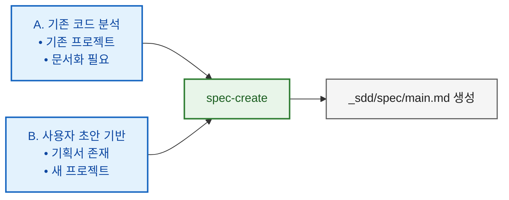

# SDD 빠른 시작 가이드

스펙 기반 개발(Spec-Driven Development) 빠른 참조

---

## 사용 가능한 스킬

각 스킬의 트리거 키워드와 사용 예시는 [SDD_WORKFLOW.md > 부록: 스킬별 설명](SDD_WORKFLOW.md#부록-스킬별-설명)을 참고하세요.

| 스킬 | 용도 |
|------|------|
| `/spec-create` | 코드 분석 또는 초안에서 스펙 생성 |
| `/feature-draft` | 스펙 패치 초안 + 구현 계획을 한 번에 생성 |
| `/spec-update-todo` | 스펙에 새 기능/요구사항을 사전 반영 (대규모 구현 시 드리프트 방지) |
| `/spec-update-done` | 구현 후 스펙과 코드 동기화 |
| `/spec-review` | 선택적 보조 검증 (리포트 전용, 스펙 본문 미수정) |
| `/spec-summary` | 스펙 요약본 생성(현황 파악/온보딩) |
| `/spec-rewrite` | 너무 긴/복잡한 스펙을 구조 재정리(파일 분할/부록 이동) |
| `/pr-spec-patch` | PR과 스펙 비교하여 패치 초안 생성 |
| `/pr-review` | PR 구현을 스펙/패치 초안 대비 검증 및 판정 |
| `/implementation-plan` | phase별 구현 계획 생성 (대규모 구현 시) |
| `/implementation` | TDD 기반 구현 실행 |
| `/implementation-review` | 계획 대비 구현 검증 (대규모 phase별 검증) |
| `/ralph-loop-init` | ML 자동 트레이닝 디버그 루프 생성 |
| `/discussion` | 구조화 의사결정 토론: 맥락 수집 + 선택지 비교 + 결정/미결/실행항목 정리 |

> (caveat) `/discussion` 스킬은 Claude Code에서만 지원합니다.

### 언제 `/discussion`을 먼저 쓰나

- 요구사항/방향이 아직 모호할 때
- 기술 선택지 트레이드오프를 빠르게 합의해야 할 때
- 구현 전에 리스크/검증 포인트를 정리할 때

출력: 핵심 논점, 결정 사항, 미결 질문, 실행 항목, (선택) Save Handoff

---

## 스펙 생성 시작점



---

## 구현 경로 선택

| 규모 | 워크플로우 |
|------|-----------|
| **대규모** | feature-draft → spec-update-todo → implementation-plan → implementation (phase 반복) → implementation-review → spec-update-done (→ spec-review) |
| **중규모** | feature-draft → implementation → spec-update-done |
| **소규모** | 직접 구현 (→ implementation-review) (→ spec-update-done) |

> **참고**: 스펙이 없는 경우 먼저 `/spec-create`로 스펙을 생성합니다.

### spec-review 사용 원칙 (선택)

- 기본 루프에서는 `/spec-update-done`으로 동기화합니다.
- `/spec-review`는 아래 경우에만 보조적으로 사용합니다:
  - 결과가 이상하거나 모호하다고 느낄 때
  - 대규모 업데이트를 `/spec-update-done`까지 완료한 뒤 최종 검증할 때
  - 결과물: `_sdd/spec/SPEC_REVIEW_REPORT.md` (리포트만 생성)

---

## 빠른 시작 시나리오

### 1. 기존 프로젝트 문서화

```bash
/spec-create
# 코드베이스를 분석하여 스펙 생성
```

### 2. 구현 전 의사결정 토론

```bash
/discussion
# 토픽 선택 → 맥락 수집 → 반복 질문 → 요약 출력
```

후속 스킬 연결:
- `/feature-draft`: 합의된 방향으로 기능 초안 작성
- `/implementation-plan`: 결정된 구조로 phase 계획 수립
- `/spec-create`: 요구사항이 정리된 새 프로젝트 스펙 생성

> 토론 결과 요약은 사용자 선택에 따라 `_sdd/discussion/discussion_<title>.md`로 저장할 수 있습니다.

### 3. 대규모 기능 구현

```bash
# 1. 스펙 패치 초안 + 구현 계획 생성
/feature-draft

# 2. 스펙에 사전 반영 (드리프트 방지)
/spec-update-todo

# 3. phase별 구현 계획 수립
/implementation-plan

# 4. 구현 (phase별 반복)
/implementation

# 5. phase별 검증
/implementation-review

# 6. 스펙 동기화
/spec-update-done

# 7. (선택) 최종 보조 검증
/spec-review
```

> 스펙이 없으면 먼저 `/spec-create`를 실행합니다.

### 4. 중규모 기능 구현

```bash
# 1. 스펙 패치 초안 + 구현 계획 생성
/feature-draft

# 2. 구현
/implementation

# 3. 스펙 동기화
/spec-update-done
```

> `feature-draft`가 스펙 패치 초안(Part 1)과 구현 계획(Part 2)을 한 번에 생성하므로 별도의 `implementation-plan`이 불필요합니다.

### 5. 소규모 / 버그 수정

```bash
# 1. 직접 수정 요청
"이 버그를 고쳐줘"

# 2. (선택) 검증
/implementation-review

# 3. (선택) 스펙에 영향 있으면 동기화
/spec-update-done
```

### 6. ML 트레이닝 디버그 루프

```bash
/ralph-loop-init
# ralph/ 디렉토리에 자동 트레이닝 디버그 루프 구조 생성
```

> LLM 기반 자동 ML 트레이닝 디버깅을 위한 루프 구조를 생성합니다.

### 7. PR 기반 스펙 패치 및 리뷰

```bash
/pr-spec-patch → (대화로 정제) → /pr-review → (스펙 반영은 /spec-update-todo) → (필요 시) /spec-update-done
```

**중요 규칙(스킬 기준)**: PR에서 나온 스펙 변경사항 반영은 **반드시** `/spec-update-todo`로 진행합니다.
(`_sdd/pr/spec_patch_draft.md` 내용을 `_sdd/spec/user_draft.md` 또는 `_sdd/spec/user_spec.md`로 옮겨서 실행)

### 8. 스펙 현황 파악

```bash
/spec-summary
# SUMMARY.md 생성 (진행률, 이슈, 추천사항 포함)
```

---

## 디렉토리 구조

```
_sdd/
├── spec/
│   ├── main.md                  # 메인 스펙 (또는 <project>.md)
│   ├── user_spec.md             # 스펙 업데이트 입력(자유 형식 가능)
│   ├── user_draft.md            # 스펙 업데이트 입력(권장 포맷)
│   ├── _processed_user_spec.md  # 처리된 입력 아카이브(/spec-update-todo가 rename)
│   ├── _processed_user_draft.md # 처리된 입력 아카이브(/spec-update-todo가 rename)
│   ├── SUMMARY.md               # 스펙 요약(/spec-summary)
│   ├── SPEC_REVIEW_REPORT.md    # 스펙 리뷰 리포트(/spec-review)
│   ├── DECISION_LOG.md          # (선택) 결정/근거 기록
│   └── prev/                    # PREV_* 백업
│
├── pr/
│   ├── spec_patch_draft.md      # PR 기반 스펙 패치 초안
│   ├── PR_REVIEW.md             # PR 리뷰 리포트
│   └── prev/                    # PREV_* 백업
│
├── implementation/
│   ├── IMPLEMENTATION_PLAN.md   # 구현 계획
│   ├── IMPLEMENTATION_PROGRESS.md
│   ├── IMPLEMENTATION_REVIEW.md
│   ├── user_input.md            # 구현 요청 (입력)
│   └── prev/                    # PREV_* 백업
│
├── drafts/                      # feature-draft 출력
│   ├── feature_draft_*.md       # 스펙 패치 + 구현 계획 통합 파일
│   └── prev/                    # 아카이브
│
└── env.md                       # 환경 설정
```

백업 파일은 각 영역의 `prev/`에 저장:
- `_sdd/spec/prev/PREV_<파일명>_<timestamp>.md`
- `_sdd/pr/prev/PREV_<파일명>_<timestamp>.md`
- `_sdd/implementation/prev/PREV_<파일명>_<timestamp>.md`

---

## 상태 마커

| 마커 | 의미 |
|------|------|
| 📋 | 계획됨 (Planned) |
| 🚧 | 진행중 (In Progress) |
| ✅ | 완료 (Completed) |
| ⏸️ | 보류 (On Hold) |

---

## 경로 선택 가이드

| 상황 | 경로 |
|------|------|
| 대규모 기능, 아키텍처 변경 | 대규모 |
| 중간 규모 기능 | 중규모 |
| 버그 수정, 긴급 핫픽스 | 소규모 |
| ML 트레이닝 디버그 | ralph-loop-init |

---

## 자세한 내용

전체 워크플로우 가이드: `SDD_WORKFLOW.md`
