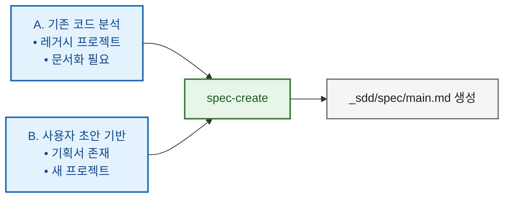

# SDD 빠른 시작 가이드

스펙 기반 개발(Spec-Driven Development) 빠른 참조

---

## 사용 가능한 스킬

| 스킬 | 트리거 | 용도 |
|------|--------|------|
| `/spec-create` | "스펙 생성" | 코드 분석 또는 초안에서 스펙 생성 |
| `/spec-draft` (레거시) | "스펙 초안" | 스펙 업데이트 입력(user_draft.md) 초안 생성 |
| `/feature-draft` **(권장)** | "기능 초안", "feature draft" | **통합 스킬**: 스펙 패치 초안 + 구현 계획을 한 번에 생성 |
| `/spec-update-todo` (레거시) | "스펙에 기능 추가" | 새 기능/요구사항을 스펙에 추가 |
| `/spec-update-done` | "스펙 동기화" | 구현 후 스펙과 코드 동기화 |
| `/spec-review` | "스펙 리뷰", "드리프트 점검" | 선택적 보조 검증 (리포트 전용, 스펙 본문 미수정) |
| `/spec-summary` | "스펙 요약" | 스펙 요약본 생성(현황 파악/온보딩) |
| `/spec-rewrite` | "스펙 리라이트", "스펙 정리" | 너무 긴/복잡한 스펙을 구조 재정리(파일 분할/부록 이동) |
| `/pr-spec-patch` | "PR 스펙 패치" | PR과 스펙 비교하여 패치 초안 생성 |
| `/pr-review` | "PR 리뷰" | PR 구현을 스펙/패치 초안 대비 검증 및 판정 |
| `/implementation-plan` (레거시) | "구현 계획 생성" | 스펙에서 실행 가능한 작업 생성 |
| `/implementation` | "구현 시작" | TDD로 작업 실행 |
| `/implementation-review` (레거시) | "진행 상황 확인" | 계획 대비 구현 검증 |

---

## 스펙 생성 시작점



---

## 구현 경로 선택

| 경로 | 복잡도 | 사용 시점 | 워크플로우 |
|------|--------|----------|-----------|
| **A: Feature Draft (권장)** | 높음 | 큰 기능, 아키텍처 변경 | spec-create → feature-draft → implementation → spec-update-done |
| **A' (레거시): Spec-First** | 높음 | 큰 기능 (전통 방식) | spec-update-todo → implementation-plan → implementation → implementation-review → spec-update-done |
| **B: Direct Plan** | 중간 | 명확한 중간 규모 기능 | 입력 → implementation-plan → implementation → implementation-review → (선택) spec-update-done |
| **C: Simple** | 낮음 | 버그 수정, 작은 기능 | 입력 → 직접 구현 → (선택적) implementation-review |

### spec-review 사용 원칙 (선택)

- 기본 루프에서는 `/spec-update-done`으로 동기화합니다.
- `/spec-review`는 아래 경우에만 보조적으로 사용합니다:
  - 결과가 이상하거나 모호하다고 느낄 때
  - 대규모 업데이트를 `/spec-update-done`까지 완료한 뒤 최종 검증할 때
  - 결과물: `_sdd/spec/SPEC_REVIEW_REPORT.md` (리포트만 생성)

---

## 빠른 시작 시나리오

### 1. 레거시 프로젝트 문서화

```bash
/spec-create
```

### 2. 기획서 기반 새 프로젝트

```bash
/spec-create → /feature-draft → /implementation → /spec-update-done
```

### 3. 새 기능 추가 (Feature Draft — 권장)

```bash
/feature-draft → /implementation → /spec-update-done
```

> `feature-draft`는 `spec-draft` + `spec-update-todo` + `implementation-plan`을 하나로 합친 통합 스킬입니다.
> 스펙 패치 초안(Part 1)과 구현 계획(Part 2)을 단일 파일로 출력하므로 4단계만으로 기능 추가가 완료됩니다.

### 3'. 새 기능 추가 (레거시: Spec-First)

```bash
/spec-update-todo → /implementation-plan → /implementation → /implementation-review → /spec-update-done → (필요 시) /spec-review
```

> 기존 7단계 워크플로우입니다. 세밀한 단계별 제어가 필요한 경우에만 사용합니다.

### 4. 중간 규모 기능 (Direct Plan)

```bash
"이 기능을 구현해줘" → /implementation-plan → /implementation → /implementation-review → (선택적) /spec-update-done
```

### 5. 버그 수정 (Simple)

```bash
"이 버그를 고쳐줘" → (선택적) /implementation-review
```

### 6. PR 기반 스펙 패치 및 리뷰

```bash
/pr-spec-patch → (대화로 정제) → /pr-review → (스펙 반영은 /spec-update-todo) → (필요 시) /spec-update-done → (필요 시) /spec-review
```

**중요 규칙(스킬 기준)**: PR에서 나온 스펙 변경사항 반영은 **반드시** `/spec-update-todo`로 진행합니다.
(`_sdd/pr/spec_patch_draft.md` 내용을 `_sdd/spec/user_draft.md` 또는 `_sdd/spec/user_spec.md`로 옮겨서 실행)

---

## 디렉토리 구조

```
_sdd/
├── spec/
│   ├── main.md                  # 메인 스펙 (또는 <project>.md)
│   ├── user_spec.md             # 스펙 업데이트 입력(자유 형식 가능)
│   ├── user_draft.md            # 스펙 업데이트 입력(권장 포맷; /spec-draft가 생성)
│   ├── _processed_user_spec.md  # 처리된 입력 아카이브(/spec-update-todo가 rename)
│   ├── _processed_user_draft.md # 처리된 입력 아카이브(/spec-update-todo가 rename)
│   ├── SUMMARY.md               # 스펙 요약(/spec-summary)
│   ├── SPEC_REVIEW_REPORT.md    # 스펙 리뷰 리포트(/spec-review)
│   ├── DECISION_LOG.md          # (선택) 결정/근거 기록
│   └── prev/                    # PREV_* 백업
│
├── pr/
│   ├── spec_patch_draft.md      # PR 기반 스펙 패치 초안
│   ├── PR_REVIEW.md             # PR 리뷰 리포트
│   └── prev/                    # PREV_* 백업
│
├── implementation/
│   ├── IMPLEMENTATION_PLAN.md   # 구현 계획
│   ├── IMPLEMENTATION_PROGRESS.md
│   ├── IMPLEMENTATION_REVIEW.md
│   ├── user_input.md            # 구현 요청 (입력)
│   └── prev/                    # PREV_* 백업
│
├── drafts/                      # feature-draft 출력
│   ├── feature_draft_*.md       # 스펙 패치 + 구현 계획 통합 파일
│   └── prev/                    # 아카이브
│
└── env.md                       # 환경 설정
```

백업 파일은 각 영역의 `prev/`에 저장:
- `_sdd/spec/prev/PREV_<파일명>_<timestamp>.md`
- `_sdd/pr/prev/PREV_<파일명>_<timestamp>.md`
- `_sdd/implementation/prev/PREV_<파일명>_<timestamp>.md`

---

## 상태 마커

| 마커 | 의미 |
|------|------|
| 📋 | 계획됨 (Planned) |
| 🚧 | 진행중 (In Progress) |
| ✅ | 완료 (Completed) |
| ⏸️ | 보류 (On Hold) |

---

## 경로 선택 가이드

| 상황 | 권장 경로 |
|------|----------|
| 새로운 대규모 기능 | A: Feature Draft (권장) |
| 아키텍처 변경 | A: Feature Draft (권장) |
| 세밀한 단계별 제어 필요 | A' (레거시): Spec-First |
| 중간 규모 기능 | B: Direct Plan |
| 버그 수정 | C: Simple |
| 긴급 핫픽스 | C: Simple |

---

## 자세한 내용

전체 워크플로우 가이드: `SDD_WORKFLOW.md`
