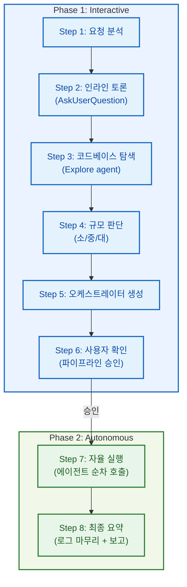

# SDD-Autopilot 사용 가이드

**버전**: 1.0.0
**날짜**: 2026-03-16

SDD 파이프라인을 자동으로 실행하는 sdd-autopilot 메타스킬 가이드

---

## 목차

1. [개요](#1-개요)
2. [핵심 개념](#2-핵심-개념)
3. [사용법](#3-사용법)
4. [규모별 파이프라인](#4-규모별-파이프라인)
5. [사용 예시](#5-사용-예시)
6. [산출물](#6-산출물)
7. [FAQ / 트러블슈팅](#7-faq--트러블슈팅)
8. [관련 스킬](#8-관련-스킬)

---

## 1. 개요

기존 SDD 워크플로우에서는 기능의 규모에 따라 `/feature-draft`, `/implementation-plan`, `/implementation`, `/spec-update-done` 등의 스킬을 사용자가 직접 순서대로 호출해야 했습니다. 규모 판단, 에이전트 선택, 실행 순서 관리가 모두 사용자 몫이었기 때문에 대규모 기능 구현 시 진입 장벽이 높았습니다.

**sdd-autopilot**은 이 전체 파이프라인을 하나의 명령으로 자동 실행하는 **적응형 오케스트레이터 메타스킬**입니다. 사용자의 기능 요청을 받으면 요구사항 토론, 코드베이스 탐색, 규모 판단, 파이프라인 구성, 에이전트 순차 실행, 리뷰-수정 루프, 테스트, 스펙 동기화까지 end-to-end로 처리합니다. 사용자는 초반 요구사항 확인과 파이프라인 승인만 참여하면 되고, 이후는 sdd-autopilot이 자율적으로 완료합니다.

---

## 2. 핵심 개념

sdd-autopilot을 이해하기 위한 3가지 핵심 개념입니다.

### 2.1 2-Phase Orchestration (Interactive → Autonomous)

sdd-autopilot은 실행을 두 단계로 나눕니다.

| 단계 | 이름 | 사용자 참여 | 수행 내용 |
|------|------|------------|----------|
| **Phase 1** | Interactive | 필수 (대화) | 요구사항 토론, 코드베이스 탐색, 규모 판단, 오케스트레이터 생성, 사용자 승인 |
| **Phase 1.5** | Checkpoint | 필수 (승인) | 오케스트레이터 확인 및 파이프라인 실행 승인 |
| **Phase 2** | Autonomous | 불필요 | 에이전트 순차 실행, 리뷰-수정 루프, 테스트, 스펙 동기화 |

Phase 1에서 사용자와 충분히 요구사항을 확인한 뒤, Phase 2에서는 **사용자 중단 없이** 파이프라인을 끝까지 실행합니다. 진행 상황은 마일스톤 메시지로 실시간 출력됩니다.

```
[sdd-autopilot] Step 1/6: feature-draft 시작...
[sdd-autopilot] Step 1/6: feature-draft 완료 -- _sdd/drafts/feature_draft_auth_system.md
[sdd-autopilot] Step 2/6: implementation-plan 시작...
...
```

### 2.2 적응형 파이프라인 (소/중/대 규모별 자동 선택)

sdd-autopilot은 요청 분석과 코드베이스 탐색 결과를 기반으로 규모를 자동 판단하고, 그에 맞는 파이프라인을 선택합니다. 사용자가 규모를 직접 지정할 필요가 없습니다.

| 규모 | 영향 파일 수 | 신규 컴포넌트 | 스펙 변경 | 파이프라인 |
|------|-------------|-------------|----------|----------|
| 소규모 | 1-3개 | 0-1개 | 없음 | implementation → 인라인 테스트 |
| 중규모 | 4-10개 | 1-3개 | 기존 섹션 패치 | feature-draft → impl-plan → impl → review → test → spec-sync |
| 대규모 | 10개+ | 3개+ | 신규 섹션 추가 | full pipeline (모든 agent) |

정량적 기준과 정성적 기준(복잡도, 의존성, 테스트 범위)이 다른 규모를 가리키면, sdd-autopilot은 **더 큰 규모를 선택**합니다.

### 2.3 Agent Wrapper 패턴 (스킬 → 에이전트 위임)

sdd-autopilot은 각 SDD 스킬을 **서브에이전트**로 호출합니다. 에이전트 간 상태는 파일 경로를 통해 전달되며, 에이전트의 전체 출력을 부모 컨텍스트에 누적하지 않습니다.

```
feature-draft agent
    │ 출력: _sdd/drafts/feature_draft_<topic>.md
    v
implementation-plan agent
    │ 출력: _sdd/implementation/IMPLEMENTATION_PLAN.md
    v
implementation agent
    │ 출력: 코드 파일들
    v
implementation-review agent  ←── review-fix loop (max 3회)
    │
    v
테스트 (인라인 or ralph-loop-init)
    │
    v
spec-update-done agent
    │ 출력: _sdd/spec/ 업데이트
```

각 에이전트에는 이전 에이전트의 **출력 파일 경로**와 **사용자의 원래 요청**이 함께 전달됩니다. sdd-autopilot은 에이전트 결과에서 핵심 정보(출력 파일 경로, 주요 결정사항)만 추출하여 파이프라인 로그에 기록합니다.

---

## 3. 사용법

### 3.1 기본 호출

```bash
/sdd-autopilot "기능 설명"
```

**호출 예시**:

```bash
/sdd-autopilot JWT 기반 인증 시스템을 구현해줘. 로그인, 로그아웃, 토큰 갱신 포함.

/sdd-autopilot 결제 시스템 전체 구현. Stripe API 연동, 웹훅 처리, 환불 로직 포함.

/sdd-autopilot 로그인 버튼 색상을 파란색에서 초록색으로 변경해줘.
```

**트리거 키워드**: `sdd-autopilot`, `autopilot`, `자동 구현`, `end-to-end 구현`, `전체 파이프라인`, `자동으로 구현해줘`, `처음부터 끝까지`

> **Tip**: 기능 설명에 **What**(무엇을), **Why**(왜), **Constraints**(제약조건)를 포함하면 Phase 1의 토론이 짧아지고 정확도가 높아집니다.

### 3.2 전체 흐름 (Step 1~8)



| Step | 이름 | 설명 |
|------|------|------|
| 1 | **요청 분석** | 사용자 입력에서 기능 설명, 기술 키워드, 제약 조건 추출. 초기 복잡도 예측 |
| 2 | **인라인 토론** | 사용자와 1-5회 대화로 요구사항 구체화. 매 질문에 "충분합니다 -- 진행해주세요" 옵션 포함 |
| 3 | **코드베이스 탐색** | Explore 에이전트로 프로젝트 구조, 관련 파일, 기존 패턴, 테스트 구조 분석 |
| 4 | **규모 판단** | 영향 파일 수, 신규 컴포넌트 수, 스펙 변경 여부 등으로 소/중/대 규모 결정 |
| 5 | **오케스트레이터 생성** | 규모에 맞는 맞춤형 파이프라인 계획을 `_sdd/pipeline/orchestrator_*.md`에 저장 |
| 6 | **사용자 확인** | 파이프라인 요약 제시, 수정/승인/취소 선택 |
| 7 | **자율 실행** | 승인된 파이프라인을 에이전트 순차 호출로 실행. 리뷰-수정 루프, 테스트 포함 |
| 8 | **최종 요약** | 로그 마무리, 생성/수정 파일 목록, 잔여 이슈, 후속 작업 제안 보고 |

### 3.3 사용자 역할 vs sdd-autopilot 역할

| Step | 사용자가 해야 할 것 | sdd-autopilot이 자동으로 하는 것 |
|------|---------------------|---------------------------|
| 1 | 기능 요청 입력 | 요청 파싱, 초기 복잡도 예측 |
| 2 | 질문에 답변 (선택지 선택 또는 자유 입력) | 질문 생성, 요구사항 수집/정리 |
| 3 | 없음 | 코드베이스 탐색, 관련 파일 식별 |
| 4 | 없음 | 규모 판단, 파이프라인/테스트 전략 결정 |
| 5 | 없음 | 오케스트레이터 파일 생성 |
| 6 | 파이프라인 승인/수정/취소 | 요약 제시, 수정 반영 |
| 7 | 없음 (마일스톤 메시지 관찰) | 에이전트 호출, 리뷰-수정 루프, 테스트, 로그 기록 |
| 8 | 결과 확인, 잔여 이슈 처리 | 로그 마무리, 최종 보고 |

> **핵심**: Step 6에서 승인한 이후(Phase 2)에는 sdd-autopilot이 사용자에게 질문하지 않습니다. 완료까지 자율 실행합니다.

---

## 4. 규모별 파이프라인

sdd-autopilot은 Step 4에서 판단한 규모에 따라 서로 다른 에이전트 조합을 사용합니다.

### 4.1 소규모 (1-3 파일)

**판단 조건**: 영향 파일 1-3개, 신규 컴포넌트 0-1개, 스펙 변경 없음, 예상 코드 200줄 미만

**파이프라인**:

```
implementation agent → 인라인 테스트 → (완료)
```

feature-draft, implementation-plan, spec-update-done을 생략합니다. 단일 함수/클래스 수정, 버그 수정, UI 미세 조정 등이 해당됩니다.

**예시 요청**: "로그인 버튼 색상을 파란색에서 초록색으로 변경해줘"

### 4.2 중규모 (4-10 파일)

**판단 조건**: 영향 파일 4-10개, 신규 컴포넌트 1-3개, 기존 스펙 섹션 패치 필요, 예상 코드 200-1000줄

**파이프라인**:

```
feature-draft agent → implementation-plan agent → implementation agent
→ review-fix loop (max 3회) → 인라인 테스트 → spec-update-done agent
```

여러 모듈이 연동되는 기능 추가, 새 의존성 도입, 통합 테스트가 필요한 작업이 해당됩니다.

**예시 요청**: "JWT 기반 인증 시스템을 구현해줘. 로그인, 로그아웃, 토큰 갱신 포함."

### 4.3 대규모 (10+ 파일)

**판단 조건**: 영향 파일 10개+, 신규 컴포넌트 3개+, 스펙에 신규 섹션 추가 필요, 예상 코드 1000줄+

**파이프라인**:

```
feature-draft agent → spec-update-todo agent → implementation-plan agent
→ implementation agent → review-fix loop (max 3회)
→ 테스트 (인라인 or ralph-loop-init) → spec-update-done agent
→ spec-review agent (선택)
```

아키텍처 레벨 변경, 시스템 전체에 영향을 미치는 대규모 기능, E2E 테스트가 필요한 작업이 해당됩니다. `spec-update-todo`로 구현 전 스펙에 사전 반영하여 드리프트를 방지합니다.

**예시 요청**: "결제 시스템 전체를 구현해줘. Stripe API 연동, 웹훅 처리, 환불 로직 포함."

---

## 5. 사용 예시

### 5.1 소규모 -- "로그인 버튼 색상 변경"

```
사용자: /sdd-autopilot 로그인 버튼 색상을 파란색에서 초록색으로 변경해줘

[sdd-autopilot] 요청 분석: 소규모 예측 (UI 컴포넌트 1개 수정)
[sdd-autopilot] 질문: "로그인 버튼이 있는 파일이 어디인가요?"
  1. "src/components/LoginButton.tsx"
  2. "잘 모르겠어요 -- 찾아주세요"
  3. "충분합니다 -- 진행해주세요"

사용자: 2

[sdd-autopilot] 코드베이스 탐색 완료: src/components/LoginButton.tsx 식별
[sdd-autopilot] 규모 판단: 소규모 (파일 1개, 스펙 변경 없음)
[sdd-autopilot] 파이프라인: implementation → 인라인 테스트

[sdd-autopilot] 파이프라인 요약:
  규모: 소규모 | 에이전트: 1개 | 테스트: 인라인

사용자: "좋습니다 -- 실행해주세요"

[sdd-autopilot] Step 1/1: implementation 시작...
[sdd-autopilot] Step 1/1: implementation 완료 -- src/components/LoginButton.tsx 수정
[sdd-autopilot] 테스트 통과 (3/3)
[sdd-autopilot] 완료 -- 총 소요 시간: 2분
```

### 5.2 중규모 -- "JWT 인증 시스템 추가"

```
사용자: /sdd-autopilot JWT 기반 인증 시스템 구현해줘. 로그인, 로그아웃, 토큰 갱신 포함.

[sdd-autopilot] 요청 분석: 중규모 예측 (여러 컴포넌트 언급)
[sdd-autopilot] 질문: "비밀번호 해싱 알고리즘과 토큰 만료 시간 정책은?"
  1. "bcrypt, access 1시간 / refresh 7일"
  2. "기본값으로 진행해주세요"
  3. "충분합니다 -- 진행해주세요"

사용자: 1

[sdd-autopilot] 질문: "기존 User 모델을 확장할까요, 새 모델을 만들까요?"
  1. "기존 User 모델 확장"
  2. "새 Auth 모델 생성"
  3. "충분합니다 -- 진행해주세요"

사용자: 1

[sdd-autopilot] 코드베이스 탐색 완료: Express.js 프로젝트, 관련 파일 7개 식별
[sdd-autopilot] 규모 판단: 중규모 (파일 7개, 신규 컴포넌트 3개, 스펙 패치 필요)

[sdd-autopilot] 파이프라인 요약:
  규모: 중규모 | 에이전트: 5개 | Review 최대: 3회 | 테스트: 인라인

사용자: "좋습니다 -- 실행해주세요"

[sdd-autopilot] Step 1/5: feature-draft 완료 -- _sdd/drafts/feature_draft_jwt_auth.md
[sdd-autopilot] Step 2/5: implementation-plan 완료 -- _sdd/implementation/IMPLEMENTATION_PLAN.md
[sdd-autopilot] Step 3/5: implementation 완료 -- 7개 파일 생성/수정
[sdd-autopilot] Review-Fix Round 1/3: critical 1건, high 1건 -- 수정 중...
[sdd-autopilot] Review-Fix Round 2/3: critical 0건, high 0건 -- 리뷰 통과
[sdd-autopilot] 테스트 통과 (18/18)
[sdd-autopilot] Step 5/5: spec-update-done 완료 -- _sdd/spec/main.md 업데이트
[sdd-autopilot] 완료 -- 총 소요 시간: 20분
```

### 5.3 대규모 -- "결제 시스템 전체 구현"

```
사용자: /sdd-autopilot 결제 시스템 전체 구현. Stripe API 연동, 웹훅 처리, 환불 로직 포함.

[sdd-autopilot] 요청 분석: 대규모 예측 (시스템 레벨 변경)
[sdd-autopilot] 질문 1: "결제 수단은? (카드만 / 카드+가상계좌 / 전체)"
[sdd-autopilot] 질문 2: "결제 상태 관리 정책은?"
[sdd-autopilot] 질문 3: "테스트 환경은? (Stripe test mode / mock)"
[sdd-autopilot] 질문 4: "웹훅 보안 검증 방식은?"
... (3-5회 토론)

[sdd-autopilot] 코드베이스 탐색 완료: 15개 파일 영향, 신규 모듈 5개 필요
[sdd-autopilot] 규모 판단: 대규모 (파일 15개+, 신규 컴포넌트 5개, 스펙 신규 섹션)

[sdd-autopilot] 파이프라인 요약:
  규모: 대규모 | 에이전트: 7개 | Review 최대: 3회 | 테스트: 인라인

사용자: "좋습니다 -- 실행해주세요"

[sdd-autopilot] Step 1/7: feature-draft 완료
[sdd-autopilot] Step 2/7: spec-update-todo 완료 -- 스펙에 결제 시스템 섹션 추가
[sdd-autopilot] Step 3/7: implementation-plan 완료 -- 3 phase로 분할
[sdd-autopilot] Step 4/7: implementation 완료 -- 18개 파일 생성/수정
[sdd-autopilot] Review-Fix Round 1/3: critical 2건 -- 수정 중...
[sdd-autopilot] Review-Fix Round 2/3: critical 0건, high 0건 -- 리뷰 통과
[sdd-autopilot] Step 6/7: 테스트 통과 (32/32)
[sdd-autopilot] Step 7/7: spec-update-done 완료
[sdd-autopilot] 완료 -- 총 소요 시간: 45분
```

---

## 6. 산출물

sdd-autopilot은 파이프라인 실행 중 다음 파일들을 생성합니다.

### 6.1 파이프라인 파일

| 파일 | 경로 | 설명 |
|------|------|------|
| 오케스트레이터 | `_sdd/pipeline/orchestrator_<topic>_<timestamp>.md` | 파이프라인 실행 계획. 에이전트 호출 순서, 프롬프트, 에러 핸들링 정책 포함 |
| 실행 로그 | `_sdd/pipeline/log_<topic>_<timestamp>.md` | 각 에이전트의 시작/완료 시간, 출력 경로, 핵심 결정사항, 에러 기록 |

- `<topic>`: 기능명을 영문 snake_case로 변환 (e.g., "인증 시스템" -> `auth_system`)
- `<timestamp>`: `YYYYMMDD_HHmmss` 형식

### 6.2 에이전트별 출력

| 에이전트 | 출력 경로 | 내용 |
|---------|----------|------|
| feature-draft | `_sdd/drafts/feature_draft_<topic>.md` | 스펙 패치 초안 + 구현 계획 초안 |
| spec-update-todo | `_sdd/spec/main.md` (업데이트) | 계획된 기능을 스펙에 사전 반영 |
| implementation-plan | `_sdd/implementation/IMPLEMENTATION_PLAN.md` | 상세 구현 계획 (phase별 분할 가능) |
| implementation | 코드 파일들 | 구현된 소스 코드 + 테스트 파일 |
| implementation-review | 텍스트 출력 | 리뷰 리포트 (critical/high/medium/low 이슈) |
| spec-update-done | `_sdd/spec/main.md` (업데이트) | 구현 결과를 스펙에 동기화 |
| spec-review | `_sdd/spec/SPEC_REVIEW_REPORT.md` | 스펙 품질/드리프트 리포트 (선택) |

### 6.3 디렉토리 구조 예시

```
_sdd/
├── pipeline/
│   ├── orchestrator_jwt_auth_20260316_143000.md   # 파이프라인 계획
│   └── log_jwt_auth_20260316_143000.md            # 실행 로그
├── drafts/
│   └── feature_draft_jwt_auth.md                   # feature-draft 출력
├── implementation/
│   └── IMPLEMENTATION_PLAN.md                      # 구현 계획
└── spec/
    └── main.md                                     # 동기화된 스펙
```

---

## 7. FAQ / 트러블슈팅

### Q1. sdd-autopilot vs 개별 스킬 직접 호출 -- 언제 뭘 쓰나?

| 상황 | 추천 |
|------|------|
| "이 기능 처음부터 끝까지 구현해줘" | `/sdd-autopilot` |
| "스펙 리뷰만 해줘" | `/spec-review` 직접 호출 |
| "이미 구현 계획이 있어, 구현만 해줘" | `/implementation` 직접 호출 |
| "토론만 하고 싶어" | `/discussion` 직접 호출 |
| 여러 스킬을 자동으로 연결해야 할 때 | `/sdd-autopilot` |
| 단일 스킬로 완료 가능한 작업 | 개별 스킬 직접 호출 |

**판단 기준**: 2개 이상의 스킬을 연속으로 호출해야 한다면 sdd-autopilot을 사용하세요. 단일 스킬로 충분하다면 직접 호출이 빠릅니다.

### Q2. 파이프라인 중간에 실패하면?

sdd-autopilot은 에이전트 실패 시 **최대 3회 재시도**합니다. 재시도에도 실패하면:

- **핵심 단계** (`feature-draft`, `implementation-plan`, `implementation`) 실패: 파이프라인을 중단하고 부분 산출물과 권장 후속 조치를 보고합니다.
- **비핵심 단계** (`implementation-review`, `spec-update-done`, `spec-review`) 실패: 건너뛰고 다음 단계를 진행합니다. 로그에 실패 사유가 기록됩니다.

파이프라인이 중단된 경우:
1. `_sdd/pipeline/log_*.md`에서 실패 원인을 확인합니다.
2. 완료된 단계까지의 산출물은 보존됩니다.
3. 실패한 단계의 에이전트를 개별 호출하여 수동으로 이어갈 수 있습니다.

### Q3. 생성된 오케스트레이터를 수정할 수 있나?

네. Step 6(사용자 확인)에서 다음 옵션을 선택할 수 있습니다:

- **"파이프라인을 수정하고 싶습니다"**: 수정 사항을 텍스트로 입력하면 sdd-autopilot이 오케스트레이터를 수정합니다.
- **"오케스트레이터 전체를 보고 싶습니다"**: 전체 내용을 출력한 뒤 재확인합니다.

수정 후에도 오케스트레이터는 `_sdd/pipeline/`에 저장되므로 나중에 참조할 수 있습니다.

### Q4. sdd-autopilot이 규모를 잘못 판단하면?

Step 6에서 파이프라인 요약을 확인할 때, 규모가 맞지 않다고 느끼면 "파이프라인을 수정하고 싶습니다"를 선택하여 규모와 에이전트 조합을 변경할 수 있습니다.

### Q5. 스펙이 없는 프로젝트에서도 sdd-autopilot을 쓸 수 있나?

사용할 수 있습니다. 단, sdd-autopilot은 `_sdd/spec/`의 존재 여부에 따라 파이프라인을 조정합니다. 스펙이 없으면 `spec-update-todo`와 `spec-update-done` 단계가 생략될 수 있습니다. 스펙 기반 워크플로우의 이점을 최대한 활용하려면 먼저 `/spec-create`로 스펙을 생성하는 것을 권장합니다.

---

## 8. 관련 스킬

sdd-autopilot이 내부적으로 호출하는 에이전트들을 개별 스킬로도 직접 사용할 수 있습니다.

| 스킬 | 호출 | 용도 |
|------|------|------|
| `/feature-draft` | `/feature-draft "기능 설명"` | 스펙 패치 초안 + 구현 계획 생성 |
| `/implementation-plan` | `/implementation-plan` | phase별 상세 구현 계획 수립 |
| `/implementation` | `/implementation` | TDD 기반 코드 구현 |
| `/implementation-review` | `/implementation-review` | 계획 대비 구현 검증 |
| `/spec-update-todo` | `/spec-update-todo` | 계획된 기능을 스펙에 사전 반영 |
| `/spec-update-done` | `/spec-update-done` | 구현 완료 후 스펙 동기화 |
| `/spec-review` | `/spec-review` | 스펙 품질/드리프트 검증 (리포트 전용) |
| `/ralph-loop-init` | `/ralph-loop-init` | 장시간 테스트용 자동 디버깅 루프 생성 |
| `/discussion` | `/discussion "토픽"` | 구현 전 의사결정 토론 |

> 각 스킬의 상세 사용법과 예시는 [SDD_WORKFLOW.md](SDD_WORKFLOW.md)와 [SDD_QUICK_START.md](SDD_QUICK_START.md)를 참조하세요.
