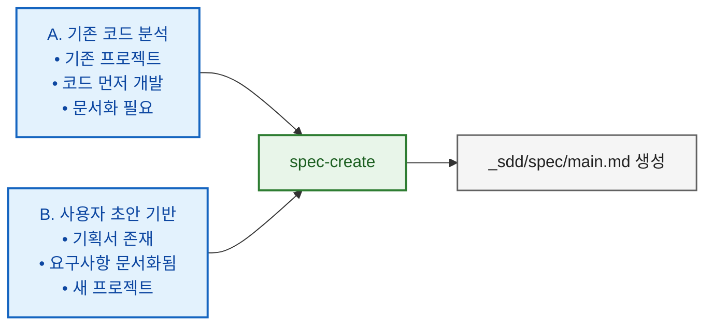
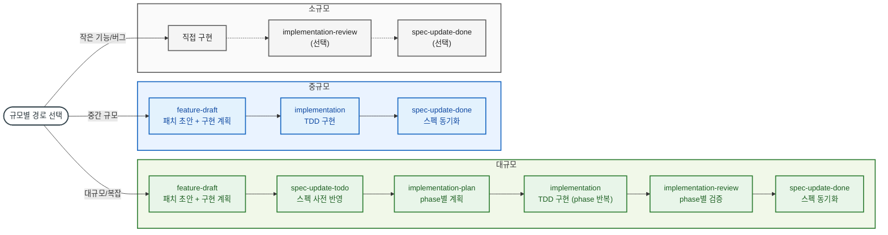
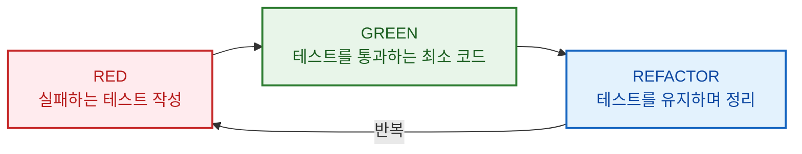
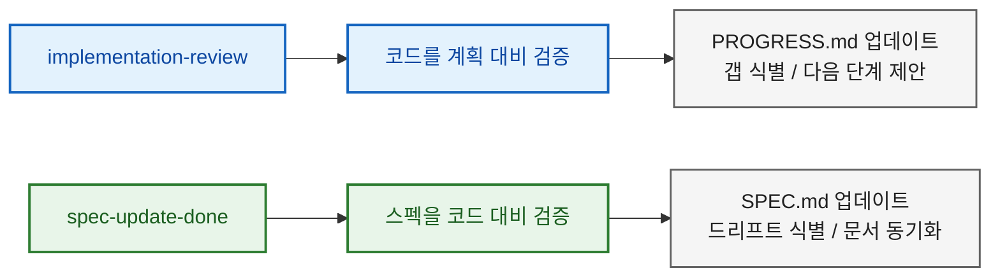
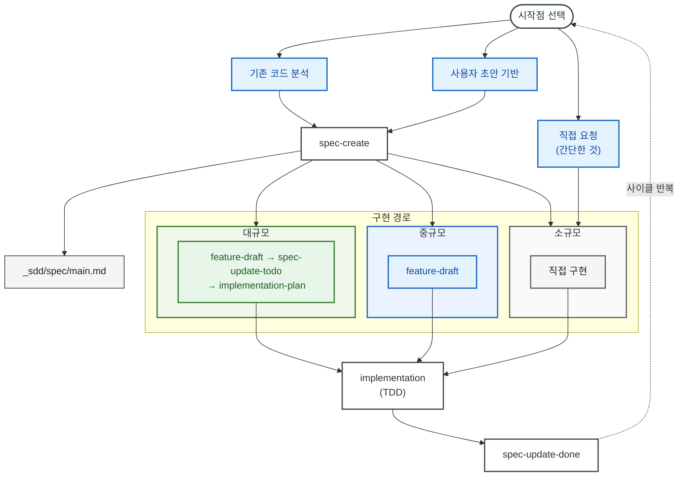

# 스펙 기반 개발 (SDD) 워크플로우 가이드

**버전**: 1.4.0
**날짜**: 2026-03-04

Claude와 함께하는 소프트웨어 개발을 위한 SDD 스킬 종합 가이드

---

## 목차

1. [핵심 개념](#1-핵심-개념)
2. [효과적인 스킬 사용법](#2-효과적인-스킬-사용법)
3. [시작하기](#3-시작하기)
4. [구현 및 스펙 유지보수](#4-구현-및-스펙-유지보수)
5. [리뷰 프로세스](#5-리뷰-프로세스)
6. [장기 실행 디버깅 — Ralph Loop](#6-장기-실행-디버깅--ralph-loop)
7. [빠른 참조](#7-빠른-참조)

---

## 1. 핵심 개념

### 스펙 기반 개발(SDD)이란?

스펙 기반 개발(Spec-Driven Development, SDD)은 **스펙 문서**가 소프트웨어 개발 생명주기 전반에 걸쳐 단일 진실 공급원(Single Source of Truth) 역할을 하는 방법론입니다. 코드와 함께 진화하는 살아있는 문서를 유지하여 요구사항과 구현 사이의 간극을 메웁니다.

### 두 단계 스펙 구조

SDD는 **글로벌 스펙**과 **임시 스펙**, 두 단계로 문서를 관리합니다.

- **글로벌 스펙** (`_sdd/spec/main.md`): `CLAUDE.md`를 대체하는 프로젝트의 Single Source of Truth. 목표, 아키텍처, 컴포넌트 상세 등 모든 프로젝트 정보를 담으며, 모든 스킬이 이 문서를 기준으로 동작합니다.
- **임시 스펙** (`feature_draft`, `spec_patch_draft`, `user_draft`): 글로벌 스펙에 대한 **변경 제안서**. Git의 feature branch처럼 먼저 만들고, 검증 후 글로벌 스펙에 병합한 뒤 아카이브됩니다.

> 두 단계 구조의 상세 설명과 생명주기: [SDD_CONCEPT.md](SDD_CONCEPT.md)

### SDD 철학


### 현재 제공 SDD 스킬(15개)

| 스킬 | 트리거 | 목적 |
|------|--------|------|
| **spec-create** | "스펙 생성", "프로젝트 문서화" | 코드 분석 또는 초안에서 스펙 생성 |
| **feature-draft** | "기능 초안", "feature draft" | 스펙 패치 초안 + 구현 계획을 한 번에 생성 |
| **spec-update-todo** | "스펙에 기능 추가", "스펙 업데이트" | 스펙에 새 기능/요구사항을 사전 반영 (대규모 구현 시 드리프트 방지) |
| **spec-update-done** | "완료 항목 반영", "스펙 동기화" | 구현 변경사항과 스펙 동기화 |
| **spec-review** | "스펙 리뷰", "드리프트 점검" | 보조 검증용 strict 리뷰 (리포트 전용) |
| **spec-summary** | "스펙 요약", "프로젝트 개요" | 스펙의 요약본 생성 (현황 파악용) |
| **spec-rewrite** | "스펙 리라이트", "스펙 정리" | 긴/복잡한 스펙을 구조 재정리(파일 분할/부록 이동) + 이슈 리포트 |
| **pr-spec-patch** | "PR 스펙 패치", "PR 리뷰 준비" | PR과 스펙 비교하여 패치 초안 생성 |
| **pr-review** | "PR 리뷰", "PR 검증" | PR 구현을 스펙 대비 검증 및 판정 |
| **implementation-plan** | "구현 계획 생성" | phase별 구현 계획 생성 (대규모 구현 시) |
| **implementation** | "계획 구현", "구현 시작" | TDD 기반 구현 실행 |
| **implementation-review** | "구현 리뷰", "진행 상황 확인" | 계획 대비 구현 검증 (대규모 phase별 검증) |
| **ralph-loop-init** | "ralph loop", "training debug loop" | ML 자동 트레이닝 디버그 루프 생성 |
| **discussion** | "토론", "discuss", "brainstorm" | 구조화 의사결정 토론: 맥락 수집 + 선택지 비교 + 결정/미결/실행항목 정리 |
| **guide-create** | "가이드 작성", "기능 가이드", "guide create" | 스펙+코드 기반 기능별 구현/리뷰 가이드 문서 생성 |

> (caveat) `/discussion` 스킬은 Claude Code에서만 지원합니다.

### 규모별 워크플로우

기능의 규모에 따라 3가지 경로를 사용합니다:

| 규모 | 워크플로우 |
|------|-----------|
| **대규모** | feature-draft → spec-update-todo → implementation-plan → implementation (phase 반복) → implementation-review → spec-update-done (→ spec-review) |
| **중규모** | feature-draft → implementation → spec-update-done |
| **소규모** | 직접 구현 (→ implementation-review) (→ spec-update-done) |

> **참고**: 스펙이 없는 경우 먼저 `/spec-create`로 스펙을 생성합니다.

#### 구현 전 토론 게이트 (선택)

- 방향/요구사항이 불명확하면 `/discussion`을 먼저 실행합니다.
- 토론 결과를 `/feature-draft` 또는 `/implementation-plan` 입력으로 사용합니다.
- 방향이 명확하면 기존 규모별 경로로 바로 진행합니다.

#### 대규모 vs 중규모 차이

- **대규모**: `spec-update-todo`로 구현 전 스펙에 사전 반영(드리프트 방지), `implementation-plan`으로 phase별 계획 수립, `implementation-review`로 phase별 검증
- **중규모**: `feature-draft`가 스펙 패치 초안(Part 1) + 구현 계획(Part 2)을 한 번에 생성하므로 별도 계획/검증 불필요
- **소규모**: `feature-draft` 없이 직접 구현, 필요 시에만 검증/동기화

### 디렉토리 구조

```
project/
├── _sdd/
│   ├── spec/
│   │   ├── main.md                   # 메인 스펙 문서 (또는 <project>.md)
│   │   ├── user_spec.md              # 스펙 업데이트 입력(자유 형식 가능)
│   │   ├── user_draft.md             # 스펙 업데이트 입력(권장 포맷)
│   │   ├── _processed_user_spec.md   # 처리된 입력 (아카이브; spec-update-todo가 rename)
│   │   ├── _processed_user_draft.md  # 처리된 입력 (아카이브; spec-update-todo가 rename)
│   │   ├── SUMMARY.md                # 스펙 요약 (spec-summary)
│   │   ├── SPEC_REVIEW_REPORT.md     # 스펙 리뷰 리포트 (spec-review)
│   │   ├── DECISION_LOG.md           # (선택) 결정/근거 기록
│   │   └── prev/                      # 스펙 백업 (PREV_*.md)
│   │
│   ├── pr/
│   │   ├── spec_patch_draft.md       # PR 기반 스펙 패치 초안 (스펙 반영은 spec-update-todo로)
│   │   ├── PR_REVIEW.md              # PR 리뷰 리포트
│   │   └── prev/                      # PR 리포트 백업 (PREV_*.md)
│   │
│   ├── implementation/
│   │   ├── IMPLEMENTATION_PLAN.md     # 구현 계획 (인덱스/요약; 필요 시 phase 파일로 분할)
│   │   ├── IMPLEMENTATION_PLAN_PHASE_<n>.md     # (선택) phase별 구현 계획
│   │   ├── IMPLEMENTATION_PROGRESS.md           # 진행 상황 추적 (전체/요약)
│   │   ├── IMPLEMENTATION_PROGRESS_PHASE_<n>.md  # (선택) phase별 진행 리포트
│   │   ├── IMPLEMENTATION_REVIEW.md   # 리뷰 결과
│   │   ├── TEST_SUMMARY.md            # 테스트 현황
│   │   ├── user_input.md              # 구현 요청 (입력)
│   │   └── prev/                      # 구현 문서 백업 (PREV_*.md)
│   │
│   ├── drafts/                          # feature-draft 출력
│   │   ├── feature_draft_*.md           # 스펙 패치 + 구현 계획 통합 파일
│   │   └── prev/                        # 아카이브
│   │
│   ├── guides/                          # guide-create 출력
│   │   ├── guide_<slug>.md              # 기능별 구현/리뷰 가이드
│   │   └── prev/                        # PREV_* 백업
│   │
│   └── env.md                         # 환경 설정
│
└── src/                               # 소스 코드
```

## 2. 효과적인 스킬 사용법

스킬은 **구조화된 워크플로우 템플릿**입니다. 동일한 스킬이라도 사용자의 입력에 따라 결과 품질이 크게 달라집니다.

### 핵심 원칙: 입력의 질 = 출력의 질

스킬은 사용자의 입력을 일관된 순서와 품질로 처리하는 역할을 합니다. 스킬이 추측으로 빈칸을 채울수록 결과가 사용자 의도와 멀어집니다. **좋은 입력은 다음 세 가지를 포함합니다**:

| 요소 | 설명 | 예시 |
|------|------|------|
| **What** (무엇을) | 구현할 기능의 범위와 동작 | "CSV 업로드 시 자동 파싱 후 DB 저장" |
| **Why** (왜) | 배경과 맥락 — 설계 판단에 영향 | "수동 입력이 너무 느려서 대량 등록이 필요" |
| **Constraints** (제약조건) | 경계조건, 비기능 요구사항, 기술 제약 | "최대 10MB, 컬럼 매핑은 UI에서 수동 지정" |

### 스킬별 좋은 입력 vs 나쁜 입력

**`/feature-draft`**

```
# 나쁜 입력
/feature-draft CSV 업로드 기능

# 좋은 입력
/feature-draft
사용자가 CSV를 업로드하면 자동으로 파싱해서 DB에 저장하는 기능.
- 최대 10MB, 컬럼 매핑은 UI에서 수동 지정
- 에러 행은 건너뛰고 별도 리포트로 출력
- 기존 users 테이블에 bulk insert
- 수동 입력이 너무 느려서 대량 등록용으로 필요
```

**`/implementation`**

```
# 나쁜 입력
/implementation 구현해 줘

# 좋은 입력 (중규모)
/implementation
feature draft(_sdd/drafts/feature_draft_csv_upload.md)를 보고 구현해 줘.
CSV 파싱은 Papa Parse 라이브러리 사용.

# 좋은 입력 (대규모)
/implementation
구현 계획 phase 2를 구현해 줘.
phase 1에서 만든 FileUploader 컴포넌트 위에 매핑 UI를 붙이는 작업이야.
```

**`/discussion`**

```
# 나쁜 입력
/discussion 아키텍처 토론

# 좋은 입력
/discussion
실시간 알림을 WebSocket으로 할지 SSE로 할지 결정해야 해.
- 현재 서버는 FastAPI, 클라이언트는 React
- 동시 접속 최대 500명 예상
- 단방향 알림만 필요 (서버→클라이언트)
- 인프라는 AWS ECS 위에서 운영 중
```

**`/spec-create`**

```
# 나쁜 입력
/spec-create 스펙 만들어 줘

# 좋은 입력 (기존 코드 분석)
/spec-create
이 프로젝트의 코드를 분석해서 스펙을 만들어 줘.
주요 진입점은 src/main.py이고, API 서버 + 배치 스크래퍼 구조야.

# 좋은 입력 (초안 기반)
/spec-create
_sdd/spec/user_draft.md에 작성한 기획서를 기반으로 스펙을 생성해 줘.
기술 스택은 env.md에 정리해 뒀어.
```

**`/spec-update-done`**

```
# 나쁜 입력
/spec-update-done 스펙 업데이트해 줘

# 좋은 입력
/spec-update-done
phase 1 구현이 끝났어. 구현 과정에서 API 응답 포맷을
{ data, error } 에서 { result, errors[] } 로 변경했어.
이 부분 스펙에 반영해 줘.
```

### 입력 작성 팁

1. **구체적 파일/위치 언급**: "feature draft 보고" 보다 "_sdd/drafts/feature_draft_csv_upload.md 보고"가 정확합니다.
2. **변경 이유 포함**: 구현 중 스펙과 달라진 부분이 있으면 왜 바꿨는지 한 줄 적어주면 스펙 동기화가 정확해집니다.
3. **이미 결정된 것 명시**: 기술 스택, 라이브러리, 컨벤션 등 이미 정해진 사항을 적어주면 불필요한 제안을 줄입니다.
4. **범위 경계 설정**: "이 스킬에서는 X까지만 하고 Y는 다음에" 같은 범위 제한도 유용합니다.

---

## 3. 시작하기

### 스펙 생성의 시작점

스펙은 두 가지 방식으로 생성할 수 있습니다:



#### A. 기존 코드 분석으로 시작

기존 코드베이스가 있을 때 사용:

```bash
# 코드 분석하여 스펙 생성
/spec-create

# Claude가 다음을 수행:
# 1. 코드베이스 구조 분석
# 2. 컴포넌트 식별
# 3. 아키텍처 파악
# 4. 스펙 문서 생성
```

**적합한 경우:**
- 기존 프로젝트 문서화
- 코드 먼저 개발 후 문서 작성
- 인수인계를 위한 문서화

#### B. 사용자 초안 기반으로 시작

기획서나 요구사항 문서가 있을 때 사용:

```bash
# 1. 초안/요구사항 입력 준비
# - _sdd/spec/user_spec.md 또는 _sdd/spec/user_draft.md에 작성

# 2. 스펙 생성 요청
"이 초안을 기반으로 스펙을 생성해줘"
/spec-create
```

**초안 파일 예시:**
```markdown
# 프로젝트 초안

## 목표
사용자 인증이 있는 작업 관리 API 구축

## 필요한 기능
- JWT 기반 로그인/회원가입
- 작업 CRUD
- 마감일 알림

## 기술 스택
- Python + FastAPI
- PostgreSQL
```

**적합한 경우:**
- PM/기획자가 요구사항 제공
- 새 프로젝트 시작
- 명확한 요구사항이 있을 때

---

### 구현 경로 선택

기능의 복잡도와 상황에 따라 경로를 선택합니다:



### 경로 선택 가이드

| 상황 | 경로 | 이유 |
|------|------|------|
| 대규모 기능, 아키텍처 변경 | 대규모 | phase별 계획 + 스펙 사전 반영으로 드리프트 방지 |
| 중간 규모 기능 | 중규모 | feature-draft로 초안 + 계획을 한 번에 |
| 버그 수정, 긴급 핫픽스 | 소규모 | 바로 수정, 필요 시 검증 |
| ML 트레이닝 디버그 | ralph-loop-init | 자동 트레이닝 디버그 루프 |

---

### 시나리오별 시작하기

#### 시나리오 1: 기존 프로젝트 문서화

```bash
# 코드 분석으로 스펙 생성
/spec-create
# 코드베이스를 분석하여 스펙 생성
```

#### 시나리오 2: 구현 전 의사결정 토론

```bash
# 토론 시작
/discussion
# 토픽 선택 → 맥락 수집 → 반복 질문 → 요약 출력
```

후속 스킬 연결:
- `/feature-draft`: 합의된 방향으로 기능 초안 작성
- `/implementation-plan`: 결정된 구조로 phase 계획 수립
- `/spec-create`: 요구사항이 정리된 새 프로젝트 스펙 생성

> 토론 결과 요약은 사용자 선택에 따라 `_sdd/discussion/discussion_<title>.md`로 저장할 수 있습니다.

#### 시나리오 3: 대규모 기능 구현

```bash
# 1. 스펙 패치 초안 + 구현 계획 생성
/feature-draft

# 2. 스펙에 사전 반영 (드리프트 방지)
/spec-update-todo

# 3. phase별 구현 계획 수립
/implementation-plan

# 4. 구현 (phase별 반복)
/implementation

# 5. phase별 검증
/implementation-review

# 6. 스펙 동기화
/spec-update-done

# 7. (선택) 최종 보조 검증
/spec-review
```

> 스펙이 없으면 먼저 `/spec-create`를 실행합니다.

#### 시나리오 4: 중규모 기능 구현

```bash
# 1. 스펙 패치 초안 + 구현 계획 생성
/feature-draft

# 2. 구현
/implementation

# 3. 스펙 동기화
/spec-update-done
```

> `feature-draft`가 스펙 패치 초안(Part 1)과 구현 계획(Part 2)을 한 번에 생성하므로 별도의 `implementation-plan`이 불필요합니다.

#### 시나리오 5: 소규모 / 버그 수정

```bash
# 1. 직접 수정 요청
"이 파일의 널 포인터 버그를 고쳐줘"

# 2. (선택) 검증
/implementation-review

# 3. (선택) 스펙에 영향 있으면 동기화
/spec-update-done
```

#### 시나리오 6: 장기 실행 디버깅 (Ralph Loop)

한 턴의 디버깅에 시간이 오래 걸리는 작업(ML 트레이닝, e2e 테스트 등)에 LLM 기반 자동 루프를 적용합니다.

```bash
# ralph 루프 초기화
/ralph-loop-init
# ralph/ 디렉토리에 자동 디버깅 루프 구조 생성

# 루프 실행
bash ralph/run.sh

# 결과 확인
ls ralph/results/
```

> 상세 워크플로우와 사용 예시는 [6. 장기 실행 디버깅 — Ralph Loop](#6-장기-실행-디버깅--ralph-loop) 참고.

#### 시나리오 7: PR 기반 스펙 패치 및 리뷰

```bash
# 1. PR과 스펙 비교하여 패치 초안 생성
/pr-spec-patch

# 2. PR 리뷰
/pr-review

# 3. (필요 시) 스펙에 반영
# 패치 초안을 user_draft.md로 옮긴 뒤
/spec-update-todo

# 4. (필요 시) 스펙 동기화
/spec-update-done
```

#### 시나리오 8: 기능 가이드 생성

스펙과 코드 기반으로 기능별 구현/리뷰 가이드 문서를 생성합니다. 스펙을 수정하지 않고 파생 문서를 만들 때 사용합니다.

```bash
/guide-create
# 스펙과 코드를 분석하여 기능별 가이드 문서 생성
# 출력: _sdd/guides/guide_<slug>.md
```

> 스펙이 있으면 스펙 기반으로, 코드만 있으면 Low 신뢰도로 가이드를 생성합니다. 스펙 자체를 수정하지 않으므로 안전하게 사용할 수 있습니다.

#### 시나리오 9: 스펙 현황 파악

```bash
# 스펙 요약 생성
/spec-summary
# SUMMARY.md 생성 (진행률, 이슈, 추천사항 포함)
```

---

## 4. 구현 및 스펙 유지보수

### TDD 구현 워크플로우

implementation 스킬은 테스트 주도 개발(TDD)을 사용합니다:



### 스펙 유지보수 전략

#### 구현 중 스펙 업데이트 시점

| 상황 | 조치 |
|------|------|
| 더 나은 접근법 발견 | 진행 상황에 기록, 페이즈 후 스펙 업데이트 |
| 새 요구사항 발견 | `/feature-draft`로 통합 초안 생성 |
| 계획된 기능 제거 | `/feature-draft`로 패치 초안 생성 |
| API 변경 | 스펙의 컴포넌트 상세 업데이트 |
| PR 생성 후 스펙 반영 | `/pr-spec-patch` 생성 → `/pr-review` → (패치 초안을 입력으로) `/spec-update-todo` |
| PR 머지 전 스펙 기반 검증 | `/pr-spec-patch` → `/pr-review`로 검증 후 머지 |
| 결과가 이상하거나 모호함 | `/spec-review`로 보조 검증 (리포트 전용) |
| 대규모 업데이트 직후 최종 점검 | `/spec-update-done` 완료 후 `/spec-review` 실행 권장 |

#### 구현 페이즈 완료 후

```bash
# 스펙과 코드 동기화
/spec-update-done

# (선택) 보조 검증
# 사용자가 이상함을 느끼거나 대규모 업데이트 직후
/spec-review

# Claude가 수행하는 작업:
# 1. 구현 로그 읽기
# 2. 스펙과 실제 코드 비교
# 3. 드리프트 리포트 생성
# 4. 승인 후 스펙 업데이트
```

### 파일 관리

#### 입력 파일

| 파일 | 용도 | 처리 후 |
|------|------|---------|
| `_sdd/spec/user_spec.md` | 사용자 입력 (드래프트 스펙, 새 기능/요구사항 등) | → `_processed_user_spec.md` |
| `_sdd/spec/user_draft.md` | 사용자 입력 (권장 포맷; Spec Update Input) | → `_processed_user_draft.md` |
| `_sdd/pr/spec_patch_draft.md` | PR 기반 스펙 패치 초안 | 스펙 반영은 `/spec-update-todo`로 진행 |
| `_sdd/implementation/user_input.md` | 구현 요청 | → `_processed_user_input.md` |

> 참고: `_sdd/pr/spec_patch_draft.md`의 내용은 그대로 스펙에 자동 반영되지 않습니다.
> 패치 내용을 `_sdd/spec/user_draft.md`(권장) 또는 `_sdd/spec/user_spec.md`로 옮긴 뒤 `/spec-update-todo`를 실행해 반영합니다.

#### PREV 백업 저장 위치 규칙

- `_sdd/spec/prev/PREV_<파일명>_<timestamp>.md`
- `_sdd/pr/prev/PREV_<파일명>_<timestamp>.md`
- `_sdd/implementation/prev/PREV_<파일명>_<timestamp>.md`

`prev/`가 없으면 먼저 생성한 뒤 저장합니다.

#### 버전 히스토리

이전 버전은 자동으로 아카이브됩니다:

```
_sdd/implementation/
├── IMPLEMENTATION_PLAN.md                      # 현재 (인덱스/요약)
├── IMPLEMENTATION_PLAN_PHASE_1.md              # (선택) phase 1 상세 계획
├── IMPLEMENTATION_PROGRESS.md                  # 진행 추적 (전체/요약)
├── IMPLEMENTATION_PROGRESS_PHASE_1.md          # (선택) phase 1 진행 리포트
└── prev/
    ├── PREV_IMPLEMENTATION_PLAN_20260204_150502.md # 이전
    ├── PREV_IMPLEMENTATION_PLAN_20260204_194934.md # 더 이전
    ├── PREV_IMPLEMENTATION_PROGRESS_20260204_150502.md # 이전 진행 추적
    └── PREV_IMPLEMENTATION_PROGRESS_20260204_194934.md # 더 이전 진행 추적
```

### 스펙의 상태 마커

기능 상태 추적을 위한 마커:

| 마커 | 의미 |
|------|------|
| 📋 계획됨 | 아직 구현되지 않음 |
| 🚧 진행중 | 현재 구현 중 |
| ✅ 완료 | 구현 완료 |
| ⏸️ 보류 | 일시 중단 |

스펙 예시:
```markdown
### 주요 기능
1. **데이터 스크래핑**: Apify Actor 연동 ✅
2. **이미지 다운로드**: 병렬 다운로드 지원 ✅
3. **스케줄러 통합**: 예약 실행 📋 계획됨
4. **웹 대시보드**: 모니터링 UI 📋 계획됨
```

---

## 5. 리뷰 프로세스

### 구현 리뷰 (Implementation Review)

> **참고**: `implementation` 스킬에 페이즈별 리뷰가 내장되어 있으므로, 중규모/소규모에서는 별도의 `/implementation-review` 실행이 선택 사항입니다. 대규모에서는 phase별 검증을 위해 사용합니다.

**사용 시점**: 작업 또는 페이즈 완료 후

```bash
/implementation-review  또는  "진행 상황 확인"
```

**수행 내용**:

1. **인벤토리**: 계획된 모든 작업 나열
2. **검증**: 실제 구현된 내용 확인
3. **평가**: 수용 기준 충족 여부 검증
4. **이슈**: 문제점과 갭 식별
5. **요약**: 다음 단계 제시

**출력 위치**: `_sdd/implementation/IMPLEMENTATION_REVIEW.md`

### 스펙 동기화 (Spec Sync)

**사용 시점**: 구현 변경 후

```bash
/spec-update-done  또는  "스펙 동기화"
```

**수행 내용**:

1. **컨텍스트 수집**: 구현 로그, git 히스토리 읽기
2. **드리프트 식별**: 스펙과 코드 비교
3. **리포트 생성**: 필요한 변경사항 목록
4. **업데이트 적용**: 승인 후 스펙 업데이트

### 보조 스펙 리뷰 (Spec Review, 선택)

**사용 시점**:
- 사용자가 결과에 이상함/모호함을 느낄 때
- 대규모 업데이트를 `/spec-update-done`으로 반영한 직후 최종 검증이 필요할 때

```bash
/spec-review  또는  "스펙 드리프트 점검"
```

**수행 내용**:
1. **리뷰 전용 점검**: 스펙 품질/드리프트 확인
2. **리포트 생성**: `_sdd/spec/SPEC_REVIEW_REPORT.md`에 기록
3. **본문 미수정**: 스펙 파일은 직접 수정하지 않음

**감지되는 드리프트 유형**:

| 유형 | 예시 |
|------|------|
| 아키텍처 | 문서화되지 않은 새 컴포넌트 |
| 기능 | 스펙에 없는 구현된 기능 |
| 이슈 | 해결됐지만 여전히 열려있는 버그 |
| 설정 | 추가된 새 환경 변수 |

### 리뷰 사이클



필요 시(이상 징후 또는 대규모 변경 직후) `/spec-review`를 추가로 실행해 최종 검증합니다.

---

## 6. 장기 실행 디버깅 — Ralph Loop

### Ralph Loop란?

Ralph Loop는 **human-in-the-loop 디버깅에서 human을 LLM으로 교체**한 자동화 루프입니다 ([원본 컨셉](https://dev.to/ibrahimpima/the-ralf-wiggum-breakdown-3mko)). 사람이 매번 개입하지 않아도 LLM이 상태를 분석하고, 액션을 작성·실행하고, 결과를 보고 다음 단계를 판단합니다.

이 스킬은 특히 **한 턴의 실행에 시간이 오래 걸리는 디버깅**에 초점을 맞춰 개발되었습니다:
- ML 트레이닝 디버깅 — 학습 실행에 수십 분~수 시간 소요
- e2e 테스트 디버깅 — 전체 테스트 스위트 실행이 오래 걸림
- 인프라/배포 디버깅 — 빌드·배포 사이클이 긴 환경
- 데이터 파이프라인 디버깅 — 대용량 처리 후 결과 확인이 필요한 경우

**핵심 원리**: `LLM이 분석 → action.sh 작성 → 스크립트 실행 → 결과 저장 → LLM이 다시 분석` 사이클을 phase가 DONE이 될 때까지 반복합니다.

### 워크플로우

#### 1단계: 초기화

```bash
/ralph-loop-init
```

`ralph/` 디렉토리에 다음 파일들이 생성됩니다:

| 파일 | 역할 |
|------|------|
| `PROMPT.md` | LLM에게 전달되는 시스템 프롬프트 (프로젝트 맥락, 지시사항) |
| `state.md` | 현재 상태 (phase, iteration, 에러, 체크포인트 등) |
| `config.sh` | 설정 (타임아웃, completion promise 등) |
| `run.sh` | 메인 루프 스크립트 |
| `results/` | 매 이터레이션 결과 저장 디렉토리 |

#### 2단계: 프롬프트 작성

`ralph/PROMPT.md`를 프로젝트에 맞게 수정합니다. LLM이 매 이터레이션마다 이 프롬프트를 읽고 상태를 분석하므로, 프로젝트 맥락과 디버깅 목표를 명확히 기술합니다.

#### 3단계: 루프 실행

```bash
bash ralph/run.sh          # 루프 시작
bash ralph/run.sh --reset  # 상태 초기화 후 재시작
```

매 이터레이션 흐름:

```
┌─────────────────────────────────────────┐
│  LLM이 state.md + results/ 분석        │
│  → action.sh 작성                       │
├─────────────────────────────────────────┤
│  action.sh 실행 (트레이닝, 테스트 등)   │
│  → 결과를 results/에 저장               │
├─────────────────────────────────────────┤
│  state.md 업데이트                      │
│  → phase가 DONE이면 종료               │
│  → 아니면 다음 이터레이션               │
└─────────────────────────────────────────┘
```

#### 4단계: 결과 확인

```bash
ls ralph/results/               # 이터레이션별 결과 파일
cat ralph/state.md              # 최종 상태 확인
cat ralph/results/last_exit_code  # 마지막 액션 종료 코드
```

### state.md 페이즈

| 페이즈 | 의미 |
|--------|------|
| `SETUP` | 초기 상태, 환경 확인 |
| `SMOKE_TEST` | 빠른 검증 실행 |
| `TRAINING` | 본격 학습/실행 |
| `VALIDATING` | 결과 검증 |
| `ANALYZING` | 결과 분석 |
| `ADJUSTING` | 파라미터/설정 조정 |
| `DONE` | 완료 |

### 안전 장치

- **중복 실행 방지**: lock 디렉토리(`ralph/.ralph.lock.d`)로 동시 실행 차단
- **state.md 무결성 검증**: LLM/action.sh 실행 후 phase와 iteration 유효성 자동 검사
- **state.md 백업/복구**: action.sh 실행 전 자동 백업, 손상 시 자동 복구
- **LLM 실패 재시도**: 최대 3회 연속 실패 시 자동 종료
- **Completion promise**: config.sh에서 `COMPLETION_PROMISE` 설정 시 DONE 단계에서 LLM 출력 검증

### 사용 예시

#### ML 트레이닝 디버깅

학습 loss가 수렴하지 않는 문제를 디버깅할 때. LLM이 학습 로그를 분석하고, 하이퍼파라미터를 조정하고, 재학습을 반복합니다.

```bash
/ralph-loop-init
# PROMPT.md에 모델 구조, 데이터셋, 현재 문제 상황 기술
bash ralph/run.sh
```

#### e2e 테스트 디버깅

전체 테스트 스위트 실행에 30분 이상 걸리는 경우. LLM이 실패 테스트를 분석하고, 코드를 수정하고, 재실행을 반복합니다.

```bash
/ralph-loop-init
# PROMPT.md에 테스트 환경, 실패 패턴, 수정 범위 기술
bash ralph/run.sh
```

#### 데이터 파이프라인 디버깅

대용량 데이터 처리 파이프라인에서 특정 단계가 실패하는 경우. LLM이 로그를 분석하고, 설정을 조정하고, 파이프라인을 재실행합니다.

```bash
/ralph-loop-init
# PROMPT.md에 파이프라인 구조, 데이터 규모, 에러 패턴 기술
bash ralph/run.sh
```

---

## 7. 빠른 참조

### 명령어 치트시트

| 명령어 | 사용 시점 |
|--------|----------|
| `/spec-create` | 새 프로젝트 시작 또는 기존 코드 문서화 |
| `/feature-draft` | 스펙 패치 초안 + 구현 계획 통합 생성 |
| `/spec-update-todo` | 스펙에 새 기능/요구사항 사전 반영 (대규모 구현 시) |
| `/spec-update-done` | 구현 변경사항과 스펙 동기화 |
| `/spec-review` | 선택적 보조 검증 (이상 징후/대규모 업데이트 후) |
| `/spec-summary` | 스펙 현황 파악 및 요약본 생성 |
| `/spec-rewrite` | 긴/복잡한 스펙 구조 재정리(파일 분할/부록 이동) |
| `/pr-spec-patch` | PR과 스펙 비교하여 패치 초안 생성 |
| `/pr-review` | PR 구현을 스펙/패치 초안 대비 검증 및 판정 |
| `/implementation-plan` | phase별 구현 계획 생성 (대규모 구현 시) |
| `/implementation` | TDD 기반 구현 실행 |
| `/implementation-review` | 계획 대비 구현 검증 (대규모 phase별 검증) |
| `/ralph-loop-init` | ML 자동 트레이닝 디버그 루프 생성 |
| `/discussion` | 구현 전 의사결정 정리(논점/결정/미결/실행항목 도출) |
| `/guide-create` | 스펙+코드 기반 기능별 구현/리뷰 가이드 문서 생성 |

### 경로별 워크플로우 요약

#### 대규모

```bash
/feature-draft → /spec-update-todo → /implementation-plan → /implementation (phase 반복) → /implementation-review → /spec-update-done (→ /spec-review)
```

#### 중규모

```bash
/feature-draft → /implementation → /spec-update-done
```

#### 소규모

```bash
직접 구현 (→ /implementation-review) (→ /spec-update-done)
```

### 파일 위치

| 용도 | 기본 경로 |
|------|----------|
| 메인 스펙 | `_sdd/spec/main.md` 또는 `_sdd/spec/<프로젝트>.md` |
| 스펙 입력 | `_sdd/spec/user_spec.md` |
| 스펙 입력(권장 포맷) | `_sdd/spec/user_draft.md` |
| 스펙 요약 | `_sdd/spec/SUMMARY.md` |
| 스펙 리뷰 리포트 | `_sdd/spec/SPEC_REVIEW_REPORT.md` |
| 결정/근거 로그(선택) | `_sdd/spec/DECISION_LOG.md` |
| PR 패치 초안 | `_sdd/pr/spec_patch_draft.md` |
| PR 리뷰 리포트 | `_sdd/pr/PR_REVIEW.md` |
| 구현 계획 (인덱스) | `_sdd/implementation/IMPLEMENTATION_PLAN.md` |
| 구현 계획 (phase 분할 시) | `_sdd/implementation/IMPLEMENTATION_PLAN_PHASE_<n>.md` |
| 진행 추적 (전체/요약) | `_sdd/implementation/IMPLEMENTATION_PROGRESS.md` |
| 진행 추적 (phase 분할 시) | `_sdd/implementation/IMPLEMENTATION_PROGRESS_PHASE_<n>.md` |
| 리뷰 결과 | `_sdd/implementation/IMPLEMENTATION_REVIEW.md` |
| 기능 가이드 | `_sdd/guides/guide_<slug>.md` |
| 환경 설정 | `_sdd/env.md` |

### 전체 워크플로우 다이어그램



### 모범 사례

1. **Feature Draft First**: 대규모/중규모 구현 전에 `/feature-draft`로 패치 초안 + 구현 계획을 한 번에 생성
2. **대규모는 phase별 검증**: `/implementation-review`로 phase마다 검증, 중규모/소규모에서는 선택적
3. **큰 계획은 phase 분할**: `IMPLEMENTATION_PLAN.md`는 인덱스/요약으로 두고 `IMPLEMENTATION_PLAN_PHASE_<n>.md`로 분할 (진행 리포트도 `IMPLEMENTATION_PROGRESS_PHASE_<n>.md` 사용)
4. **동기화 유지**: 기본은 spec-update-done, 이상 징후/대규모 변경 후에는 spec-review로 보조 검증
5. **히스토리 보존**: 프로젝트 안정화 전까지 `prev/` 아래 PREV_* 파일 삭제 금지
6. **상태 표시**: 스펙에 상태 마커(📋, 🚧, ✅) 사용
7. **테스트 먼저**: implementation 스킬에서 TDD 준수

---

## 부록: 스킬별 설명

클로드 코드 사용시 스킬을 호출하기 위해서는 앞에 스킬 이름을 /\<skillname\> 으로 붙이고 사용합니다.
- e.g. `/spec-create 이 프로젝트 코드 분석해서 스펙 만들어 줘`

코덱스 사용시에는 스킬 이름을 넣고 대화 방식으로 호출합니다.
- e.g. `spec-create 스킬로 이 프로젝트 코드 분석해서 스펙 만들어 줘`

### spec-create

프로젝트의 SDD(Software Design Document) 스펙 문서를 처음 생성합니다. `_sdd/spec/` 디렉토리 구조와 초기 스펙 파일을 만듭니다.

**트리거**: "스펙 생성", "스펙 만들어줘", "프로젝트 문서화", "SDD 생성", "create a spec", "document the project"

**사용 예시**:
- "이 프로젝트 스펙 만들어 줘."
- "코드베이스 분석해서 SDD 문서 생성해 줘."
- "새 프로젝트 시작하는데 이 초안 파일 참고해서 스펙 문서 구조 잡아 줘."

### feature-draft

새로운 기능의 명세서(스펙 패치 초안)를 작성합니다. 요구사항을 정리하고, 스펙 패치와 구현 계획 초안을 한 번에 생성합니다. 대규모/중규모 구현의 시작점입니다.

**트리거**: "기능 초안", "기능 계획", "feature draft", "feature plan", "초안과 계획", "draft and plan"

**사용 예시**:
- "지금까지 논의한 내용으로 기능 명세서 만들어 줘."
- "내가 사용자 인증 기능을 구현하려고 해. 스펙 잡아 줘."
- "`requirements.md`에 있는 내용을 참고해서 기능 명세서를 만들어 줘."
- "채팅 기능 추가하려는데, 기술 스펙이랑 구현 계획 초안 같이 뽑아 줘."

### spec-update-todo

대규모 구현 시 `feature-draft` 후 스펙에 사전 반영하는 용도로 사용합니다. 아직 구현되지 않은 기능/요구사항을 스펙 문서에 추가합니다.

**트리거**: "스펙에 기능 추가", "스펙 업데이트", "요구사항 추가", "add features to spec", "update spec"

**사용 예시**:
- "이번에 만든 feature draft를 스펙에 반영해 줘."
- "새로운 요구사항이 생겼어. 이 문서의 내용들을 스펙에 추가해 줘."

### spec-update-done

구현 완료된 내용을 스펙 문서에 동기화합니다. 코드와 문서를 비교하여 상태 마커를 업데이트하고, 실제 구현과 스펙의 차이를 반영합니다.

**트리거**: "완료 항목 반영", "스펙 동기화", "구현 반영", "sync spec with code", "update done items in spec"

**사용 예시**:
- "지금까지 구현된 내용들 문서와 코드를 보고 스펙에 반영해 줘."
- "구현된 거 스펙에 반영해 줘. 문서는 없어. 코드만 보고 반영해 줘."
- "phase 2까지 구현 끝났으니까 스펙 상태 업데이트해 줘."

### spec-review

스펙 문서의 품질과 코드-스펙 정합성을 검증합니다. 수정은 하지 않고 분석 리포트만 생성합니다. 대규모 변경 후 이상 징후 확인에 유용합니다.

**트리거**: "스펙 리뷰", "스펙 드리프트 확인", "이상한데 검증해줘", "review spec", "spec drift check", "verify spec quality"

**사용 예시**:
- "스펙이랑 코드가 좀 안 맞는 것 같은데, 검증해 줘."
- "리팩토링 후에 스펙 드리프트 없는지 확인해 줘."
- "스펙 문서 품질 리뷰해 줘."

### spec-summary

현재 스펙 문서의 요약을 생성합니다. 프로젝트 현황을 빠르게 파악할 때 사용합니다.

**트리거**: "스펙 요약", "스펙 개요", "스펙 현황", "프로젝트 개요", "현재 상태는", "summarize spec", "spec summary", "show spec overview"

**사용 예시**:
- "지금 프로젝트 현황 요약해 줘."
- "스펙 개요 보여 줘."
- "어디까지 구현됐는지 한눈에 보고 싶어."

### spec-rewrite

스펙 문서가 비대해졌을 때 정리/재구성합니다. 노이즈를 제거하고, 필요시 파일을 분할하여 관리 가능한 구조로 만듭니다.

**트리거**: "스펙 리라이트", "스펙 정리", "스펙을 파일로 쪼개줘", "rewrite spec", "refactor spec", "split spec"

**사용 예시**:
- "스펙 문서가 너무 길어졌어. 정리해 줘."
- "스펙을 모듈별로 파일 분할해 줘."
- "불필요한 내용 정리하고 스펙 깔끔하게 다시 써 줘."

### pr-spec-patch

PR의 변경사항을 분석하여 스펙 패치 문서를 생성합니다. PR 머지 전에 스펙 반영 준비를 할 때 사용합니다.

**트리거**: "PR 스펙 패치", "PR 리뷰 준비", "스펙 패치 생성", "PR 변경사항 스펙 반영", "create spec patch from PR", "compare PR with spec"

**사용 예시**:
- "PR #42의 변경사항으로 스펙 패치 만들어 줘."
- "이 PR 머지하기 전에 스펙에 반영할 내용 정리해 줘."
- "PR이랑 현재 스펙 비교해서 패치 문서 생성해 줘."

### pr-review

PR의 구현 내용을 스펙과 스펙 패치 기준으로 검증합니다. 코드 품질, 스펙 준수, 누락 사항을 확인합니다.

**트리거**: "PR 리뷰", "PR 검증", "스펙 기반 PR 리뷰", "PR 승인 검토", "review PR", "review PR against spec", "PR review"

**사용 예시**:
- "PR #42 스펙 기준으로 리뷰해 줘."
- "이 PR 승인해도 되는지 검증해 줘."
- "PR 변경사항이 스펙 패치 내용과 일치하는지 확인해 줘."

### implementation-plan

대규모 구현 시 phase별 상세 계획을 수립합니다. feature draft와 스펙을 기반으로 구현 순서, 의존성, 병렬 실행 가능 여부를 분석합니다.

**트리거**: "구현 계획 생성", "병렬 구현 계획", "create implementation plan", "parallel implementation plan"

**사용 예시**:
- "이번에 만든 feature draft와 스펙을 보고 구현 계획을 페이즈별로 상세하게 작성해 줘."
- "병렬로 진행할 수 있는 작업들 분리해서 구현 계획 세워 줘."
- "이 기능 구현하려면 어떤 순서로 해야 하는지 계획 잡아 줘."

### implementation

구현 계획 또는 feature draft를 기반으로 실제 코드를 구현합니다. TDD를 준수하며, phase 단위 또는 전체 구현을 수행합니다.

**트리거**: "계획 구현", "구현 시작", "병렬 구현", "작업 실행", "implement the plan", "start implementation"

**사용 예시**:
- (중규모) "이번에 만든 feature draft를 보고 기능을 구현해 줘."
- (대규모) "구현 계획 phase 2와 feature draft를 보고 phase 2를 구현해 줘."
- "병렬로 구현 가능한 것들 동시에 진행해 줘."

### implementation-review

구현 결과를 계획/스펙 대비 검증합니다. 대규모 구현 시 phase별 검증에 사용하며, 중규모/소규모에서는 선택 사항입니다.

**트리거**: "구현 리뷰", "진행 상황 확인", "뭐가 완료됐어?", "review implementation", "check progress"

**사용 예시**:
- "phase 1부터 3까지 구현된 것들 리뷰해 줘."
- "이번에 구현된 것 feature draft랑 스펙 참고해서 리뷰해 줘."
- "구현된 거 리뷰해 줘. 문서는 없고, code diff랑 스펙만 보고 리뷰해 줘."
- "acceptance criteria 기준으로 통과 여부 확인해 줘."

### ralph-loop-init

LLM 기반 자동화 ML 학습 디버깅 루프(ralph loop)를 초기화합니다. `ralph/` 디렉토리 구조, 설정 파일, 프롬프트 템플릿을 생성합니다.

**트리거**: "ralph loop", "init ralph", "training debug loop", "set up ralph loop", "automated training loop"

**사용 예시**:
- "지금 만든 기능을 검증할 ralph loop 초기화해 줘."
- "자동 e2e 학습 디버깅 루프 만들어 줘."

### discussion

구조화된 반복 토론을 진행합니다. 리서치 지원과 함께 아이디어를 정리하고 결론을 도출합니다.

**트리거**: "토론", "토론하자", "논의", "의견 나누기", "discuss", "discussion", "let's discuss", "brainstorm"

**사용 예시**:
- "새로 넣을 기능에 대해 논의하자."
- "이 아키텍처에 대해 토론하자."
- "기술 선택지들 브레인스토밍 해 줘."
- "이 접근 방식의 장단점 논의해 보자."

**언제 안 쓰는지**:
- 이미 요구사항/설계가 고정되어 바로 구현 가능한 경우
- 단순 버그 픽스로 의사결정 토론이 불필요한 경우

### guide-create

스펙과 코드를 분석하여 기능별 구현/리뷰 가이드 문서를 생성합니다. 스펙 자체를 수정하지 않고 파생 가이드 문서를 `_sdd/guides/`에 작성합니다.

**트리거**: "가이드 작성", "기능 가이드", "가이드 문서 만들어줘", "구현 가이드", "guide create", "create guide", "feature guide", "write guide"

**사용 예시**:
- "결제 승인 기능 구현 가이드 만들어 줘."
- "이 스펙 기준으로 리뷰 가이드 정리해 줘."
- "사용자 초대 기능 가이드 작성해 줘."

**언제 쓰는지**:
- 스펙은 있지만 구현/리뷰용 실행 문서가 필요할 때
- 팀원에게 기능별 체크리스트와 규칙을 공유할 때
- 스펙을 수정하지 않고 파생 가이드만 만들 때

**언제 안 쓰는지**:
- 스펙 자체를 수정/생성해야 하는 경우 (→ spec-create, spec-update-todo)
- 구현 계획이 필요한 경우 (→ feature-draft, implementation-plan)
