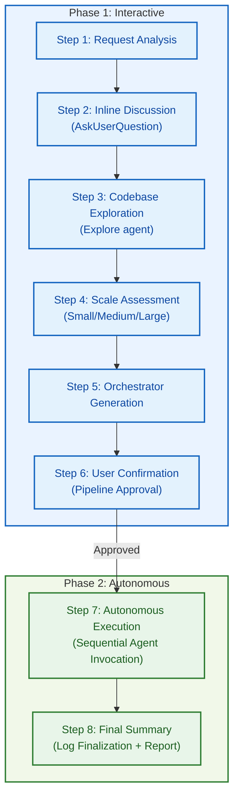

# SDD-Autopilot User Guide

**Version**: 1.2.0
**Date**: 2026-04-10

A guide for the sdd-autopilot meta-skill that automatically executes the SDD pipeline.

---

## Table of Contents

1. [Overview](#1-overview)
2. [Core Concepts](#2-core-concepts)
3. [Usage](#3-usage)
4. [Pipelines by Scale](#4-pipelines-by-scale)
5. [Usage Examples](#5-usage-examples)
6. [Artifacts](#6-artifacts)
7. [FAQ / Troubleshooting](#7-faq--troubleshooting)
8. [Codex Verification Checklist](#8-codex-verification-checklist)
9. [Related Skills](#9-related-skills)

---

## 1. Overview

**sdd-autopilot** is an **adaptive orchestrator meta-skill** that executes the SDD pipeline through a single command. Upon receiving a feature request, it handles requirements discussion, codebase exploration, scale assessment, pipeline composition, sequential agent execution, review-fix loops, testing, and spec synchronization end-to-end. The user only needs to participate in the initial requirements confirmation and pipeline approval, and sdd-autopilot carries the execution after that point.

---

## 2. Core Concepts

Three core concepts for understanding sdd-autopilot.

### 2.1 2-Phase Orchestration (Interactive -> Autonomous)

sdd-autopilot divides execution into two phases.

| Phase | Name | User Involvement | Activities |
|-------|------|-------------------|------------|
| **Phase 1** | Interactive | Required (conversation) | Requirements discussion, codebase exploration, scale assessment, orchestrator creation, user approval |
| **Phase 1.5** | Checkpoint | Required (approval) | Orchestrator review and pipeline execution approval |
| **Phase 2** | Autonomous | Not required | Sequential agent execution, review-fix loop, testing, spec synchronization |

After sufficiently confirming requirements with the user in Phase 1, Phase 2 executes the pipeline to completion **without user interruption**. Progress is reported in real-time via milestone messages.

```
[sdd-autopilot] Step 1/N: Starting feature-draft...
[sdd-autopilot] Step 1/N: feature-draft complete -- _sdd/drafts/2026-04-10_feature_draft_auth_system.md
[sdd-autopilot] Step 2/N: Starting implementation... (direct path)
[sdd-autopilot] Step 2/N: Starting implementation-plan... (expanded path only)
[sdd-autopilot] Phase Gate 1/3: implementation -> review -> fix -> validation
...
```

### 2.2 Adaptive Pipeline (Auto-selection by Small/Medium/Large Scale)

sdd-autopilot automatically determines the scale based on request analysis and codebase exploration results, then selects the appropriate pipeline. The user does not need to specify the scale manually.

| Scale | Affected Files | New Components | Spec Changes | Default Pipeline |
|-------|---------------|----------------|-------------|------------------|
| Small | 1-3 | 0-1 | None | implementation -> inline test |
| Medium | 4-10 | 1-3 | Existing section patch | feature-draft -> implementation, or on the expanded path feature-draft -> implementation-plan -> phase-gated execution |
| Large | 10+ | 3+ | New section addition possible | feature-draft -> (conditional spec-update-todo) -> implementation-plan -> per-phase impl/review/fix -> final integration review |

When quantitative criteria and qualitative criteria (complexity, dependencies, test scope) point to different scales, sdd-autopilot **selects the larger scale**.

Additional rules:

- The default planning entry for non-trivial changes is `feature-draft`.
- `implementation-plan` is not a peer alternative to `feature-draft`; it is a follow-up expansion stage used when Part 2 is not sufficient or a multi-phase gate is needed.
- `spec-update-todo` is added only when planned persistent global alignment is actually needed.
- Even on medium-scale work, if a multi-phase plan is produced, the default review-fix scope becomes `per-phase`, followed by one mandatory `final integration review`.

### 2.3 Agent Wrapper Pattern (Skill -> Agent Delegation)

In Codex, `sdd-autopilot` does not use each SDD **wrapper skill** as a direct execution unit -- instead, it invokes the corresponding custom agent from `.codex/agents/`. The wrapper skill describes the user entry point and handoff contract, while the actual execution is handled by the custom agent. State between agents is passed via file paths, and the full output of each agent is not accumulated in the parent context.

```
feature-draft agent
    | Output: _sdd/drafts/<YYYY-MM-DD>_feature_draft_<topic>.md
    +-- direct path --> implementation agent
    |                    | Output: Code files
    |                    v
    |                implementation-review agent  <-- global review-fix loop
    |
    \-- expanded path --> implementation-plan agent
                         | Output: _sdd/implementation/<YYYY-MM-DD>_implementation_plan_<topic>.md
                         v
                     implementation agent
                         | Output: Code files
                         v
                     implementation-review agent  <-- per-phase review-fix loop
                         |
                         v
                     final integration review
                         |
                         v
                     Testing (inline or ralph-loop-init)
                         |
                         v
                     spec-update-done agent
                         | Output: _sdd/spec/ updated
```

Each agent receives the **output file path** from the previous agent along with the **user's original request**. sdd-autopilot extracts only key information (output file paths, major decisions) from agent results and records them in the pipeline log.

---

## 3. Usage

### 3.1 Basic Invocation

```bash
/sdd-autopilot "feature description"
```

**Invocation examples**:

```bash
/sdd-autopilot Implement a JWT-based authentication system. Include login, logout, and token refresh.

/sdd-autopilot Implement the entire payment system. Include Stripe API integration, webhook handling, and refund logic.

/sdd-autopilot Change the login button color from blue to green.
```

**Trigger keywords**: `sdd-autopilot`, `autopilot`, `auto implement`, `end-to-end implementation`, `full pipeline`, `implement automatically`, `start to finish`

> **Tip**: Including **What**, **Why**, and **Constraints** in the feature description shortens the Phase 1 discussion and improves accuracy.

### 3.2 Full Flow (Steps 1-8)



| Step | Name | Description |
|------|------|-------------|
| 1 | **Request Analysis** | Extract feature description, technical keywords, and constraints from user input. Initial complexity prediction |
| 2 | **Inline Discussion** | 1-5 rounds of conversation to refine requirements. Each question includes a "That's enough -- please proceed" option |
| 3 | **Codebase Exploration** | Analyze project structure, related files, existing patterns, and test structure using the Explore agent |
| 4 | **Scale Assessment** | Determine Small/Medium/Large scale based on affected file count, new component count, spec change scope, etc. |
| 5 | **Orchestrator Generation** | Save a customized pipeline plan to `_sdd/pipeline/orchestrators/orchestrator_<topic>.md` |
| 6 | **User Confirmation** | Present pipeline summary; user chooses to modify/approve/cancel |
| 7 | **Autonomous Execution** | Execute the approved pipeline via sequential agent invocation. If the plan is multi-phase, enforce per-phase `implementation -> review -> fix -> validation` gates plus a final integration review |
| 8 | **Final Summary** | Finalize log, report generated/modified file list, remaining issues, and suggested follow-up actions |

### 3.3 User Role vs sdd-autopilot Role

| Step | What the User Does | What sdd-autopilot Does Automatically |
|------|---------------------|---------------------------------------|
| 1 | Enter feature request | Parse request, predict initial complexity |
| 2 | Answer questions (select options or free-form input) | Generate questions, collect/organize requirements |
| 3 | Nothing | Explore codebase, identify related files |
| 4 | Nothing | Assess scale, determine pipeline/test strategy |
| 5 | Nothing | Generate orchestrator file |
| 6 | Approve/modify/cancel pipeline | Present summary, apply modifications |
| 7 | Nothing (observe milestone messages) | Invoke agents, run review-fix loop, test, write logs |
| 8 | Review results, handle remaining issues | Finalize log, deliver final report |

> **Key point**: After approval at Step 6 (Phase 2), sdd-autopilot does not ask the user any questions. It runs autonomously until completion.

---

## 4. Pipelines by Scale

sdd-autopilot uses different agent combinations depending on the scale determined in Step 4.

### 4.1 Small (1-3 files)

**Assessment criteria**: 1-3 affected files, 0-1 new components, no spec changes, estimated code under 200 lines

**Pipeline**:

```
implementation agent -> inline test -> (done)
```

Skips feature-draft, implementation-plan, and spec-update-done. Applies to single function/class modifications, bug fixes, minor UI adjustments, etc.

**Example request**: "Change the login button color from blue to green"

### 4.2 Medium (4-10 files)

**Assessment criteria**: 4-10 affected files, 1-3 new components, existing spec section patch needed, estimated code 200-1000 lines

Medium-scale work splits into two paths.

**A. Single-phase medium direct path**

```text
feature-draft agent -> implementation agent
-> global review-fix loop (max 3 rounds) -> inline test -> spec-update-done agent
```

- The default planning entry is `feature-draft`
- Skip `implementation-plan` when feature-draft Part 2 already provides enough task/dependency/validation detail
- Fits bounded feature work that spans several files but does not need phase gates

**B. Multi-phase medium expanded path**

```text
feature-draft agent -> implementation-plan agent
-> Phase 1: implementation -> review-fix -> validation
-> Phase 2..N: implementation -> review-fix -> validation
-> final integration review -> inline test -> spec-update-done agent
```

- Use `implementation-plan` only when Part 2 is not sufficient or explicit phase boundaries are needed
- Even on medium-scale work, once a multi-phase plan exists, the default review-fix scope becomes `per-phase`
- `medium` issues block phase exit unless an explicit carry-over policy allows them

**Example request**: "Implement a JWT-based authentication system. Include login, logout, and token refresh."

### 4.3 Large (10+ files)

**Assessment criteria**: 10+ affected files, 3+ new components, new spec section addition needed, estimated code 1000+ lines

**Pipeline**:

```text
feature-draft agent -> (conditional) spec-update-todo agent -> implementation-plan agent
-> Phase 1: implementation -> review-fix -> validation
-> Phase 2..N: implementation -> review-fix -> validation
-> final integration review
-> testing (inline or ralph-loop-init) -> spec-update-done agent
-> spec-review agent (optional)
```

Applies to architecture-level changes, large-scale features affecting the entire system, and tasks requiring E2E testing. `spec-update-todo` is added only when planned persistent global spec alignment is actually needed.

**Example request**: "Implement the entire payment system. Include Stripe API integration, webhook handling, and refund logic."

---

## 5. Usage Examples

### 5.1 Small -- "Login Button Color Change"

```
User: /sdd-autopilot Change the login button color from blue to green

[sdd-autopilot] Request analysis: Small scale predicted (1 UI component modification)
[sdd-autopilot] Question: "Which file contains the login button?"
  1. "src/components/LoginButton.tsx"
  2. "I'm not sure -- please find it"
  3. "That's enough -- please proceed"

User: 2

[sdd-autopilot] Codebase exploration complete: src/components/LoginButton.tsx identified
[sdd-autopilot] Scale assessment: Small (1 file, no spec changes)
[sdd-autopilot] Pipeline: implementation -> inline test

[sdd-autopilot] Pipeline summary:
  Scale: Small | Agents: 1 | Test: inline

User: "Looks good -- go ahead"

[sdd-autopilot] Step 1/1: Starting implementation...
[sdd-autopilot] Step 1/1: implementation complete -- src/components/LoginButton.tsx modified
[sdd-autopilot] Tests passed (3/3)
[sdd-autopilot] Done -- Total elapsed time: 2 min
```

### 5.2 Medium -- "Add JWT Authentication System"

```
User: /sdd-autopilot Implement a JWT-based authentication system. Include login, logout, and token refresh.

[sdd-autopilot] Request analysis: Medium scale predicted (multiple components mentioned)
[sdd-autopilot] Question: "What password hashing algorithm and token expiration policy?"
  1. "bcrypt, access 1 hour / refresh 7 days"
  2. "Use defaults"
  3. "That's enough -- please proceed"

User: 1

[sdd-autopilot] Question: "Extend the existing User model or create a new one?"
  1. "Extend existing User model"
  2. "Create new Auth model"
  3. "That's enough -- please proceed"

User: 1

[sdd-autopilot] Codebase exploration complete: Express.js project, 7 related files identified
[sdd-autopilot] Scale assessment: Medium (7 files, 3 new components, spec patch needed)

[sdd-autopilot] Pipeline summary:
  Scale: Medium | Path: single-phase direct | Agents: 4 | Max review rounds: 3 | Test: inline

User: "Looks good -- go ahead"

[sdd-autopilot] Step 1/4: feature-draft complete -- _sdd/drafts/2026-04-10_feature_draft_jwt_auth.md
[sdd-autopilot] Step 2/4: implementation complete -- 7 files created/modified
[sdd-autopilot] Review-Fix Round 1/3: 1 critical, 1 high -- fixing...
[sdd-autopilot] Review-Fix Round 2/3: 0 critical, 0 high, 0 medium -- review passed
[sdd-autopilot] Tests passed (18/18)
[sdd-autopilot] Step 4/4: spec-update-done complete -- _sdd/spec/main.md updated
[sdd-autopilot] Done -- Total elapsed time: 20 min
```

### 5.3 Large -- "Full Payment System Implementation"

```
User: /sdd-autopilot Implement the entire payment system. Include Stripe API integration, webhook handling, and refund logic.

[sdd-autopilot] Request analysis: Large scale predicted (system-level changes)
[sdd-autopilot] Question 1: "Payment methods? (card only / card + virtual account / all)"
[sdd-autopilot] Question 2: "Payment status management policy?"
[sdd-autopilot] Question 3: "Test environment? (Stripe test mode / mock)"
[sdd-autopilot] Question 4: "Webhook security verification method?"
... (3-5 rounds of discussion)

[sdd-autopilot] Codebase exploration complete: 15 files affected, 5 new modules needed
[sdd-autopilot] Scale assessment: Large (15+ files, 5 new components, new spec section)

[sdd-autopilot] Pipeline summary:
  Scale: Large | Path: multi-phase expanded | Agents: 5 + phase gates | Max review rounds: 3 per phase | Test: inline

User: "Looks good -- go ahead"

[sdd-autopilot] Step 1/5: feature-draft complete
[sdd-autopilot] Step 2/5: spec-update-todo complete -- payment system section added to spec
[sdd-autopilot] Step 3/5: implementation-plan complete -- split into 3 phases
[sdd-autopilot] Phase Gate 1/3: implementation complete -- payment domain + Stripe client
[sdd-autopilot] Phase Gate 1/3 Review-Fix 1/3: 2 medium issues -- phase exit blocked
[sdd-autopilot] Phase Gate 1/3 Review-Fix 2/3: 0 critical, 0 high, 0 medium -- phase passed
[sdd-autopilot] Phase Gate 2/3: implementation + review-fix complete -- payment/webhook flow passed
[sdd-autopilot] Phase Gate 3/3: implementation + review-fix complete -- refund/reconciliation flow passed
[sdd-autopilot] Final Integration Review: 0 cross-phase regressions
[sdd-autopilot] Step 4/5: Tests passed (32/32)
[sdd-autopilot] Step 5/5: spec-update-done complete
[sdd-autopilot] Done -- Total elapsed time: 45 min
```

---

## 6. Artifacts

sdd-autopilot generates the following files during pipeline execution.

### 6.1 Pipeline Files

| File | Path | Description |
|------|------|-------------|
| Orchestrator | `_sdd/pipeline/orchestrators/orchestrator_<topic>.md` | The currently authoritative pipeline plan. Includes step order, handoff rules, review-fix policy, and phase-gate rules |
| Execution log | `_sdd/pipeline/log_<topic>_<timestamp>.md` | Start/completion times, output paths, key decisions, and error records for each step |
| Final report | `_sdd/pipeline/report_<topic>_<timestamp>.md` | Completed tasks, test results, review-fix results, and suggested follow-up work |

- `<topic>`: Feature name converted to English snake_case (e.g., "auth system" -> `auth_system`)
- `<timestamp>`: `YYYYMMDD_HHmmss` format

In Codex, this orchestrator directly spawns custom agents from `.codex/agents/`. Before approval, it reads both `_sdd/env.md` and `.codex/config.toml` to check `agents.max_depth`, `agents.max_threads`, and test/execution resource gaps.

### 6.2 Per-Agent Output

| Agent | Output Path | Content |
|-------|-------------|---------|
| feature-draft | `_sdd/drafts/<YYYY-MM-DD>_feature_draft_<topic>.md` | Temporary spec + implementation input draft |
| spec-update-todo | `_sdd/spec/main.md` (updated) | Pre-reflect planned features in spec |
| implementation-plan | `_sdd/implementation/<YYYY-MM-DD>_implementation_plan_<topic>.md` | Detailed implementation plan + phase metadata |
| implementation | Code files | Implemented source code + test files |
| implementation-review | Text output | Review report (critical/high/medium/low issues) |
| spec-update-done | `_sdd/spec/main.md` (updated) | Synchronize implementation results to spec |
| spec-review | `_sdd/spec/SPEC_REVIEW_REPORT.md` | Spec quality/drift report (optional) |

### 6.3 Directory Structure Example

```
project_root/
├── .codex/
│   ├── config.toml
│   └── agents/
│       ├── feature-draft.toml
│       ├── implementation-plan.toml
│       ├── implementation.toml
│       ├── implementation-review.toml
│       ├── spec-update-todo.toml
│       ├── spec-update-done.toml
│       ├── spec-review.toml
│       └── ralph-loop-init.toml
└── _sdd/
    ├── pipeline/
    │   ├── log_jwt_auth_20260410_143000.md              # Execution log
    │   ├── report_jwt_auth_20260410_143000.md           # Final report
    │   └── orchestrators/
    │       └── orchestrator_jwt_auth.md                 # Active orchestrator
    ├── drafts/
    │   └── 2026-04-10_feature_draft_jwt_auth.md        # feature-draft output
    ├── implementation/
    │   └── 2026-04-10_implementation_plan_jwt_auth.md  # Implementation plan
    └── spec/
        └── main.md                                      # Synchronized spec
```

---

## 7. FAQ / Troubleshooting

### Q1. sdd-autopilot vs direct individual skill invocation -- when to use which?

| Situation | Recommendation |
|-----------|----------------|
| "Implement this feature from start to finish" | `/sdd-autopilot` |
| "Just review the spec" | Invoke `/spec-review` directly |
| "I already have an implementation plan, just implement it" | Invoke `/implementation` directly |
| "I just want to discuss" | Invoke `/discussion` directly |
| When multiple skills need to be chained automatically | `/sdd-autopilot` |
| Tasks completable with a single skill | Direct individual skill invocation |

**Decision rule**: If you need to invoke 2 or more skills in sequence, use sdd-autopilot. If a single skill is sufficient, direct invocation is faster.

### Q2. What happens if the pipeline fails midway?

sdd-autopilot **retries up to 3 times** on agent failure. If retries also fail:

- **Critical steps** (`feature-draft`, `implementation-plan`, `implementation`) failure: The pipeline is halted and partial artifacts along with recommended follow-up actions are reported.
- **Conditionally critical steps** (`implementation-review`) failure: In pipelines that include review, this is treated as a critical step. If the review-fix loop cannot be completed, the pipeline is halted.
- **Non-critical steps** (`spec-update-done`, `spec-review`, `ralph-loop-init`) failure: Skipped or an alternative strategy is used; the failure reason and manual follow-up actions are recorded in the log.

When the pipeline is halted:
1. Check the failure cause in `_sdd/pipeline/log_*.md`.
2. Artifacts from completed steps are preserved.
3. You can manually continue by individually invoking the agent for the failed step.

### Q3. Can I modify the generated orchestrator?

Yes. At Step 6 (User Confirmation), you can choose the following options:

- **"I'd like to modify the pipeline"**: Describe your modifications in text and sdd-autopilot will update the orchestrator.
- **"I'd like to see the full orchestrator"**: The full content is displayed, then re-confirmed.

The active orchestrator being modified is maintained at `_sdd/pipeline/orchestrators/orchestrator_<topic>.md`. During execution, the pipeline keeps reading this file as the authoritative contract and handoff source.

In Codex, this orchestrator directly uses custom agents from `.codex/agents/`. It does not treat skill names themselves as sub-execution units.

### Q4. What if sdd-autopilot misjudges the scale?

When reviewing the pipeline summary at Step 6, if you feel the scale is incorrect, select "I'd like to modify the pipeline" to change the scale and agent combination.

### Q5. Can I use sdd-autopilot on a project without specs?

Yes. However, sdd-autopilot adjusts the pipeline based on the presence of `_sdd/spec/`. If no spec exists, the `spec-update-todo` and `spec-update-done` steps may be skipped. To fully benefit from the spec-based workflow, it is recommended to first create a spec using `/spec-create`.

---

## 8. Codex Verification Checklist

In Codex, it is important to verify through manual dry-runs that `sdd-autopilot` and the custom agent backbone work together not just in documentation/design but also in actual runtime.

> This section is the operational checklist for confirming the `sdd-autopilot` contract in Codex runtime. Use it when checking the wrapper -> custom agent -> nested `write_phased` -> autopilot dry-run path.

### 8.1 Wrapper -> Agent Smoke Test

- Targets: `/feature-draft`, `/implementation-plan`, `/implementation`, `/implementation-review`, `/spec-review`
- Verify:
  - Does the wrapper skill describe only the corresponding custom agent name and basic artifact contract?
  - Does the wrapper skill not contain lengthy workflow body text?

### 8.2 Custom Agent Direct Execution Check

- Targets: `feature_draft`, `implementation_plan`, `implementation_review`
- Verify:
  - Do `.codex/agents/*.toml` files have `name`, `description`, `developer_instructions`?
  - Does `developer_instructions` contain a self-contained workflow without depending on local skill file paths?
  - Are hard rules, input/output contract, process, and fallback rules included within the agent?

### 8.3 Nested `write_phased` Check

- Targets: `feature_draft`, `implementation_plan`, `implementation_review`, `spec_review`
- Verify:
  - Are nested `write_phased` usage rules reflected in both skill and agent?
  - Is `agents.max_depth >= 2` set in `.codex/config.toml`?

### 8.4 Autopilot Dry-Run

- Small scenario:
  - Simple change requiring only `implementation`
- Medium single-phase scenario:
  - `feature_draft -> implementation -> implementation_review -> spec_update_done`
- Medium/large expanded scenario:
  - `feature_draft -> implementation_plan -> phase gate execution -> final integration review -> spec_update_done`

Verify:

- The generated orchestrator uses custom agent names, not skill names
- The generated orchestrator is saved to `_sdd/pipeline/orchestrators/orchestrator_<topic>.md`
- `_sdd/pipeline/log_*.md` is created/updated
- `_sdd/pipeline/report_*.md` is created
- If a multi-phase plan exists, the orchestrator records the phase boundary source, carry-over policy, and final integration review

### 8.5 Pre-flight Check

- Does `_sdd/env.md` exist?
- Does `.codex/config.toml` exist?
- Do `agents.max_threads` and `agents.max_depth` match the pipeline requirements?
- If nested writing is needed but `max_depth < 2`, is this reported as a risk before approval?

### 8.6 Quick Dry-Run Checklist (5-10 min)

If you want to quickly perform a minimum execution check in the actual Codex app/runtime, follow this order.

#### A. Wrapper Smoke

- Execution example:
  - `$feature-draft Create a draft for a simple settings UI improvement`
- Verify:
  - Is `_sdd/drafts/feature_draft_<topic>.md` created?
  - Does the result description match the wrapper skill contract?
  - Does the artifact structure follow the Part 1 / Part 2 format?

#### B. Nested `write_phased`

- Execution example:
  - `$implementation-plan Create an implementation plan for a medium-scale feature that requires a lengthy plan`
- Note:
  - Use this check for the follow-up expansion path after `feature-draft`, or for the standalone exception path when a feature draft, temporary spec, or prior plan artifact already exists.
- Verify:
  - Is the long output organized using skeleton -> fill or an equivalent 2-phase writing strategy?
  - Does the result remain a complete document without being excessively truncated?
  - If needed, does it not conflict with the `max_depth = 2` prerequisite in `.codex/config.toml`?

#### C. Autopilot Medium Run

- Execution example:
  - `$sdd-autopilot Run user profile editing feature from spec organization through implementation review and spec sync`
- Verify:
  - Does the pre-flight before approval read both `_sdd/env.md` and `.codex/config.toml` and summarize risks?
  - Does the generated orchestrator describe using custom agent names rather than skill names?
  - Is `_sdd/pipeline/orchestrators/orchestrator_<topic>.md` maintained in active state?
  - Is `_sdd/pipeline/log_<topic>_<timestamp>.md` created/updated?
  - Is `_sdd/pipeline/report_<topic>_<timestamp>.md` created?
  - If a multi-phase plan exists, do the logs show phase gates and a final integration review?

---

## 9. Related Skills

The agents that sdd-autopilot invokes internally can also be used directly as individual skills.

| Skill | Invocation | Purpose |
|-------|-----------|---------|
| `/feature-draft` | `/feature-draft "feature description"` | Generate spec patch draft + implementation plan |
| `/implementation-plan` | `/implementation-plan` | Create the phase-by-phase follow-up plan after `feature-draft`, or refine an existing draft/plan in the standalone exception path |
| `/implementation` | `/implementation` | TDD-based code implementation |
| `/implementation-review` | `/implementation-review` | Verify implementation against plan |
| `/spec-update-todo` | `/spec-update-todo` | Pre-reflect planned features in spec |
| `/spec-update-done` | `/spec-update-done` | Synchronize spec after implementation completion |
| `/spec-review` | `/spec-review` | Spec quality/drift verification (report only) |
| `/ralph-loop-init` | `/ralph-loop-init` | Create automated debugging loop for long-running tests |
| `/discussion` | `/discussion "topic"` | Pre-implementation decision-making discussion |

> For detailed usage and examples of each skill, see [SDD_WORKFLOW.md](../SDD_WORKFLOW.md) and [SDD_QUICK_START.md](../SDD_QUICK_START.md).
