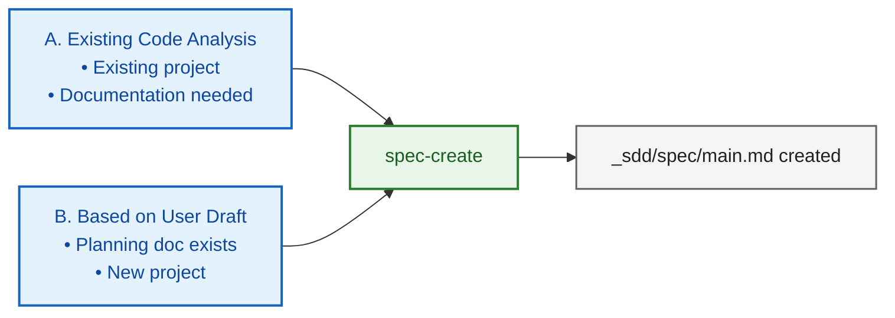

# SDD Quick Start Guide

Quick reference for Spec-Driven Development (SDD)

---

> **Two-Layer Spec Structure**: SDD manages documents as **Global Spec** (main.md = Single Source of Truth) and **Temporary Specs** (feature_draft, spec_patch_draft = change proposals). Create the temporary spec first, then merge it into the global spec after verification. Details: [SDD_CONCEPT.md](SDD_CONCEPT.md)

> **Key to Using Skills**: Skills are structured workflow templates, not magic. **The quality of your input determines the quality of the output.** When invoking a skill, specify **What** (what you want to build), **Why** (why it is needed), and **Constraints** (constraints/boundary conditions).
>
> Examples comparing good vs. bad inputs for each skill, plus a detailed guide: [SDD_WORKFLOW.md > 2. Effective Skill Usage](SDD_WORKFLOW.md#2-effective-skill-usage)

---

## Available Skills

For each skill's trigger keywords and usage examples, see [SDD_WORKFLOW.md > Appendix: Skill Descriptions](SDD_WORKFLOW.md#appendix-skill-descriptions).

| Skill | Purpose |
|------|------|
| `/spec-create` | Generate a spec from code analysis or a draft |
| `/feature-draft` | Generate a spec patch draft + implementation plan in one step |
| `/spec-update-todo` | Pre-reflect new features/requirements in the spec (prevents drift during large implementations) |
| `/spec-update-done` | Synchronize the spec with code after implementation |
| `/spec-review` | Optional supplementary verification (report only, does not modify the spec) |
| `/spec-summary` | Generate a spec summary (for status overview / onboarding) |
| `/spec-rewrite` | Restructure an overly long/complex spec (file splitting / appendix relocation) |
| `/pr-spec-patch` | Compare a PR against the spec and generate a patch draft |
| `/pr-review` | Verify and judge the PR implementation against the spec/patch draft |
| `/implementation-plan` | Generate a phase-based implementation plan (for large implementations) |
| `/implementation` | Execute TDD-based implementation |
| `/implementation-review` | Verify implementation against the plan (phase-level verification for large projects) |
| `/ralph-loop-init` | Create an automated ML training debug loop |
| `/discussion` | Structured decision-making discussion: context gathering + option comparison + decisions/open questions/action items |

> (caveat) The `/discussion` skill is only supported in Claude Code.

### When to Use `/discussion` First

- When requirements or direction are still ambiguous
- When you need to quickly align on trade-offs between technical options
- When you want to organize risks and verification points before implementation

Output: key discussion points, decisions made, open questions, action items, (optional) Save Handoff

---

## Spec Creation Starting Points



---

## Choosing an Implementation Path

| Scale | Workflow |
|------|-----------|
| **Large** | feature-draft → spec-update-todo → implementation-plan → implementation (repeat per phase) → implementation-review → spec-update-done (→ spec-review) |
| **Medium** | feature-draft → implementation → spec-update-done |
| **Small** | Direct implementation (→ implementation-review) (→ spec-update-done) |

> **Note**: If no spec exists, first create one with `/spec-create`.

### spec-review Usage Principles (Optional)

- In the default loop, synchronize with `/spec-update-done`.
- Use `/spec-review` only as a supplementary check in the following cases:
  - When results feel incorrect or ambiguous
  - For a final verification after completing a large update through `/spec-update-done`
  - Output: `_sdd/spec/SPEC_REVIEW_REPORT.md` (generates a report only)

---

## Quick Start Scenarios

### 1. Documenting an Existing Project

```bash
/spec-create
# Analyze the codebase and generate a spec
```

### 2. Pre-Implementation Decision Discussion

```bash
/discussion
# Select topic → Gather context → Iterative Q&A → Summary output
```

Follow-up skill connections:
- `/feature-draft`: Draft a feature based on the agreed direction
- `/implementation-plan`: Create a phase plan based on the decided architecture
- `/spec-create`: Generate a spec for a new project with organized requirements

> Discussion summaries can optionally be saved to `_sdd/discussion/discussion_<title>.md` at the user's discretion.

### 3. Large-Scale Feature Implementation

```bash
# 1. Generate spec patch draft + implementation plan
/feature-draft

# 2. Pre-reflect in the spec (prevent drift)
/spec-update-todo

# 3. Create phase-based implementation plan
/implementation-plan

# 4. Implement (repeat per phase)
/implementation

# 5. Phase-level verification
/implementation-review

# 6. Synchronize the spec
/spec-update-done

# 7. (Optional) Final supplementary verification
/spec-review
```

> If no spec exists, run `/spec-create` first.

### 4. Medium-Scale Feature Implementation

```bash
# 1. Generate spec patch draft + implementation plan
/feature-draft

# 2. Implement
/implementation

# 3. Synchronize the spec
/spec-update-done
```

> Since `feature-draft` generates both the spec patch draft (Part 1) and the implementation plan (Part 2) in one step, a separate `implementation-plan` is unnecessary.

### 5. Small-Scale / Bug Fix

```bash
# 1. Request the fix directly
"Fix this bug"

# 2. (Optional) Verification
/implementation-review

# 3. (Optional) Synchronize the spec if affected
/spec-update-done
```

### 6. ML Training Debug Loop

```bash
/ralph-loop-init
# Create an automated training debug loop structure in the ralph/ directory
```

> Creates a loop structure for LLM-based automated ML training debugging.

### 7. PR-Based Spec Patch and Review

```bash
/pr-spec-patch → (refine through conversation) → /pr-review → (reflect spec changes via /spec-update-todo) → (if needed) /spec-update-done
```

**Important Rule (Skill-Based)**: Spec changes derived from a PR **must** be reflected using `/spec-update-todo`.
(Move the contents of `_sdd/pr/spec_patch_draft.md` to `_sdd/spec/user_draft.md` or `_sdd/spec/user_spec.md` before running)

### 8. Spec Status Overview

```bash
/spec-summary
# Generate SUMMARY.md (includes progress, issues, and recommendations)
```

---

## Directory Structure

```
_sdd/
├── spec/
│   ├── main.md                  # Main spec (or <project>.md)
│   ├── user_spec.md             # Spec update input (free format allowed)
│   ├── user_draft.md            # Spec update input (recommended format)
│   ├── _processed_user_spec.md  # Processed input archive (renamed by /spec-update-todo)
│   ├── _processed_user_draft.md # Processed input archive (renamed by /spec-update-todo)
│   ├── SUMMARY.md               # Spec summary (/spec-summary)
│   ├── SPEC_REVIEW_REPORT.md    # Spec review report (/spec-review)
│   ├── DECISION_LOG.md          # (Optional) Decision/rationale log
│   └── prev/                    # PREV_* backups
│
├── pr/
│   ├── spec_patch_draft.md      # PR-based spec patch draft
│   ├── PR_REVIEW.md             # PR review report
│   └── prev/                    # PREV_* backups
│
├── implementation/
│   ├── IMPLEMENTATION_PLAN.md   # Implementation plan
│   ├── IMPLEMENTATION_PROGRESS.md
│   ├── IMPLEMENTATION_REVIEW.md
│   ├── user_input.md            # Implementation request (input)
│   └── prev/                    # PREV_* backups
│
├── drafts/                      # feature-draft output
│   ├── feature_draft_*.md       # Spec patch + implementation plan combined file
│   └── prev/                    # Archive
│
└── env.md                       # Environment configuration
```

Backup files are saved in each area's `prev/` directory:
- `_sdd/spec/prev/PREV_<filename>_<timestamp>.md`
- `_sdd/pr/prev/PREV_<filename>_<timestamp>.md`
- `_sdd/implementation/prev/PREV_<filename>_<timestamp>.md`

---

## Status Markers

| Marker | Meaning |
|------|------|
| 📋 | Planned |
| 🚧 | In Progress |
| ✅ | Completed |
| ⏸️ | On Hold |

---

## Path Selection Guide

| Situation | Path |
|------|------|
| Large-scale feature, architecture change | Large |
| Medium-scale feature | Medium |
| Bug fix, urgent hotfix | Small |
| ML training debug | ralph-loop-init |

---

## More Details

Full workflow guide: `SDD_WORKFLOW.md`
