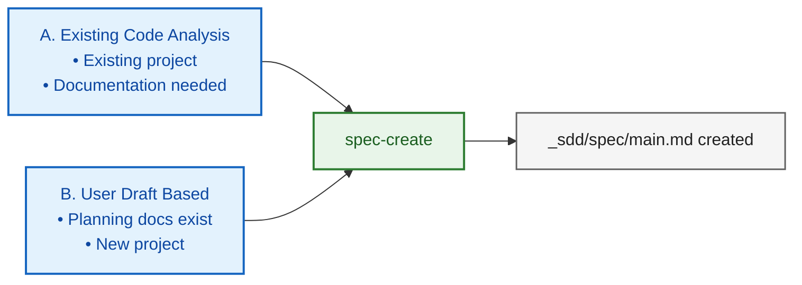

# SDD Quick Start Guide

Spec-Driven Development (SDD) Quick Reference

---

> **Two-Level Spec Structure**: SDD manages documents with a **global spec** (main.md = Single Source of Truth) and **temporary specs** (feature_draft, spec_patch_draft = change proposals). Create temporary specs first, then merge into the global spec after validation. Details: [SDD_CONCEPT.md](SDD_CONCEPT.md)

> **What a Spec Is**: In SDD, a spec is not just a manual. It is a whitepaper-like reference document that captures background, motivation, core design, expected results, and code-grounded evidence together. Details: [SDD_SPEC_DEFINITION.md](SDD_SPEC_DEFINITION.md)

> **Key to Using Skills**: Skills are structured workflow templates, not magic. **Input quality determines output quality.** When invoking a skill, specify **What** (what to build), **Why** (why it's needed), and **Constraints** (constraints/boundary conditions).
>
> Good/bad input comparison examples and detailed guide per skill: [SDD_WORKFLOW.md > 2. Effective Skill Usage](SDD_WORKFLOW.md#2-effective-skill-usage)

---

## Available Skills

See [SDD_WORKFLOW.md > Appendix: Skill Descriptions](SDD_WORKFLOW.md#appendix-skill-descriptions) for trigger keywords and usage examples per skill.

| Skill | Purpose |
|-------|---------|
| `/spec-create` | Generate spec from code analysis or draft |
| `/feature-draft` | Generate spec patch draft + implementation plan in one step |
| `/spec-update-todo` | Pre-register new features/requirements in spec (prevents drift during large-scale implementation) |
| `/spec-update-done` | Sync spec with code after implementation |
| `/spec-review` | Optional auxiliary verification (report only, no spec modification) |
| `/spec-summary` | Generate spec summary (for status overview/onboarding) |
| `/spec-rewrite` | Restructure overly long/complex specs (file splitting/appendix migration) |
| `/spec-upgrade` | Convert old-format specs to whitepaper §1-§8 structure (migration) |
| `/pr-spec-patch` | Generate patch draft by comparing PR with spec |
| `/pr-review` | Verify PR implementation against spec/patch draft and render verdict |
| `/implementation-plan` | Generate phase-by-phase implementation plan (for large-scale) |
| `/implementation` | Execute TDD-based implementation |
| `/implementation-review` | Verify implementation against plan (phase-by-phase for large-scale) |
| `/ralph-loop-init` | Generate automated debug loop for long-running processes |
| `/discussion` | Structured decision-making discussion: context gathering + option comparison + decisions/open questions/action items |
| `/guide-create` | Generate feature-specific implementation/review guide from spec and code |
| `/sdd-autopilot` | Autonomous orchestration of the full SDD pipeline |

### When to Use `/discussion` First

- When requirements/direction are still unclear
- When technical trade-offs need rapid consensus
- When risks/verification points need to be organized before implementation

Output: Key discussion points, decisions, open questions, action items, (optional) Save Handoff

---

## Starting Point for Spec Creation



---

## Choosing an Implementation Path

For most feature implementations, start with `/sdd-autopilot`. If direction is unclear, run `/discussion` first to align, then call `/sdd-autopilot`.

```bash
# When direction is clear
/sdd-autopilot Implement this feature: [feature description]

# When direction is unclear
/discussion → (after alignment) → /sdd-autopilot
```

To manually compose individual skills, use the scale-based paths below:

| Scale | Workflow |
|-------|----------|
| **Large** | feature-draft → spec-update-todo → implementation-plan → implementation (phase iteration) → implementation-review → spec-update-done (→ spec-review) |
| **Medium** | feature-draft → implementation → spec-update-done |
| **Small** | Direct implementation (→ implementation-review) (→ spec-update-done) |

> **Note**: If no spec exists, first create one with `/spec-create`.

### spec-review Usage Principle (Optional)

- The primary loop uses `/spec-update-done` for synchronization.
- `/spec-review` is used as auxiliary support only in these cases:
  - When results seem unusual or ambiguous
  - For final verification after completing a large-scale update with `/spec-update-done`
  - Output: `_sdd/spec/SPEC_REVIEW_REPORT.md` (report only)

---

## Quick Start Scenarios

### 1. Documenting an Existing Project

```bash
/spec-create
# Analyze codebase and generate spec
```

### 2. Pre-Implementation Decision Discussion

```bash
/discussion
# Topic selection → Context gathering → Iterative Q&A → Summary output
```

Follow-up skill connections:
- `/feature-draft`: Draft feature based on agreed direction
- `/implementation-plan`: Build phase plan based on decided structure
- `/spec-create`: Generate spec for new project with organized requirements

> Discussion summaries can optionally be saved as `_sdd/discussion/discussion_<title>.md`.

### 3. Automated Orchestration (Autopilot) — Recommended

The **default path** for most feature implementations. Automatically determines skill combinations and runs the full pipeline.

```bash
/sdd-autopilot
Implement this feature: [feature description]
# Runs the full pipeline from requirements analysis to spec sync
```

> To manually compose individual skills, see scenarios 4–6 below.

### 4. Large-Scale Feature Implementation (Manual)

```bash
# 1. Generate spec patch draft + implementation plan
/feature-draft

# 2. Pre-register in spec (prevent drift)
/spec-update-todo

# 3. Create phase-by-phase implementation plan
/implementation-plan

# 4. Implement (iterate per phase)
/implementation

# 5. Phase-by-phase verification
/implementation-review

# 6. Sync spec
/spec-update-done

# 7. (Optional) Final auxiliary verification
/spec-review
```

> If no spec exists, run `/spec-create` first.

### 5. Medium-Scale Feature Implementation (Manual)

```bash
# 1. Generate spec patch draft + implementation plan
/feature-draft

# 2. Implement
/implementation

# 3. Sync spec
/spec-update-done
```

> `feature-draft` generates both the spec patch draft (Part 1) and implementation plan (Part 2) in one step, so a separate `implementation-plan` is unnecessary.

### 6. Small-Scale / Bug Fixes

```bash
# 1. Direct fix request
"Fix this bug"

# 2. (Optional) Verification
/implementation-review

# 3. (Optional) Sync spec if affected
/spec-update-done
```

### 7. ML Training Debug Loop

```bash
/ralph-loop-init
# Generate automated training debug loop structure in ralph/ directory
```

> Generates an LLM-based automated debug loop for long-running processes.

### 8. PR-Based Spec Patch and Review

```bash
/pr-spec-patch → (refine via conversation) → /pr-review → (spec reflection via /spec-update-todo) → (if needed) /spec-update-done
```

**Important rule (per skill)**: Spec change reflection from PRs **must** be done via `/spec-update-todo`.
(Move contents from `_sdd/pr/spec_patch_draft.md` to `_sdd/spec/user_draft.md` or `_sdd/spec/user_spec.md` and execute)

### 9. Feature Guide Generation

```bash
/guide-create
# Analyze spec and code to generate feature-specific implementation/review guide
# Output: _sdd/guides/guide_<slug>.md
```

> If a spec exists, guides are generated based on the spec; if only code exists, guides are generated with Low confidence.

### 10. Spec Status Overview

```bash
/spec-summary
# Generate SUMMARY.md (includes progress, issues, recommendations)
```

---

## Directory Structure

```
_sdd/
├── spec/
│   ├── main.md                  # Main spec (or <project>.md)
│   ├── user_spec.md             # Spec update input (free format)
│   ├── user_draft.md            # Spec update input (recommended format)
│   ├── _processed_user_spec.md  # Processed input archive (renamed by /spec-update-todo)
│   ├── _processed_user_draft.md # Processed input archive (renamed by /spec-update-todo)
│   ├── SUMMARY.md               # Spec summary (/spec-summary)
│   ├── SPEC_REVIEW_REPORT.md    # Spec review report (/spec-review)
│   ├── DECISION_LOG.md          # (Optional) Decision/rationale records
│   └── prev/                    # PREV_* backups
│
├── pr/
│   ├── spec_patch_draft.md      # PR-based spec patch draft
│   ├── PR_REVIEW.md             # PR review report
│   └── prev/                    # PREV_* backups
│
├── implementation/
│   ├── IMPLEMENTATION_PLAN.md   # Implementation plan
│   ├── IMPLEMENTATION_PROGRESS.md
│   ├── IMPLEMENTATION_REVIEW.md
│   ├── user_input.md            # Implementation request (input)
│   └── prev/                    # PREV_* backups
│
├── drafts/                      # feature-draft output
│   ├── feature_draft_*.md       # Spec patch + implementation plan combined file
│   └── prev/                    # Archive
│
├── guides/                      # guide-create output
│   ├── guide_<slug>.md          # Feature-specific implementation/review guide
│   └── prev/                    # PREV_* backups
│
└── env.md                       # Environment configuration
```

Backup files are saved in each area's `prev/`:
- `_sdd/spec/prev/PREV_<filename>_<timestamp>.md`
- `_sdd/pr/prev/PREV_<filename>_<timestamp>.md`
- `_sdd/implementation/prev/PREV_<filename>_<timestamp>.md`

---

## Status Markers

| Marker | Meaning |
|--------|---------|
| 📋 | Planned |
| 🚧 | In Progress |
| ✅ | Completed |
| ⏸️ | On Hold |

---

## Path Selection Guide

| Situation | Path |
|-----------|------|
| Large-scale features, architecture changes | Large |
| Medium-scale features | Medium |
| Bug fixes, urgent hotfixes | Small |
| Long-running process debug (ML, e2e, build, etc.) | ralph-loop-init |
| **Full automation (recommended)** | **sdd-autopilot** |

---

## More Information

Full workflow guide: `SDD_WORKFLOW.md`
