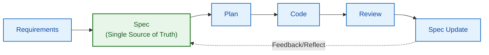
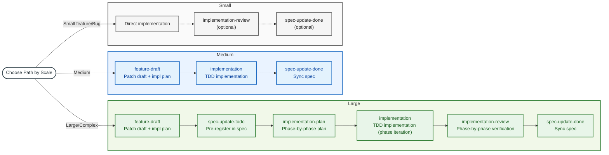
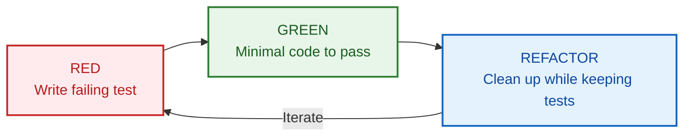
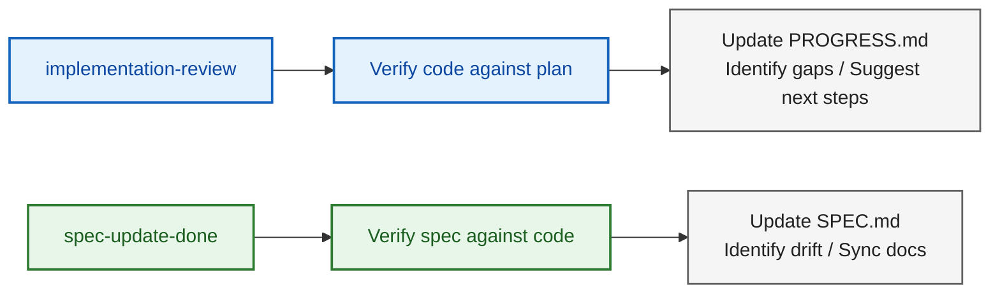
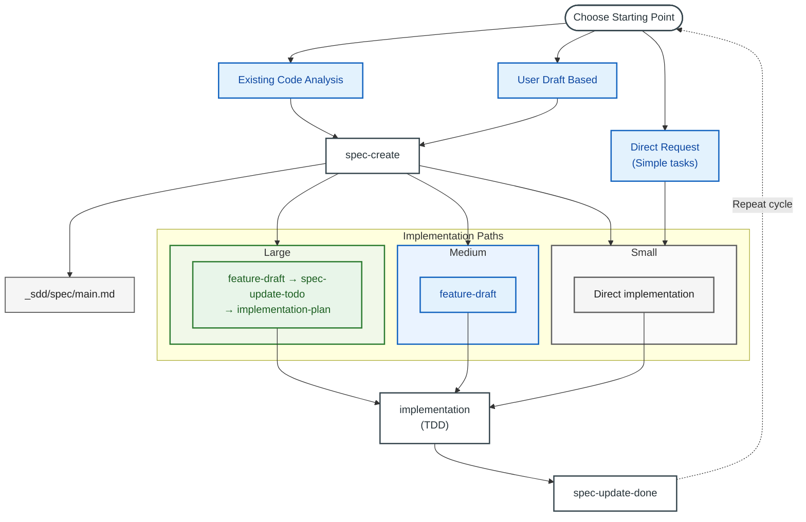

# Spec-Driven Development (SDD) Workflow Guide

**Version**: 1.4.0
**Date**: 2026-03-04

A comprehensive guide to SDD skills for software development with Claude.

---

## Table of Contents

1. [Core Concepts](#1-core-concepts)
2. [Effective Skill Usage](#2-effective-skill-usage)
3. [Getting Started](#3-getting-started)
4. [Implementation & Spec Maintenance](#4-implementation--spec-maintenance)
5. [Review Process](#5-review-process)
6. [Long-Running Debugging — Ralph Loop](#6-long-running-debugging--ralph-loop)
7. [Quick Reference](#7-quick-reference)

---

## 1. Core Concepts

### What is Spec-Driven Development (SDD)?

Spec-Driven Development (SDD) is a methodology where the **spec document** serves as the Single Source of Truth throughout the entire software development lifecycle. It bridges the gap between requirements and implementation by maintaining a living document that evolves alongside the code.

### Two-Level Spec Structure

SDD manages documents in two levels: the **global spec** and **temporary specs**.

- **Global Spec** (`_sdd/spec/main.md`): The project's Single Source of Truth, replacing `CLAUDE.md`. Contains all project information including goals, architecture, and component details. All skills operate based on this document.
- **Temporary Specs** (`feature_draft`, `spec_patch_draft`, `user_draft`): **Change proposals** for the global spec. Like Git feature branches, they are created first, validated, then merged into the global spec and archived.

> Detailed explanation of the two-level structure and lifecycle: [SDD_CONCEPT.md](SDD_CONCEPT.md)

> Definition of what kind of document an SDD spec should be: [SDD_SPEC_DEFINITION.md](SDD_SPEC_DEFINITION.md)

### SDD Philosophy



### Currently Available SDD Skills (18)

| Skill | Trigger | Purpose |
|-------|---------|---------|
| **spec-create** | "create spec", "document project" | Generate spec from code analysis or draft |
| **feature-draft** | "feature draft", "feature plan" | Generate spec patch draft + implementation plan in one step |
| **spec-update-todo** | "add features to spec", "update spec" | Pre-register new features/requirements in spec (prevents drift during large-scale implementation) |
| **spec-update-done** | "sync completed items", "sync spec" | Sync implementation changes with spec |
| **spec-review** | "spec review", "drift check" | Auxiliary strict review for verification (report only) |
| **spec-summary** | "spec summary", "project overview" | Generate spec summary (for status overview) |
| **spec-rewrite** | "spec rewrite", "clean up spec" | Restructure long/complex specs (file splitting/appendix migration) + issue report |
| **spec-upgrade** | "spec upgrade", "convert to whitepaper" | Convert old-format specs to whitepaper §1-§8 structure (migration) |
| **pr-spec-patch** | "PR spec patch", "prep PR review" | Generate patch draft by comparing PR with spec |
| **pr-review** | "PR review", "verify PR" | Verify PR implementation against spec and render verdict |
| **implementation-plan** | "create implementation plan" | Generate phase-by-phase implementation plan (for large-scale) |
| **implementation** | "implement plan", "start implementation" | Execute TDD-based implementation |
| **implementation-review** | "review implementation", "check progress" | Verify implementation against plan (phase-by-phase for large-scale) |
| **ralph-loop-init** | "ralph loop", "training debug loop" | Generate automated debug loop for long-running processes |
| **discussion** | "discuss", "brainstorm", "let's discuss" | Structured decision-making discussion: context gathering + option comparison + decisions/open questions/action items |
| **guide-create** | "create guide", "feature guide", "guide create" | Generate feature-specific implementation/review guide from spec and code |
| **sdd-autopilot** | "autopilot", "auto implement", "full pipeline" | Autonomous orchestration of the full SDD pipeline |

### Automated Orchestration (sdd-autopilot) — Recommended Path

For most feature implementations, start with `/sdd-autopilot`. If direction is unclear, run `/discussion` first to align, then call `/sdd-autopilot`. It analyzes requirements, automatically determines scale, composes the appropriate skill combination, and runs the full pipeline autonomously.

```bash
/sdd-autopilot Implement this feature: [feature description]
```

> Detailed guide: [AUTOPILOT_GUIDE.md](../AUTOPILOT_GUIDE.md)

### Scale-Based Workflows (Manual)

When manually composing individual skills, three paths are used depending on feature scale:

| Scale | Workflow |
|-------|----------|
| **Large** | feature-draft → spec-update-todo → implementation-plan → implementation (phase iteration) → implementation-review → spec-update-done (→ spec-review) |
| **Medium** | feature-draft → implementation → spec-update-done |
| **Small** | Direct implementation (→ implementation-review) (→ spec-update-done) |

> **Note**: If no spec exists, first create one with `/spec-create`.

#### Pre-Implementation Discussion Gate (Optional)

- If direction/requirements are unclear, run `/discussion` first.
- Use discussion results as input for `/feature-draft` or `/implementation-plan`.
- If direction is clear, proceed directly with the scale-based path.

#### Large vs Medium Differences

- **Large**: Pre-register in spec with `spec-update-todo` before implementation (drift prevention), create phase-by-phase plans with `implementation-plan`, verify per phase with `implementation-review`
- **Medium**: `feature-draft` generates both spec patch draft (Part 1) + implementation plan (Part 2) in one step, so separate planning/verification is unnecessary
- **Small**: Implement directly without `feature-draft`, verify/sync only when needed

### Directory Structure

```
project/
├── _sdd/
│   ├── spec/
│   │   ├── main.md                   # Main spec document (or <project>.md)
│   │   ├── user_spec.md              # Spec update input (free format)
│   │   ├── user_draft.md             # Spec update input (recommended format)
│   │   ├── _processed_user_spec.md   # Processed input (archive; renamed by spec-update-todo)
│   │   ├── _processed_user_draft.md  # Processed input (archive; renamed by spec-update-todo)
│   │   ├── SUMMARY.md                # Spec summary (spec-summary)
│   │   ├── SPEC_REVIEW_REPORT.md     # Spec review report (spec-review)
│   │   ├── DECISION_LOG.md           # (Optional) Decision/rationale records
│   │   └── prev/                      # Spec backups (PREV_*.md)
│   │
│   ├── pr/
│   │   ├── spec_patch_draft.md       # PR-based spec patch draft (reflect in spec via spec-update-todo)
│   │   ├── PR_REVIEW.md              # PR review report
│   │   └── prev/                      # PR report backups (PREV_*.md)
│   │
│   ├── implementation/
│   │   ├── IMPLEMENTATION_PLAN.md     # Implementation plan (index/summary; split into phase files if needed)
│   │   ├── IMPLEMENTATION_PLAN_PHASE_<n>.md     # (Optional) Phase-specific implementation plan
│   │   ├── IMPLEMENTATION_PROGRESS.md           # Progress tracking (overall/summary)
│   │   ├── IMPLEMENTATION_PROGRESS_PHASE_<n>.md  # (Optional) Phase-specific progress report
│   │   ├── IMPLEMENTATION_REVIEW.md   # Review results
│   │   ├── TEST_SUMMARY.md            # Test status
│   │   ├── user_input.md              # Implementation request (input)
│   │   └── prev/                      # Implementation doc backups (PREV_*.md)
│   │
│   ├── drafts/                          # feature-draft output
│   │   ├── feature_draft_*.md           # Spec patch + implementation plan combined file
│   │   └── prev/                        # Archive
│   │
│   ├── guides/                          # guide-create output
│   │   ├── guide_<slug>.md              # Feature-specific implementation/review guide
│   │   └── prev/                        # PREV_* backups
│   │
│   └── env.md                         # Environment configuration
│
└── src/                               # Source code
```

## 2. Effective Skill Usage

Skills are **structured workflow templates**. Even with the same skill, output quality varies significantly based on user input.

### Core Principle: Input Quality = Output Quality

Skills process user input in a consistent order and quality. The more a skill has to guess to fill in blanks, the further the results deviate from user intent. **Good input includes these three elements**:

| Element | Description | Example |
|---------|-------------|---------|
| **What** | Scope and behavior of the feature to implement | "Auto-parse CSV on upload and save to DB" |
| **Why** | Background and context — affects design decisions | "Manual entry is too slow, need bulk registration" |
| **Constraints** | Boundary conditions, non-functional requirements, tech constraints | "Max 10MB, column mapping manually specified in UI" |

### Good Input vs Bad Input by Skill

**`/feature-draft`**

```
# Bad input
/feature-draft CSV upload feature

# Good input
/feature-draft
Feature to auto-parse uploaded CSV and save to DB.
- Max 10MB, column mapping manually specified in UI
- Skip error rows and output separate report
- Bulk insert into existing users table
- Needed for bulk registration since manual entry is too slow
```

**`/implementation`**

```
# Bad input
/implementation implement it

# Good input (medium-scale)
/implementation
Implement based on the feature draft (_sdd/drafts/feature_draft_csv_upload.md).
Use Papa Parse library for CSV parsing.

# Good input (large-scale)
/implementation
Implement phase 2 of the implementation plan.
This is the task of adding the mapping UI on top of the FileUploader component from phase 1.
```

**`/discussion`**

```
# Bad input
/discussion architecture discussion

# Good input
/discussion
Need to decide whether to use WebSocket or SSE for real-time notifications.
- Current server is FastAPI, client is React
- Expected max 500 concurrent users
- Only need one-way notifications (server→client)
- Running on AWS ECS infrastructure
```

**`/spec-create`**

```
# Bad input
/spec-create create a spec

# Good input (existing code analysis)
/spec-create
Analyze this project's code and create a spec.
Main entry point is src/main.py, structured as API server + batch scraper.

# Good input (draft-based)
/spec-create
Generate spec based on the planning doc written in _sdd/spec/user_draft.md.
Tech stack is documented in env.md.
```

**`/spec-update-done`**

```
# Bad input
/spec-update-done update the spec

# Good input
/spec-update-done
Phase 1 implementation is complete. During implementation, I changed the API response
format from { data, error } to { result, errors[] }.
Please reflect this in the spec.
```

### Tips for Writing Input

1. **Mention specific files/locations**: "_sdd/drafts/feature_draft_csv_upload.md" is more precise than "the feature draft"
2. **Include reasons for changes**: If implementation diverged from spec, a one-line explanation of why makes spec sync more accurate
3. **State what's already decided**: Specifying tech stack, libraries, and conventions that are already determined reduces unnecessary suggestions
4. **Set scope boundaries**: Scope limits like "this skill should only handle X, leave Y for later" are also useful

---

## 3. Getting Started

### Starting Points for Spec Creation

Specs can be created in two ways:


#### A. Start with Existing Code Analysis

Use when you have an existing codebase:

```bash
# Generate spec by analyzing code
/spec-create

# Claude performs:
# 1. Analyze codebase structure
# 2. Identify components
# 3. Determine architecture
# 4. Generate spec document
```

**Suitable for:**
- Documenting existing projects
- Writing docs after code-first development
- Documentation for handovers

#### B. Start with User Draft

Use when you have planning documents or requirements:

```bash
# 1. Prepare draft/requirements input
# - Write in _sdd/spec/user_spec.md or _sdd/spec/user_draft.md

# 2. Request spec creation
"Generate spec based on this draft"
/spec-create
```

**Draft file example:**
```markdown
# Project Draft

## Goal
Build a task management API with user authentication

## Required Features
- JWT-based login/signup
- Task CRUD
- Deadline notifications

## Tech Stack
- Python + FastAPI
- PostgreSQL
```

**Suitable for:**
- PM/planner provides requirements
- Starting a new project
- When requirements are clear

---

### Choosing an Implementation Path

`/sdd-autopilot` automatically selects the appropriate path. To choose manually, refer to the guide below:



### Path Selection Guide

| Situation | Path | Reason |
|-----------|------|--------|
| Large features, architecture changes | Large | Phase-by-phase planning + spec pre-registration prevents drift |
| Medium features | Medium | feature-draft creates draft + plan in one step |
| Bug fixes, urgent hotfixes | Small | Fix directly, verify when needed |
| Long-running process debug (ML, e2e, build, etc.) | ralph-loop-init | Automated debug loop |
| **Full automation (recommended)** | **sdd-autopilot** | **Full pipeline autonomous execution** |

---

### Scenario-Based Getting Started

#### Scenario 1: Documenting an Existing Project

```bash
# Generate spec by analyzing code
/spec-create
# Analyze codebase and generate spec
```

#### Scenario 2: Pre-Implementation Decision Discussion

```bash
# Start discussion
/discussion
# Topic selection → Context gathering → Iterative Q&A → Summary output
```

Follow-up skill connections:
- `/feature-draft`: Draft feature based on agreed direction
- `/implementation-plan`: Build phase plan based on decided structure
- `/spec-create`: Generate spec for new project with organized requirements

> Discussion summaries can optionally be saved as `_sdd/discussion/discussion_<title>.md`.

#### Scenario 3: Automated Orchestration (Autopilot) — Recommended

The **default path** for most feature implementations. Automatically determines skill combinations and runs the full pipeline.

```bash
/sdd-autopilot
Implement this feature: [feature description]
# Runs the full pipeline from requirements analysis to spec sync
```

> To manually compose individual skills, see scenarios 4–6 below.

#### Scenario 4: Large-Scale Feature Implementation (Manual)

```bash
# 1. Generate spec patch draft + implementation plan
/feature-draft

# 2. Pre-register in spec (prevent drift)
/spec-update-todo

# 3. Create phase-by-phase implementation plan
/implementation-plan

# 4. Implement (iterate per phase)
/implementation

# 5. Phase-by-phase verification
/implementation-review

# 6. Sync spec
/spec-update-done

# 7. (Optional) Final auxiliary verification
/spec-review
```

> If no spec exists, run `/spec-create` first.

#### Scenario 5: Medium-Scale Feature Implementation (Manual)

```bash
# 1. Generate spec patch draft + implementation plan
/feature-draft

# 2. Implement
/implementation

# 3. Sync spec
/spec-update-done
```

> `feature-draft` generates both the spec patch draft (Part 1) and implementation plan (Part 2) in one step, so a separate `implementation-plan` is unnecessary.

#### Scenario 6: Small-Scale / Bug Fixes

```bash
# 1. Direct fix request
"Fix this null pointer bug in this file"

# 2. (Optional) Verification
/implementation-review

# 3. (Optional) Sync spec if affected
/spec-update-done
```

#### Scenario 7: Long-Running Debugging (Ralph Loop)

Applies an LLM-based automated loop to tasks where a single debugging turn takes a long time (ML training, e2e tests, etc.).

```bash
# Initialize ralph loop
/ralph-loop-init
# Generate automated debugging loop structure in ralph/ directory

# Run the loop
bash ralph/run.sh

# Check results
ls ralph/results/
```

> For detailed workflow and examples, see [6. Long-Running Debugging — Ralph Loop](#6-long-running-debugging--ralph-loop).

#### Scenario 8: PR-Based Spec Patch and Review

```bash
# 1. Generate patch draft by comparing PR with spec
/pr-spec-patch

# 2. PR review
/pr-review

# 3. (If needed) Reflect in spec
# Move patch draft to user_draft.md, then
/spec-update-todo

# 4. (If needed) Sync spec
/spec-update-done
```

#### Scenario 9: Feature Guide Generation

Generate feature-specific implementation/review guide documents based on spec and code. Used when creating derived documents without modifying the spec itself.

```bash
/guide-create
# Analyze spec and code to generate feature-specific guide
# Output: _sdd/guides/guide_<slug>.md
```

> If a spec exists, guides are generated based on the spec; if only code exists, guides are generated with Low confidence. Does not modify the spec itself, so it is safe to use.

#### Scenario 10: Spec Status Overview

```bash
# Generate spec summary
/spec-summary
# Generate SUMMARY.md (includes progress, issues, recommendations)
```

---

## 4. Implementation & Spec Maintenance

### TDD Implementation Workflow

The implementation skill uses Test-Driven Development (TDD):



### Spec Maintenance Strategy

#### When to Update Spec During Implementation

| Situation | Action |
|-----------|--------|
| Better approach discovered | Record in progress, update spec after phase |
| New requirement discovered | Generate combined draft with `/feature-draft` |
| Planned feature removed | Generate patch draft with `/feature-draft` |
| API change | Update component details in spec |
| After PR creation for spec reflection | Generate `/pr-spec-patch` → `/pr-review` → (patch draft as input) `/spec-update-todo` |
| Spec-based verification before PR merge | `/pr-spec-patch` → verify with `/pr-review` then merge |
| Results seem unusual or ambiguous | Auxiliary verification with `/spec-review` (report only) |
| Final check right after large update | Running `/spec-review` after completing `/spec-update-done` is recommended |

#### After Completing an Implementation Phase

```bash
# Sync spec with code
/spec-update-done

# (Optional) Auxiliary verification
# When user senses something off or right after large-scale update
/spec-review

# Claude performs:
# 1. Read implementation logs
# 2. Compare spec with actual code
# 3. Generate drift report
# 4. Update spec after approval
```

### File Management

#### Input Files

| File | Purpose | After Processing |
|------|---------|-----------------|
| `_sdd/spec/user_spec.md` | User input (draft spec, new features/requirements, etc.) | → `_processed_user_spec.md` |
| `_sdd/spec/user_draft.md` | User input (recommended format; Spec Update Input) | → `_processed_user_draft.md` |
| `_sdd/pr/spec_patch_draft.md` | PR-based spec patch draft | Reflect in spec via `/spec-update-todo` |
| `_sdd/implementation/user_input.md` | Implementation request | → `_processed_user_input.md` |

> Note: Contents of `_sdd/pr/spec_patch_draft.md` are not automatically reflected in the spec.
> Move patch contents to `_sdd/spec/user_draft.md` (recommended) or `_sdd/spec/user_spec.md`, then run `/spec-update-todo` to reflect.

#### PREV Backup Storage Rules

- `_sdd/spec/prev/PREV_<filename>_<timestamp>.md`
- `_sdd/pr/prev/PREV_<filename>_<timestamp>.md`
- `_sdd/implementation/prev/PREV_<filename>_<timestamp>.md`

If `prev/` doesn't exist, create it first before saving.

#### Version History

Previous versions are automatically archived:

```
_sdd/implementation/
├── IMPLEMENTATION_PLAN.md                      # Current (index/summary)
├── IMPLEMENTATION_PLAN_PHASE_1.md              # (Optional) Phase 1 detailed plan
├── IMPLEMENTATION_PROGRESS.md                  # Progress tracking (overall/summary)
├── IMPLEMENTATION_PROGRESS_PHASE_1.md          # (Optional) Phase 1 progress report
└── prev/
    ├── PREV_IMPLEMENTATION_PLAN_20260204_150502.md # Previous
    ├── PREV_IMPLEMENTATION_PLAN_20260204_194934.md # Older
    ├── PREV_IMPLEMENTATION_PROGRESS_20260204_150502.md # Previous progress
    └── PREV_IMPLEMENTATION_PROGRESS_20260204_194934.md # Older progress
```

### Spec Status Markers

Markers for tracking feature status:

| Marker | Meaning |
|--------|---------|
| 📋 Planned | Not yet implemented |
| 🚧 In Progress | Currently being implemented |
| ✅ Completed | Implementation complete |
| ⏸️ On Hold | Temporarily suspended |

Spec example:
```markdown
### Key Features
1. **Data Scraping**: Apify Actor integration ✅
2. **Image Download**: Parallel download support ✅
3. **Scheduler Integration**: Scheduled execution 📋 Planned
4. **Web Dashboard**: Monitoring UI 📋 Planned
```

---

## 5. Review Process

### Implementation Review

> **Note**: The `implementation` skill has built-in phase-level reviews, so running a separate `/implementation-review` is optional for medium/small scale. Use it for phase-by-phase verification in large-scale implementations.

**When to use**: After completing a task or phase

```bash
/implementation-review  or  "check progress"
```

**What it does**:

1. **Inventory**: List all planned tasks
2. **Verification**: Confirm what was actually implemented
3. **Evaluation**: Verify acceptance criteria met
4. **Issues**: Identify problems and gaps
5. **Summary**: Suggest next steps

**Output location**: `_sdd/implementation/IMPLEMENTATION_REVIEW.md`

### Spec Sync

**When to use**: After implementation changes

```bash
/spec-update-done  or  "sync spec"
```

**What it does**:

1. **Context gathering**: Read implementation logs, git history
2. **Drift identification**: Compare spec with code
3. **Report generation**: List of needed changes
4. **Apply updates**: Update spec after approval

### Auxiliary Spec Review (Optional)

**When to use**:
- When user senses something unusual/ambiguous in results
- When final verification is needed right after reflecting large-scale updates with `/spec-update-done`

```bash
/spec-review  or  "spec drift check"
```

**What it does**:
1. **Review-only check**: Verify spec quality/drift
2. **Report generation**: Record in `_sdd/spec/SPEC_REVIEW_REPORT.md`
3. **No direct modification**: Does not modify spec files directly

**Types of drift detected**:

| Type | Example |
|------|---------|
| Architecture | Undocumented new components |
| Feature | Implemented features not in spec |
| Issue | Resolved bugs still listed as open |
| Configuration | New environment variables added |

### Review Cycle



When needed (anomaly signs or right after large changes), additionally run `/spec-review` for final verification.

---

## 6. Long-Running Debugging — Ralph Loop

### What is Ralph Loop?

Ralph Loop is an automation loop that **replaces the human in human-in-the-loop debugging with an LLM** ([original concept](https://dev.to/ibrahimpima/the-ralf-wiggum-breakdown-3mko)). Without human intervention every time, the LLM analyzes state, writes and executes actions, observes results, and determines next steps.

This skill is specifically designed for **debugging where a single turn takes a long time**:
- ML training debugging — training runs take tens of minutes to hours
- e2e test debugging — full test suite execution takes a long time
- Infrastructure/deployment debugging — long build/deploy cycles
- Data pipeline debugging — needs result verification after large-scale processing

**Core principle**: The cycle `LLM analyzes → writes action.sh → executes script → saves results → LLM analyzes again` repeats until the phase is DONE.

### Workflow

#### Step 1: Initialize

```bash
/ralph-loop-init
```

The following files are generated in the `ralph/` directory:

| File | Role |
|------|------|
| `PROMPT.md` | System prompt sent to the LLM (project context, instructions) |
| `state.md` | Current state (phase, iteration, errors, checkpoints, etc.) |
| `config.sh` | Configuration (timeout, completion promise, etc.) |
| `run.sh` | Main loop script |
| `results/` | Directory for storing results per iteration |

#### Step 2: Write the Prompt

Customize `ralph/PROMPT.md` for your project. Since the LLM reads this prompt and analyzes state every iteration, clearly describe the project context and debugging goals.

#### Step 3: Run the Loop

```bash
bash ralph/run.sh          # Start the loop
bash ralph/run.sh --reset  # Reset state and restart
```

Per-iteration flow:

```
┌─────────────────────────────────────────┐
│  LLM analyzes state.md + results/       │
│  → Writes action.sh                     │
├─────────────────────────────────────────┤
│  Execute action.sh (training, tests, etc.) │
│  → Save results to results/             │
├─────────────────────────────────────────┤
│  Update state.md                        │
│  → If phase is DONE, exit              │
│  → Otherwise, next iteration           │
└─────────────────────────────────────────┘
```

#### Step 4: Check Results

```bash
ls ralph/results/               # Result files per iteration
cat ralph/state.md              # Final state
cat ralph/results/last_exit_code  # Last action exit code
```

### state.md Phases

| Phase | Meaning |
|-------|---------|
| `SETUP` | Initial state, environment check |
| `SMOKE_TEST` | Quick validation run |
| `EXECUTING` | Main process execution (training, testing, building, etc.) |
| `CHECKING` | Result verification |
| `ANALYZING` | Result analysis |
| `ADJUSTING` | Parameter/configuration adjustment |
| `DONE` | Complete |

### Safety Mechanisms

- **Duplicate execution prevention**: Lock directory (`ralph/.ralph.lock.d`) blocks concurrent execution
- **state.md integrity verification**: Auto-validates phase and iteration after LLM/action.sh execution
- **state.md backup/recovery**: Auto-backup before action.sh execution, auto-recovery on corruption
- **LLM failure retry**: Auto-exits after 3 consecutive failures
- **Completion promise**: When `COMPLETION_PROMISE` is set in config.sh, verifies LLM output at the DONE stage

### Usage Examples

#### ML Training Debugging

When debugging a training loss that won't converge. The LLM analyzes training logs, adjusts hyperparameters, and repeats training.

```bash
/ralph-loop-init
# Describe model structure, dataset, current problem in PROMPT.md
bash ralph/run.sh
```

#### e2e Test Debugging

When full test suite execution takes over 30 minutes. The LLM analyzes failing tests, modifies code, and repeats execution.

```bash
/ralph-loop-init
# Describe test environment, failure patterns, fix scope in PROMPT.md
bash ralph/run.sh
```

#### Data Pipeline Debugging

When a specific stage fails in a large-scale data processing pipeline. The LLM analyzes logs, adjusts configuration, and reruns the pipeline.

```bash
/ralph-loop-init
# Describe pipeline structure, data scale, error patterns in PROMPT.md
bash ralph/run.sh
```

---

## 7. Quick Reference

### Command Cheat Sheet

| Command | When to Use |
|---------|-------------|
| `/spec-create` | Starting a new project or documenting existing code |
| `/feature-draft` | Generate combined spec patch draft + implementation plan |
| `/spec-update-todo` | Pre-register new features/requirements in spec (for large-scale) |
| `/spec-update-done` | Sync implementation changes with spec |
| `/spec-review` | Optional auxiliary verification (anomaly signs/after large updates) |
| `/spec-summary` | Spec status overview and summary generation |
| `/spec-rewrite` | Restructure long/complex specs (file splitting/appendix migration) |
| `/pr-spec-patch` | Generate patch draft by comparing PR with spec |
| `/pr-review` | Verify PR implementation against spec/patch draft and render verdict |
| `/implementation-plan` | Generate phase-by-phase implementation plan (for large-scale) |
| `/implementation` | Execute TDD-based implementation |
| `/implementation-review` | Verify implementation against plan (phase-by-phase for large-scale) |
| `/ralph-loop-init` | Generate automated debug loop for long-running processes |
| `/discussion` | Pre-implementation decision-making (discussion points/decisions/open questions/action items) |
| `/guide-create` | Generate feature-specific implementation/review guide from spec and code |
| `/sdd-autopilot` | Autonomous orchestration of the full SDD pipeline |

### Path-Based Workflow Summary

#### Large

```bash
/feature-draft → /spec-update-todo → /implementation-plan → /implementation (phase iteration) → /implementation-review → /spec-update-done (→ /spec-review)
```

#### Medium

```bash
/feature-draft → /implementation → /spec-update-done
```

#### Small

```bash
Direct implementation (→ /implementation-review) (→ /spec-update-done)
```

### File Locations

| Purpose | Default Path |
|---------|-------------|
| Main spec | `_sdd/spec/main.md` or `_sdd/spec/<project>.md` |
| Spec input | `_sdd/spec/user_spec.md` |
| Spec input (recommended format) | `_sdd/spec/user_draft.md` |
| Spec summary | `_sdd/spec/SUMMARY.md` |
| Spec review report | `_sdd/spec/SPEC_REVIEW_REPORT.md` |
| Decision/rationale log (optional) | `_sdd/spec/DECISION_LOG.md` |
| PR patch draft | `_sdd/pr/spec_patch_draft.md` |
| PR review report | `_sdd/pr/PR_REVIEW.md` |
| Implementation plan (index) | `_sdd/implementation/IMPLEMENTATION_PLAN.md` |
| Implementation plan (phase split) | `_sdd/implementation/IMPLEMENTATION_PLAN_PHASE_<n>.md` |
| Progress tracking (overall/summary) | `_sdd/implementation/IMPLEMENTATION_PROGRESS.md` |
| Progress tracking (phase split) | `_sdd/implementation/IMPLEMENTATION_PROGRESS_PHASE_<n>.md` |
| Review results | `_sdd/implementation/IMPLEMENTATION_REVIEW.md` |
| Feature guide | `_sdd/guides/guide_<slug>.md` |
| Environment configuration | `_sdd/env.md` |

### Full Workflow Diagram



### Best Practices

1. **Feature Draft First**: Before large/medium implementation, generate patch draft + implementation plan in one step with `/feature-draft`
2. **Phase-by-phase verification for large-scale**: Verify per phase with `/implementation-review`; optional for medium/small
3. **Split large plans into phases**: Keep `IMPLEMENTATION_PLAN.md` as index/summary and split into `IMPLEMENTATION_PLAN_PHASE_<n>.md` (progress reports also use `IMPLEMENTATION_PROGRESS_PHASE_<n>.md`)
4. **Maintain sync**: Default is spec-update-done; use spec-review for auxiliary verification after anomaly signs/large changes
5. **Preserve history**: Do not delete `prev/` PREV_* files until project stabilization
6. **Use status markers**: Use status markers (📋, 🚧, ✅) in spec
7. **Test first**: Follow TDD in implementation skill

---

## Appendix: Skill Descriptions

To invoke skills in Claude Code, prefix the skill name with /\<skillname\>.
- e.g. `/spec-create Analyze this project's code and create a spec`

For Codex, include the skill name in a conversational format.
- e.g. `Use spec-create skill to analyze this project's code and create a spec`

### spec-create

Creates the initial SDD (Software Design Document) spec for a project. Sets up the `_sdd/spec/` directory structure and initial spec files.

**Trigger**: "create spec", "write spec", "document project", "generate SDD", "create software design document"

**Usage examples**:
- "Create a spec for this project."
- "Analyze the codebase and generate an SDD document."
- "I'm starting a new project — set up the spec document structure based on this draft."

### feature-draft

Writes a feature specification (spec patch draft) for new features. Organizes requirements and generates both spec patch and implementation plan drafts in one step. The starting point for large/medium scale implementations.

**Trigger**: "feature draft", "feature plan", "draft and plan", "draft feature"

**Usage examples**:
- "Create a feature spec based on what we've discussed so far."
- "I want to implement user authentication. Draft the spec."
- "Create a feature spec referencing `requirements.md`."
- "I want to add chat functionality — generate both a technical spec and implementation plan draft."

### spec-update-todo

Used to pre-register in the spec after `feature-draft` for large-scale implementations. Adds features/requirements that haven't been implemented yet to the spec document.

**Trigger**: "add features to spec", "update spec", "add requirements", "spec update"

**Usage examples**:
- "Reflect this feature draft into the spec."
- "New requirements came up. Add these to the spec."

### spec-update-done

Syncs implementation-completed content with the spec document. Compares code and documentation, updates status markers, and reflects differences between actual implementation and spec.

**Trigger**: "reflect completed items", "sync spec", "reflect implementation", "update done items in spec"

**Usage examples**:
- "Look at the code and documentation for what's been implemented and reflect it in the spec."
- "Reflect implementation in the spec. There are no docs, just look at the code."
- "Phase 2 implementation is done, update the spec status."

### spec-review

Verifies spec document quality and code-spec alignment. Does not modify anything — only generates an analysis report. Useful for checking anomalies after large changes.

**Trigger**: "spec review", "spec drift check", "verify spec", "review spec quality"

**Usage examples**:
- "The spec and code seem misaligned — verify it."
- "After refactoring, check if there's any spec drift."
- "Review the spec document quality."

### spec-summary

Generates a summary of the current spec document. Used for quickly understanding project status.

**Trigger**: "spec summary", "spec overview", "spec status", "project overview", "current state", "summarize spec"

**Usage examples**:
- "Summarize the current project status."
- "Show me the spec overview."
- "I want to see at a glance how far implementation has progressed."

### spec-rewrite

Reorganizes spec documents when they've become bloated. Removes noise and splits files into a manageable structure when needed.

**Trigger**: "rewrite spec", "clean up spec", "split spec into files", "refactor spec"

**Usage examples**:
- "The spec document has gotten too long. Clean it up."
- "Split the spec into module-specific files."
- "Remove unnecessary content and rewrite the spec cleanly."

### pr-spec-patch

Analyzes PR changes and generates a spec patch document. Used for preparing spec reflection before PR merge.

**Trigger**: "PR spec patch", "prep PR review", "generate spec patch", "compare PR with spec"

**Usage examples**:
- "Create a spec patch from PR #42's changes."
- "Before merging this PR, organize what needs to be reflected in the spec."
- "Compare the PR with the current spec and generate a patch document."

### pr-review

Verifies PR implementation against spec and spec patch criteria. Checks code quality, spec compliance, and omissions.

**Trigger**: "PR review", "verify PR", "spec-based PR review", "review PR against spec"

**Usage examples**:
- "Review PR #42 against the spec."
- "Verify if this PR can be approved."
- "Check if the PR changes match the spec patch content."

### implementation-plan

Creates detailed phase-by-phase plans for large-scale implementations. Analyzes implementation order, dependencies, and parallelization possibilities based on feature drafts and specs.

**Trigger**: "create implementation plan", "parallel implementation plan", "break down this spec"

**Usage examples**:
- "Based on the feature draft and spec, create a detailed phase-by-phase implementation plan."
- "Separate tasks that can run in parallel and create an implementation plan."
- "Plan the order needed to implement this feature."

### implementation

Implements actual code based on the implementation plan or feature draft. Follows TDD and performs phase-unit or full implementation.

**Trigger**: "implement plan", "start implementation", "parallel implementation", "execute tasks"

**Usage examples**:
- (Medium) "Implement the feature based on this feature draft."
- (Large) "Implement phase 2 based on the implementation plan and feature draft."
- "Proceed with things that can be implemented in parallel simultaneously."

### implementation-review

Verifies implementation results against plan/spec. Used for phase-by-phase verification in large-scale implementations; optional for medium/small scale.

**Trigger**: "review implementation", "check progress", "what's done?", "verify implementation"

**Usage examples**:
- "Review what's been implemented for phases 1 through 3."
- "Review this implementation referencing the feature draft and spec."
- "Review the implementation. No docs — just look at the code diff and spec."
- "Check pass/fail against acceptance criteria."

### ralph-loop-init

Initializes an LLM-based automated debug loop for long-running processes (ralph loop). Generates the `ralph/` directory structure, configuration files, and prompt templates.

**Trigger**: "ralph loop", "init ralph", "training debug loop", "set up ralph loop", "automated training loop"

**Usage examples**:
- "Initialize a ralph loop to verify the feature we just built."
- "Create an automated e2e training debug loop."

### discussion

Conducts structured iterative discussions. Organizes ideas with research support and derives conclusions.

**Trigger**: "discuss", "let's discuss", "brainstorm", "discussion"

**Usage examples**:
- "Let's discuss the new feature to add."
- "Let's discuss this architecture."
- "Brainstorm the technical options."
- "Let's discuss the pros and cons of this approach."

**When NOT to use**:
- When requirements/design are already fixed and ready for immediate implementation
- For simple bug fixes where decision-making discussion is unnecessary

### sdd-autopilot

Autonomously orchestrates the full SDD pipeline. Performs requirements analysis, scale determination, skill combination selection, and autonomous execution in one go.

In Codex, the generated orchestration skill directly spawns `.codex/agents/` custom agents, and uses both the active skill directory and `_sdd/pipeline/` logs to support resume/partial execution.

**Trigger**: "autopilot", "auto implement", "end-to-end implement", "full pipeline", "start to finish"

**Usage examples**:
- "Implement this feature from start to finish automatically."
- "Implement the auth system with the full pipeline."

**When to use**:
- When you want to automate feature implementation from start to finish
- When you want to handle a broad implementation request in one go

**When NOT to use**:
- Tasks completable with a single skill (e.g., spec review only)
- When an implementation plan already exists and only execution is needed

### guide-create

Generates feature-specific implementation/review guide documents by analyzing spec and code. Writes derived guide documents to `_sdd/guides/` without modifying the spec itself.

**Trigger**: "create guide", "feature guide", "guide create", "write guide", "implementation guide"

**Usage examples**:
- "Create an implementation guide for the payment approval feature."
- "Organize a review guide based on this spec."
- "Write a guide for the user invitation feature."

**When to use**:
- When a spec exists but execution documents for implementation/review are needed
- When sharing feature-specific checklists and rules with team members
- When creating derived guides without modifying the spec

**When NOT to use**:
- When the spec itself needs to be modified/created (use spec-create, spec-update-todo)
- When an implementation plan is needed (use feature-draft, implementation-plan)
