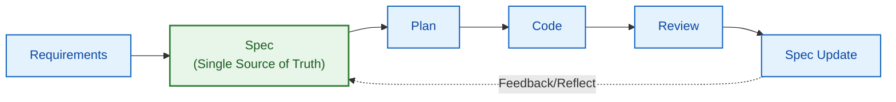
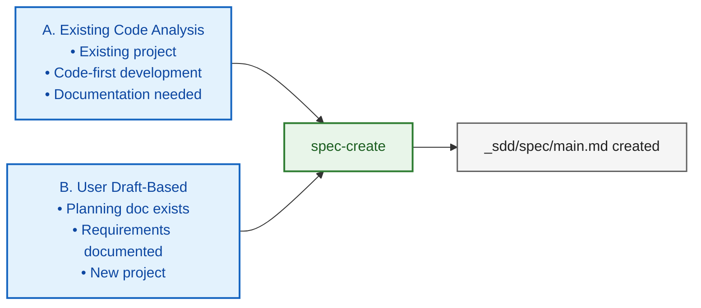
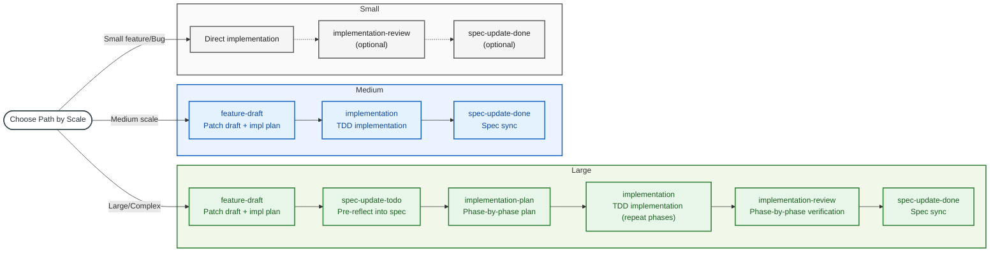
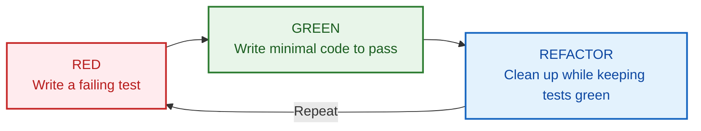
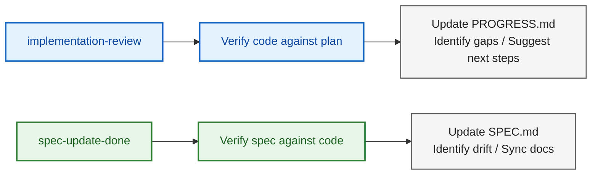
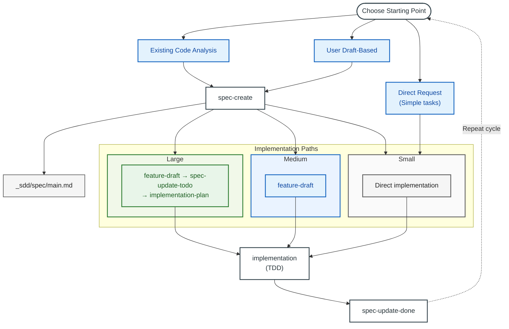

# Spec-Driven Development (SDD) Workflow Guide

**Version**: 1.4.0
**Date**: 2026-03-04

A comprehensive guide to SDD skills for software development with Claude

---

## Table of Contents

1. [Core Concepts](#1-core-concepts)
2. [Effective Skill Usage](#2-effective-skill-usage)
3. [Getting Started](#3-getting-started)
4. [Implementation and Spec Maintenance](#4-implementation-and-spec-maintenance)
5. [Review Process](#5-review-process)
6. [Long-Running Debugging — Ralph Loop](#6-long-running-debugging--ralph-loop)
7. [Quick Reference](#7-quick-reference)

---

## 1. Core Concepts

### What Is Spec-Driven Development (SDD)?

Spec-Driven Development (SDD) is a methodology where **spec documents** serve as the Single Source of Truth throughout the entire software development lifecycle. It bridges the gap between requirements and implementation by maintaining living documents that evolve alongside the code.

### Two-Tier Spec Structure

SDD manages documents in two tiers: **Global Spec** and **Temporary Spec**.

- **Global Spec** (`_sdd/spec/main.md`): The project's Single Source of Truth, replacing `CLAUDE.md`. It contains all project information including goals, architecture, and component details. All skills operate based on this document.
- **Temporary Spec** (`feature_draft`, `spec_patch_draft`, `user_draft`): **Change proposals** to the global spec. Like Git feature branches, they are created first, validated, merged into the global spec, and then archived.

> For a detailed explanation of the two-tier structure and its lifecycle, see: [SDD_CONCEPT.md](SDD_CONCEPT.md)

### SDD Philosophy



### Currently Available SDD Skills (14)

| Skill | Trigger | Purpose |
|-------|---------|---------|
| **spec-create** | "create spec", "document project" | Generate spec from code analysis or draft |
| **feature-draft** | "feature draft", "feature plan" | Generate spec patch draft + implementation plan in one step |
| **spec-update-todo** | "add features to spec", "update spec" | Pre-reflect new features/requirements into spec (prevents drift in large implementations) |
| **spec-update-done** | "sync done items", "sync spec" | Synchronize spec with implementation changes |
| **spec-review** | "review spec", "check drift" | Auxiliary strict review for validation (report only) |
| **spec-summary** | "spec summary", "project overview" | Generate a spec summary (for status overview) |
| **spec-rewrite** | "rewrite spec", "reorganize spec" | Restructure long/complex specs (file splitting/appendix relocation) + issue report |
| **pr-spec-patch** | "PR spec patch", "prepare PR review" | Generate patch draft by comparing PR with spec |
| **pr-review** | "PR review", "verify PR" | Validate PR implementation against spec and render judgment |
| **implementation-plan** | "create implementation plan" | Generate phase-by-phase implementation plan (for large implementations) |
| **implementation** | "implement the plan", "start implementation" | Execute TDD-based implementation |
| **implementation-review** | "review implementation", "check progress" | Validate implementation against plan (phase-by-phase verification for large projects) |
| **ralph-loop-init** | "ralph loop", "training debug loop" | Create automated ML training debug loop |
| **discussion** | "discuss", "brainstorm" | Structured decision-making discussion: context gathering + option comparison + decisions/open items/action items |

> (caveat) The `/discussion` skill is only supported in Claude Code.

### Workflow by Scale

Three paths are used depending on the scale of the feature:

| Scale | Workflow |
|-------|----------|
| **Large** | feature-draft → spec-update-todo → implementation-plan → implementation (repeat phases) → implementation-review → spec-update-done (→ spec-review) |
| **Medium** | feature-draft → implementation → spec-update-done |
| **Small** | Direct implementation (→ implementation-review) (→ spec-update-done) |

> **Note**: If no spec exists, first create one with `/spec-create`.

#### Pre-Implementation Discussion Gate (Optional)

- If the direction/requirements are unclear, run `/discussion` first.
- Use the discussion results as input for `/feature-draft` or `/implementation-plan`.
- If the direction is clear, proceed directly with the scale-appropriate path.

#### Differences Between Large and Medium Scale

- **Large**: Use `spec-update-todo` to pre-reflect into spec before implementation (prevents drift), `implementation-plan` for phase-by-phase planning, and `implementation-review` for phase-by-phase verification
- **Medium**: `feature-draft` generates the spec patch draft (Part 1) + implementation plan (Part 2) in one step, so separate planning/verification is unnecessary
- **Small**: Implement directly without `feature-draft`, only verify/sync when needed

### Directory Structure

```
project/
├── _sdd/
│   ├── spec/
│   │   ├── main.md                   # Main spec document (or <project>.md)
│   │   ├── user_spec.md              # Spec update input (free-form accepted)
│   │   ├── user_draft.md             # Spec update input (recommended format)
│   │   ├── _processed_user_spec.md   # Processed input (archive; renamed by spec-update-todo)
│   │   ├── _processed_user_draft.md  # Processed input (archive; renamed by spec-update-todo)
│   │   ├── SUMMARY.md                # Spec summary (spec-summary)
│   │   ├── SPEC_REVIEW_REPORT.md     # Spec review report (spec-review)
│   │   ├── DECISION_LOG.md           # (Optional) Decision/rationale log
│   │   └── prev/                      # Spec backups (PREV_*.md)
│   │
│   ├── pr/
│   │   ├── spec_patch_draft.md       # PR-based spec patch draft (reflect into spec via spec-update-todo)
│   │   ├── PR_REVIEW.md              # PR review report
│   │   └── prev/                      # PR report backups (PREV_*.md)
│   │
│   ├── implementation/
│   │   ├── IMPLEMENTATION_PLAN.md     # Implementation plan (index/summary; split into phase files if needed)
│   │   ├── IMPLEMENTATION_PLAN_PHASE_<n>.md     # (Optional) Phase-specific implementation plan
│   │   ├── IMPLEMENTATION_PROGRESS.md           # Progress tracking (overall/summary)
│   │   ├── IMPLEMENTATION_PROGRESS_PHASE_<n>.md  # (Optional) Phase-specific progress report
│   │   ├── IMPLEMENTATION_REVIEW.md   # Review results
│   │   ├── TEST_SUMMARY.md            # Test status
│   │   ├── user_input.md              # Implementation request (input)
│   │   └── prev/                      # Implementation document backups (PREV_*.md)
│   │
│   ├── drafts/                          # feature-draft output
│   │   ├── feature_draft_*.md           # Spec patch + implementation plan combined file
│   │   └── prev/                        # Archive
│   │
│   └── env.md                         # Environment settings
│
└── src/                               # Source code
```

## 2. Effective Skill Usage

Skills are **structured workflow templates**. Even with the same skill, result quality varies significantly depending on user input.

### Core Principle: Input Quality = Output Quality

Skills process user input in a consistent order and quality. The more a skill has to guess to fill in blanks, the further the results stray from user intent. **Good input includes these three elements**:

| Element | Description | Example |
|---------|-------------|---------|
| **What** | Scope and behavior of the feature to implement | "Auto-parse CSV on upload and save to DB" |
| **Why** | Background and context — influences design decisions | "Manual entry is too slow, need bulk registration" |
| **Constraints** | Boundary conditions, non-functional requirements, technical constraints | "Max 10MB, column mapping manually specified in UI" |

### Good Input vs Bad Input by Skill

**`/feature-draft`**

```
# Bad input
/feature-draft CSV upload feature

# Good input
/feature-draft
A feature that auto-parses CSV uploads and saves them to DB.
- Max 10MB, column mapping manually specified in UI
- Skip error rows and output a separate report
- Bulk insert into the existing users table
- Needed for bulk registration because manual entry is too slow
```

**`/implementation`**

```
# Bad input
/implementation implement it

# Good input (medium scale)
/implementation
Implement based on the feature draft (_sdd/drafts/feature_draft_csv_upload.md).
Use the Papa Parse library for CSV parsing.

# Good input (large scale)
/implementation
Implement phase 2 of the implementation plan.
This phase adds the mapping UI on top of the FileUploader component created in phase 1.
```

**`/discussion`**

```
# Bad input
/discussion architecture discussion

# Good input
/discussion
We need to decide whether to use WebSocket or SSE for real-time notifications.
- Current server is FastAPI, client is React
- Expected max 500 concurrent users
- Only one-way notifications needed (server → client)
- Infrastructure runs on AWS ECS
```

**`/spec-create`**

```
# Bad input
/spec-create create a spec

# Good input (existing code analysis)
/spec-create
Analyze this project's code and create a spec.
The main entry point is src/main.py, structured as API server + batch scraper.

# Good input (draft-based)
/spec-create
Generate a spec based on the plan written in _sdd/spec/user_draft.md.
The tech stack is documented in env.md.
```

**`/spec-update-done`**

```
# Bad input
/spec-update-done update the spec

# Good input
/spec-update-done
Phase 1 implementation is complete. During implementation, I changed
the API response format from { data, error } to { result, errors[] }.
Please reflect this in the spec.
```

### Tips for Writing Input

1. **Mention specific files/locations**: "_sdd/drafts/feature_draft_csv_upload.md" is more precise than "the feature draft".
2. **Include reasons for changes**: If something diverged from the spec during implementation, a one-line explanation of why makes spec synchronization more accurate.
3. **State what's already decided**: Specifying pre-determined tech stack, libraries, and conventions reduces unnecessary suggestions.
4. **Set scope boundaries**: Scope limits like "this skill should only cover X, leave Y for later" are also useful.

---

## 3. Getting Started

### Starting Points for Spec Creation

Specs can be created in two ways:



#### A. Starting from Existing Code Analysis

Use when an existing codebase is available:

```bash
# Generate spec from code analysis
/spec-create

# Claude performs the following:
# 1. Analyze codebase structure
# 2. Identify components
# 3. Determine architecture
# 4. Generate spec document
```

**Suitable for:**
- Documenting existing projects
- Writing documentation after code-first development
- Documentation for handoff

#### B. Starting from a User Draft

Use when a planning document or requirements document exists:

```bash
# 1. Prepare draft/requirements input
# - Write in _sdd/spec/user_spec.md or _sdd/spec/user_draft.md

# 2. Request spec creation
"Create a spec based on this draft"
/spec-create
```

**Draft file example:**
```markdown
# Project Draft

## Goals
Build a task management API with user authentication

## Required Features
- JWT-based login/signup
- Task CRUD
- Deadline notifications

## Tech Stack
- Python + FastAPI
- PostgreSQL
```

**Suitable for:**
- PM/planner provides requirements
- Starting a new project
- When clear requirements exist

---

### Choosing an Implementation Path

Choose a path based on feature complexity and context:



### Path Selection Guide

| Situation | Path | Reason |
|-----------|------|--------|
| Large feature, architecture change | Large | Phase-by-phase planning + spec pre-reflection prevents drift |
| Medium-scale feature | Medium | feature-draft generates draft + plan in one step |
| Bug fix, urgent hotfix | Small | Fix immediately, verify when needed |
| ML training debug | ralph-loop-init | Automated training debug loop |

---

### Getting Started by Scenario

#### Scenario 1: Documenting an Existing Project

```bash
# Generate spec from code analysis
/spec-create
# Analyze the codebase and generate a spec
```

#### Scenario 2: Pre-Implementation Decision Discussion

```bash
# Start a discussion
/discussion
# Topic selection → Context gathering → Iterative questions → Summary output
```

Follow-up skill connections:
- `/feature-draft`: Draft a feature spec in the agreed direction
- `/implementation-plan`: Build a phase plan based on the decided structure
- `/spec-create`: Generate a new project spec with organized requirements

> Discussion results can optionally be saved to `_sdd/discussion/discussion_<title>.md` at the user's choice.

#### Scenario 3: Large-Scale Feature Implementation

```bash
# 1. Generate spec patch draft + implementation plan
/feature-draft

# 2. Pre-reflect into spec (prevents drift)
/spec-update-todo

# 3. Create phase-by-phase implementation plan
/implementation-plan

# 4. Implement (repeat per phase)
/implementation

# 5. Phase-by-phase verification
/implementation-review

# 6. Sync spec
/spec-update-done

# 7. (Optional) Final auxiliary verification
/spec-review
```

> If no spec exists, run `/spec-create` first.

#### Scenario 4: Medium-Scale Feature Implementation

```bash
# 1. Generate spec patch draft + implementation plan
/feature-draft

# 2. Implement
/implementation

# 3. Sync spec
/spec-update-done
```

> Since `feature-draft` generates both the spec patch draft (Part 1) and implementation plan (Part 2) in one step, a separate `implementation-plan` is unnecessary.

#### Scenario 5: Small-Scale / Bug Fix

```bash
# 1. Direct fix request
"Fix the null pointer bug in this file"

# 2. (Optional) Verification
/implementation-review

# 3. (Optional) Sync spec if affected
/spec-update-done
```

#### Scenario 6: Long-Running Debugging (Ralph Loop)

Apply an LLM-based automated loop for tasks where a single debugging turn takes a long time (ML training, e2e tests, etc.).

```bash
# Initialize ralph loop
/ralph-loop-init
# Creates automated debugging loop structure in ralph/ directory

# Run the loop
bash ralph/run.sh

# Check results
ls ralph/results/
```

> For detailed workflow and usage examples, see [6. Long-Running Debugging — Ralph Loop](#6-long-running-debugging--ralph-loop).

#### Scenario 7: PR-Based Spec Patching and Review

```bash
# 1. Generate patch draft by comparing PR with spec
/pr-spec-patch

# 2. PR review
/pr-review

# 3. (If needed) Reflect into spec
# Move the patch draft to user_draft.md, then
/spec-update-todo

# 4. (If needed) Sync spec
/spec-update-done
```

#### Scenario 8: Spec Status Overview

```bash
# Generate spec summary
/spec-summary
# Creates SUMMARY.md (includes progress, issues, recommendations)
```

---

## 4. Implementation and Spec Maintenance

### TDD Implementation Workflow

The implementation skill uses Test-Driven Development (TDD):



### Spec Maintenance Strategy

#### When to Update Spec During Implementation

| Situation | Action |
|-----------|--------|
| Better approach discovered | Record in progress notes, update spec after phase |
| New requirement discovered | Create integrated draft with `/feature-draft` |
| Planned feature removed | Create patch draft with `/feature-draft` |
| API changed | Update component details in spec |
| Spec reflection after PR creation | Create `/pr-spec-patch` → `/pr-review` → (use patch draft as input) `/spec-update-todo` |
| Spec-based validation before PR merge | `/pr-spec-patch` → verify with `/pr-review` before merge |
| Results seem wrong or ambiguous | Run `/spec-review` for auxiliary verification (report only) |
| Final check right after a large update | Recommended to run `/spec-review` after `/spec-update-done` completes |

#### After Implementation Phase Completion

```bash
# Sync spec with code
/spec-update-done

# (Optional) Auxiliary verification
# When something seems off or right after a large update
/spec-review

# What Claude performs:
# 1. Read implementation logs
# 2. Compare spec with actual code
# 3. Generate drift report
# 4. Update spec after approval
```

### File Management

#### Input Files

| File | Purpose | After Processing |
|------|---------|-----------------|
| `_sdd/spec/user_spec.md` | User input (draft spec, new features/requirements, etc.) | → `_processed_user_spec.md` |
| `_sdd/spec/user_draft.md` | User input (recommended format; Spec Update Input) | → `_processed_user_draft.md` |
| `_sdd/pr/spec_patch_draft.md` | PR-based spec patch draft | Spec reflection proceeds via `/spec-update-todo` |
| `_sdd/implementation/user_input.md` | Implementation request | → `_processed_user_input.md` |

> Note: The contents of `_sdd/pr/spec_patch_draft.md` are NOT automatically reflected into the spec.
> Move the patch content to `_sdd/spec/user_draft.md` (recommended) or `_sdd/spec/user_spec.md`, then run `/spec-update-todo` to apply.

#### PREV Backup Location Rules

- `_sdd/spec/prev/PREV_<filename>_<timestamp>.md`
- `_sdd/pr/prev/PREV_<filename>_<timestamp>.md`
- `_sdd/implementation/prev/PREV_<filename>_<timestamp>.md`

If `prev/` does not exist, it is created first before saving.

#### Version History

Previous versions are automatically archived:

```
_sdd/implementation/
├── IMPLEMENTATION_PLAN.md                      # Current (index/summary)
├── IMPLEMENTATION_PLAN_PHASE_1.md              # (Optional) Phase 1 detailed plan
├── IMPLEMENTATION_PROGRESS.md                  # Progress tracking (overall/summary)
├── IMPLEMENTATION_PROGRESS_PHASE_1.md          # (Optional) Phase 1 progress report
└── prev/
    ├── PREV_IMPLEMENTATION_PLAN_20260204_150502.md # Previous
    ├── PREV_IMPLEMENTATION_PLAN_20260204_194934.md # Older
    ├── PREV_IMPLEMENTATION_PROGRESS_20260204_150502.md # Previous progress tracking
    └── PREV_IMPLEMENTATION_PROGRESS_20260204_194934.md # Older progress tracking
```

### Spec Status Markers

Markers for tracking feature status:

| Marker | Meaning |
|--------|---------|
| 📋 Planned | Not yet implemented |
| 🚧 In Progress | Currently being implemented |
| ✅ Complete | Implementation complete |
| ⏸️ On Hold | Temporarily suspended |

Spec example:
```markdown
### Key Features
1. **Data Scraping**: Apify Actor integration ✅
2. **Image Download**: Parallel download support ✅
3. **Scheduler Integration**: Scheduled execution 📋 Planned
4. **Web Dashboard**: Monitoring UI 📋 Planned
```

---

## 5. Review Process

### Implementation Review

> **Note**: Since the `implementation` skill has built-in phase-level reviews, running a separate `/implementation-review` is optional for medium/small scale. For large scale, it is used for phase-by-phase verification.

**When to use**: After completing a task or phase

```bash
/implementation-review  or  "check progress"
```

**What it does**:

1. **Inventory**: List all planned tasks
2. **Verification**: Confirm what was actually implemented
3. **Evaluation**: Verify acceptance criteria fulfillment
4. **Issues**: Identify problems and gaps
5. **Summary**: Suggest next steps

**Output location**: `_sdd/implementation/IMPLEMENTATION_REVIEW.md`

### Spec Sync

**When to use**: After implementation changes

```bash
/spec-update-done  or  "sync spec"
```

**What it does**:

1. **Context gathering**: Read implementation logs, git history
2. **Drift identification**: Compare spec with code
3. **Report generation**: List required changes
4. **Apply updates**: Update spec after approval

### Auxiliary Spec Review (Optional)

**When to use**:
- When results seem wrong or ambiguous
- When final verification is needed right after reflecting a large update via `/spec-update-done`

```bash
/spec-review  or  "check spec drift"
```

**What it does**:
1. **Review-only inspection**: Check spec quality/drift
2. **Report generation**: Record in `_sdd/spec/SPEC_REVIEW_REPORT.md`
3. **No direct modification**: Does not modify spec files directly

**Types of drift detected**:

| Type | Example |
|------|---------|
| Architecture | Undocumented new component |
| Feature | Implemented feature not in spec |
| Issue | Resolved bug still listed as open |
| Configuration | Newly added environment variable |

### Review Cycle



When needed (anomalies detected or right after a large change), additionally run `/spec-review` for final verification.

---

## 6. Long-Running Debugging — Ralph Loop

### What Is Ralph Loop?

Ralph Loop is an automation loop that **replaces the human in human-in-the-loop debugging with an LLM** ([original concept](https://dev.to/ibrahimpima/the-ralf-wiggum-breakdown-3mko)). Without requiring human intervention each time, the LLM analyzes state, writes and executes actions, observes results, and decides on next steps.

This skill was specifically developed for **debugging where a single turn takes a long time to execute**:
- ML training debugging — training runs take tens of minutes to hours
- e2e test debugging — full test suite execution takes a long time
- Infrastructure/deployment debugging — environments with long build/deploy cycles
- Data pipeline debugging — cases requiring result verification after large-scale processing

**Core principle**: The cycle of `LLM analyzes → writes action.sh → script executes → results saved → LLM analyzes again` repeats until the phase reaches DONE.

### Workflow

#### Step 1: Initialization

```bash
/ralph-loop-init
```

The following files are created in the `ralph/` directory:

| File | Role |
|------|------|
| `PROMPT.md` | System prompt delivered to the LLM (project context, instructions) |
| `state.md` | Current state (phase, iteration, errors, checkpoints, etc.) |
| `config.sh` | Settings (timeout, completion promise, etc.) |
| `run.sh` | Main loop script |
| `results/` | Directory for storing results from each iteration |

#### Step 2: Write the Prompt

Modify `ralph/PROMPT.md` to fit your project. Since the LLM reads this prompt and analyzes state at every iteration, clearly describe the project context and debugging objectives.

#### Step 3: Run the Loop

```bash
bash ralph/run.sh          # Start the loop
bash ralph/run.sh --reset  # Reset state and restart
```

Flow per iteration:

```
┌─────────────────────────────────────────┐
│  LLM analyzes state.md + results/      │
│  → Writes action.sh                     │
├─────────────────────────────────────────┤
│  action.sh executes (training, tests)   │
│  → Saves results to results/            │
├─────────────────────────────────────────┤
│  state.md updated                       │
│  → If phase is DONE, terminate          │
│  → Otherwise, next iteration            │
└─────────────────────────────────────────┘
```

#### Step 4: Check Results

```bash
ls ralph/results/               # Result files per iteration
cat ralph/state.md              # Check final state
cat ralph/results/last_exit_code  # Last action exit code
```

### state.md Phases

| Phase | Meaning |
|-------|---------|
| `SETUP` | Initial state, environment verification |
| `SMOKE_TEST` | Quick validation run |
| `TRAINING` | Full-scale training/execution |
| `VALIDATING` | Result validation |
| `ANALYZING` | Result analysis |
| `ADJUSTING` | Parameter/configuration adjustment |
| `DONE` | Complete |

### Safety Mechanisms

- **Duplicate execution prevention**: Concurrent execution blocked via lock directory (`ralph/.ralph.lock.d`)
- **state.md integrity validation**: Automatic phase and iteration validity checks after LLM/action.sh execution
- **state.md backup/recovery**: Automatic backup before action.sh execution, automatic recovery on corruption
- **LLM failure retry**: Automatic termination after 3 consecutive failures maximum
- **Completion promise**: When `COMPLETION_PROMISE` is set in config.sh, LLM output is verified at the DONE stage

### Usage Examples

#### ML Training Debugging

When debugging a problem where training loss is not converging. The LLM analyzes training logs, adjusts hyperparameters, and repeats training.

```bash
/ralph-loop-init
# Describe model architecture, dataset, and current problem in PROMPT.md
bash ralph/run.sh
```

#### e2e Test Debugging

When the full test suite takes over 30 minutes to run. The LLM analyzes failing tests, modifies code, and repeats execution.

```bash
/ralph-loop-init
# Describe test environment, failure patterns, and modification scope in PROMPT.md
bash ralph/run.sh
```

#### Data Pipeline Debugging

When a specific stage fails in a large-scale data processing pipeline. The LLM analyzes logs, adjusts settings, and re-runs the pipeline.

```bash
/ralph-loop-init
# Describe pipeline structure, data scale, and error patterns in PROMPT.md
bash ralph/run.sh
```

---

## 7. Quick Reference

### Command Cheat Sheet

| Command | When to Use |
|---------|-------------|
| `/spec-create` | Starting a new project or documenting existing code |
| `/feature-draft` | Generate combined spec patch draft + implementation plan |
| `/spec-update-todo` | Pre-reflect new features/requirements into spec (for large implementations) |
| `/spec-update-done` | Synchronize spec with implementation changes |
| `/spec-review` | Optional auxiliary verification (after anomalies/large updates) |
| `/spec-summary` | Spec status overview and summary generation |
| `/spec-rewrite` | Restructure long/complex specs (file splitting/appendix relocation) |
| `/pr-spec-patch` | Generate patch draft by comparing PR with spec |
| `/pr-review` | Validate PR implementation against spec/patch draft and render judgment |
| `/implementation-plan` | Generate phase-by-phase implementation plan (for large implementations) |
| `/implementation` | Execute TDD-based implementation |
| `/implementation-review` | Validate implementation against plan (phase-by-phase verification for large projects) |
| `/ralph-loop-init` | Create automated ML training debug loop |
| `/discussion` | Pre-implementation decision structuring (derive discussion points/decisions/open items/action items) |

### Workflow Summary by Path

#### Large

```bash
/feature-draft → /spec-update-todo → /implementation-plan → /implementation (repeat phases) → /implementation-review → /spec-update-done (→ /spec-review)
```

#### Medium

```bash
/feature-draft → /implementation → /spec-update-done
```

#### Small

```bash
Direct implementation (→ /implementation-review) (→ /spec-update-done)
```

### File Locations

| Purpose | Default Path |
|---------|-------------|
| Main spec | `_sdd/spec/main.md` or `_sdd/spec/<project>.md` |
| Spec input | `_sdd/spec/user_spec.md` |
| Spec input (recommended format) | `_sdd/spec/user_draft.md` |
| Spec summary | `_sdd/spec/SUMMARY.md` |
| Spec review report | `_sdd/spec/SPEC_REVIEW_REPORT.md` |
| Decision/rationale log (optional) | `_sdd/spec/DECISION_LOG.md` |
| PR patch draft | `_sdd/pr/spec_patch_draft.md` |
| PR review report | `_sdd/pr/PR_REVIEW.md` |
| Implementation plan (index) | `_sdd/implementation/IMPLEMENTATION_PLAN.md` |
| Implementation plan (phase split) | `_sdd/implementation/IMPLEMENTATION_PLAN_PHASE_<n>.md` |
| Progress tracking (overall/summary) | `_sdd/implementation/IMPLEMENTATION_PROGRESS.md` |
| Progress tracking (phase split) | `_sdd/implementation/IMPLEMENTATION_PROGRESS_PHASE_<n>.md` |
| Review results | `_sdd/implementation/IMPLEMENTATION_REVIEW.md` |
| Environment settings | `_sdd/env.md` |

### Full Workflow Diagram



### Best Practices

1. **Feature Draft First**: Before large/medium implementations, use `/feature-draft` to generate a patch draft + implementation plan in one step
2. **Phase-by-phase verification for large scale**: Verify each phase with `/implementation-review`; optional for medium/small scale
3. **Split large plans into phases**: Keep `IMPLEMENTATION_PLAN.md` as an index/summary and split into `IMPLEMENTATION_PLAN_PHASE_<n>.md` files (progress reports also use `IMPLEMENTATION_PROGRESS_PHASE_<n>.md`)
4. **Maintain synchronization**: Use spec-update-done by default; for anomalies or right after large changes, run spec-review for auxiliary verification
5. **Preserve history**: Do not delete `PREV_*` files under `prev/` until the project is stabilized
6. **Use status indicators**: Use status markers in specs (📋, 🚧, ✅)
7. **Tests first**: Follow TDD in the implementation skill

---

## Appendix: Skill Descriptions

When using Claude Code, invoke a skill by prefixing the skill name with /\<skillname\>.
- e.g. `/spec-create analyze this project's code and create a spec`

When using Codex, invoke by including the skill name in a conversational manner.
- e.g. `Use the spec-create skill to analyze this project's code and create a spec`

### spec-create

Creates the initial SDD (Software Design Document) spec for a project. Sets up the `_sdd/spec/` directory structure and initial spec file.

**Trigger**: "create spec", "make a spec", "document project", "create SDD", "generate spec"

**Usage examples**:
- "Create a spec for this project."
- "Analyze the codebase and generate an SDD document."
- "I'm starting a new project — set up the spec document structure using this draft file as reference."

### feature-draft

Writes a feature specification (spec patch draft) for a new feature. Organizes requirements and generates a spec patch and implementation plan draft in one step. This is the starting point for large/medium implementations.

**Trigger**: "feature draft", "feature plan", "draft and plan"

**Usage examples**:
- "Create a feature specification from what we've discussed so far."
- "I want to implement user authentication. Draft the spec."
- "Create a feature specification based on the content in `requirements.md`."
- "I want to add a chat feature — generate a technical spec and implementation plan draft together."

### spec-update-todo

Used to pre-reflect into the spec after `feature-draft` during large implementations. Adds features/requirements that have not yet been implemented to the spec document.

**Trigger**: "add features to spec", "update spec", "add requirements"

**Usage examples**:
- "Reflect the feature draft I just created into the spec."
- "New requirements have come up. Add the contents of this document to the spec."

### spec-update-done

Synchronizes completed implementation with the spec document. Compares code with documentation to update status markers and reflect differences between actual implementation and spec.

**Trigger**: "reflect done items", "sync spec", "reflect implementation"

**Usage examples**:
- "Look at the implementation docs and code so far and reflect them in the spec."
- "Reflect the implementation into the spec. There are no docs — just look at the code."
- "Implementation is done through phase 2, so update the spec status."

### spec-review

Validates spec document quality and code-spec consistency. Does not modify anything — only generates an analysis report. Useful for verifying anomalies after large changes.

**Trigger**: "review spec", "check spec drift", "something seems off — verify it", "verify spec quality"

**Usage examples**:
- "The spec and code seem misaligned — verify it."
- "Check for spec drift after the refactoring."
- "Review the spec document quality."

### spec-summary

Generates a summary of the current spec document. Used for quickly understanding project status.

**Trigger**: "spec summary", "spec overview", "spec status", "project overview", "current status"

**Usage examples**:
- "Summarize the current project status."
- "Show me the spec overview."
- "I want to see at a glance how far implementation has progressed."

### spec-rewrite

Reorganizes spec documents that have grown too large. Removes noise and, when necessary, splits files into a manageable structure.

**Trigger**: "rewrite spec", "reorganize spec", "split spec into files", "refactor spec"

**Usage examples**:
- "The spec document has gotten too long. Clean it up."
- "Split the spec into separate files by module."
- "Remove unnecessary content and rewrite the spec cleanly."

### pr-spec-patch

Analyzes PR changes and generates a spec patch document. Used to prepare for spec reflection before merging a PR.

**Trigger**: "PR spec patch", "prepare PR review", "create spec patch", "reflect PR changes in spec"

**Usage examples**:
- "Create a spec patch from the changes in PR #42."
- "Before merging this PR, organize what needs to be reflected in the spec."
- "Compare the PR with the current spec and generate a patch document."

### pr-review

Validates PR implementation against the spec and spec patch. Checks code quality, spec compliance, and missing items.

**Trigger**: "PR review", "verify PR", "spec-based PR review", "PR approval review"

**Usage examples**:
- "Review PR #42 against the spec."
- "Verify whether this PR is ready for approval."
- "Check whether the PR changes match the spec patch content."

### implementation-plan

Creates a detailed phase-by-phase plan for large implementations. Analyzes implementation order, dependencies, and parallelization possibilities based on the feature draft and spec.

**Trigger**: "create implementation plan", "parallel implementation plan"

**Usage examples**:
- "Look at the feature draft and spec I just created and write a detailed implementation plan by phase."
- "Separate tasks that can run in parallel and create an implementation plan."
- "What order should I implement this feature in? Create a plan."

### implementation

Implements actual code based on the implementation plan or feature draft. Follows TDD and performs phase-level or full implementation.

**Trigger**: "implement the plan", "start implementation", "parallel implementation", "execute tasks"

**Usage examples**:
- (Medium) "Look at the feature draft I just created and implement the feature."
- (Large) "Look at implementation plan phase 2 and the feature draft and implement phase 2."
- "Run things that can be implemented in parallel simultaneously."

### implementation-review

Validates implementation results against the plan/spec. Used for phase-by-phase verification in large implementations; optional for medium/small scale.

**Trigger**: "review implementation", "check progress", "what's done?"

**Usage examples**:
- "Review what's been implemented from phase 1 through 3."
- "Review the implementation using the feature draft and spec as references."
- "Review the implementation. There are no docs — just look at the code diff and spec."
- "Check pass/fail status based on acceptance criteria."

### ralph-loop-init

Initializes an LLM-based automated ML training debugging loop (ralph loop). Creates the `ralph/` directory structure, configuration files, and prompt templates.

**Trigger**: "ralph loop", "init ralph", "training debug loop", "set up ralph loop", "automated training loop"

**Usage examples**:
- "Initialize a ralph loop to validate the feature I just built."
- "Create an automated e2e training debugging loop."

### discussion

Conducts a structured iterative discussion. Organizes ideas with research support and derives conclusions.

**Trigger**: "discuss", "let's discuss", "brainstorm"

**Usage examples**:
- "Let's discuss the new feature we want to add."
- "Let's have a discussion about this architecture."
- "Brainstorm the technology options."
- "Let's discuss the pros and cons of this approach."

**When NOT to use**:
- When requirements/design are already fixed and implementation can proceed directly
- When it's a simple bug fix that doesn't need a decision discussion
