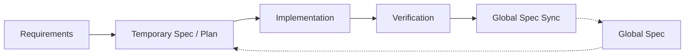

# Spec-Driven Development (SDD) Workflow Guide

**Version**: 2.0.0
**Date**: 2026-04-04

This document explains how specs are generated, consumed, verified, and synchronized in the current SDD model.

Related documents:
- [SDD_SPEC_DEFINITION.md](SDD_SPEC_DEFINITION.md)
- [SDD_CONCEPT.md](SDD_CONCEPT.md)
- [SDD_QUICK_START.md](SDD_QUICK_START.md)
- [sdd.md](sdd.md)

---

## 1. Core Model

SDD does not force one document shape for every situation. It uses two spec types that share a core but differ in density.

### Global Spec

The global spec is the long-lived Single Source of Truth. It is not a full implementation inventory. It is a thin, durable reference for humans and agents.

Core body:
- Background and high-level concept
- Scope / Non-goals / Guardrails
- Core design and key decisions
- Contract / Invariants / Verifiability
- Usage guide & expected results
- Decision-bearing structure

Optional support areas:
- data model / API / environment and configuration
- Strategic Code Map appendix
- related docs and code references

### Temporary Spec

A temporary spec is not a compressed copy of the global spec. It is an execution blueprint for change.

Canonical seven sections:
- Change Summary
- Scope Delta
- Contract/Invariant Delta
- Touchpoints
- Implementation Plan
- Validation Plan
- Risks / Open Questions

### CIV Is the Shared Quality Gate

`Contract / Invariants / Verifiability` is the common quality gate across the system.

- Global specs use explicit `Contract`, `Invariants`, and `Verifiability` blocks.
- Temporary specs express the same meaning through `Contract/Invariant Delta` and `Validation Plan`.
- IDs such as `C1`, `I1`, and `V1`, together with verification enum values, preserve traceability.

---

## 2. Update Order

When the canonical model changes, use this order:

1. update the definition
2. update generator / transformer skills
3. update consumer / planner / updater / orchestrator skills
4. update human-facing docs
5. update English mirrors, examples, and collateral references

The reason is simple: if docs move ahead of real skill behavior, the system splits into conflicting truths.

---

## 3. Choosing a Starting Point

### Default Path

For most feature work, start with `/sdd-autopilot`.

```bash
/sdd-autopilot Implement this feature: [feature description]
```

### When Direction Is Unclear

Run `/discussion` first when requirements or design direction are still unsettled.

### When No Spec Exists

Use `/spec-create` to generate a current canonical global spec.

### When a Legacy Spec Exists

Use `/spec-upgrade` to migrate it to the current canonical global spec model. It is no longer a converter into an older numbered whitepaper format.

---

## 4. Scale-Based Workflows

| Scale | Recommended Path | Why |
|-------|------------------|-----|
| Large | `feature-draft -> spec-update-todo -> implementation-plan -> implementation -> implementation-review -> spec-update-done` | Long-running work needs explicit delta, planning, and phase review. |
| Medium | `feature-draft -> implementation -> spec-update-done` | The draft already contains both temporary spec and execution plan. |
| Small | Direct implementation -> optional `implementation-review` / `spec-update-done` | Use when the change is narrow and the delta is obvious. |

Support skills:
- `/spec-review`: strict quality or drift review when needed
- `/spec-summary`: quick project/spec overview
- `/spec-rewrite`: restructure an oversized spec
- `/guide-create`: feature-specific deep-dive guide

---

## 5. Skill Roles

| Skill | Role |
|-------|------|
| `/spec-create` | Create a current canonical global spec from code or a draft |
| `/spec-upgrade` | Migrate a legacy spec to the current canonical model |
| `/feature-draft` | Create a temporary spec draft plus implementation plan |
| `/spec-update-todo` | Pre-register planned persistent information in the global spec |
| `/implementation-plan` | Expand large deltas into phases and tasks |
| `/implementation` | Execute the plan or draft |
| `/implementation-review` | Verify implementation against the plan and acceptance criteria |
| `/spec-update-done` | Sync implemented and verified persistent truth back into the global spec |
| `/spec-review` | Review spec quality, drift, CIV coverage, and global/temporary alignment |
| `/spec-summary` | Summarize global and temporary specs differently |
| `/spec-rewrite` | Reorganize an oversized spec around the canonical model |
| `/discussion` | Structured decision discussion |
| `/guide-create` | Generate a feature implementation/review guide |
| `/sdd-autopilot` | Run the end-to-end pipeline |
| `/ralph-loop-init` | Initialize a long-running debug loop |

---

## 6. What Good Input Looks Like

Skills are structured workflows, not magic. Weak input produces weak output.

Minimum input pattern:
- What: what is changing
- Why: why it matters
- Constraints: what boundaries or constraints apply

Example:

```text
/feature-draft
Add CSV upload that auto-parses and bulk-inserts into the users table.
- Max 10MB
- Column mapping stays manual in the UI
- Skip invalid rows and emit a report
```

If confidence is low, the skill should continue on a best-effort basis and record uncertainty in `Risks / Open Questions`.

---

## 7. Artifact Layout

Main directories:

```text
_sdd/
├── spec/              # global spec and supporting spec files
├── drafts/            # feature-draft outputs
├── implementation/    # plans, progress, reports, reviews
├── discussion/        # discussion handoffs and logs
├── guides/            # guide-create outputs
└── env.md             # environment and verification hints
```

Operating rule:
- keep global truth in `_sdd/spec/`
- let temporary specs and plans cycle through `_sdd/drafts/` and `_sdd/implementation/`
- use `_sdd/env.md` as the environment and verification reference

---

## 8. Workflow Summary



In one sentence:

> The global spec fixes long-lived truth, the temporary spec drives execution, and the skillchain preserves the contract and verification linkage between them.
